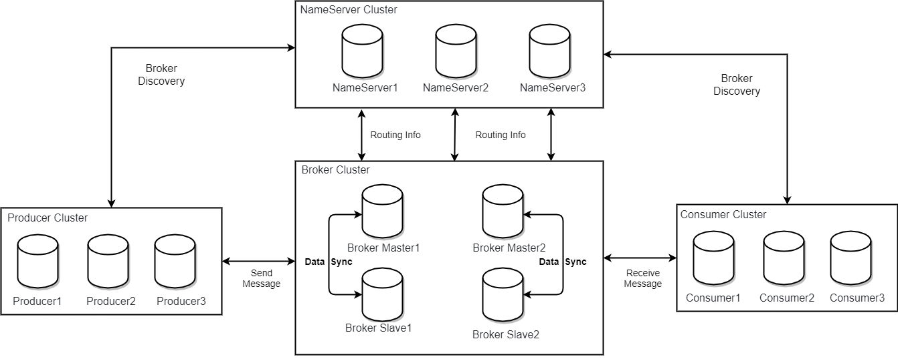
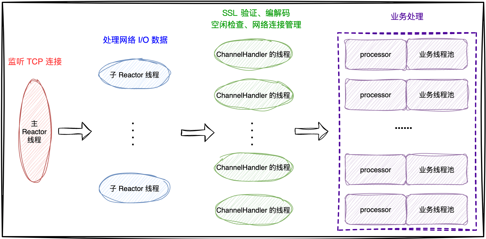
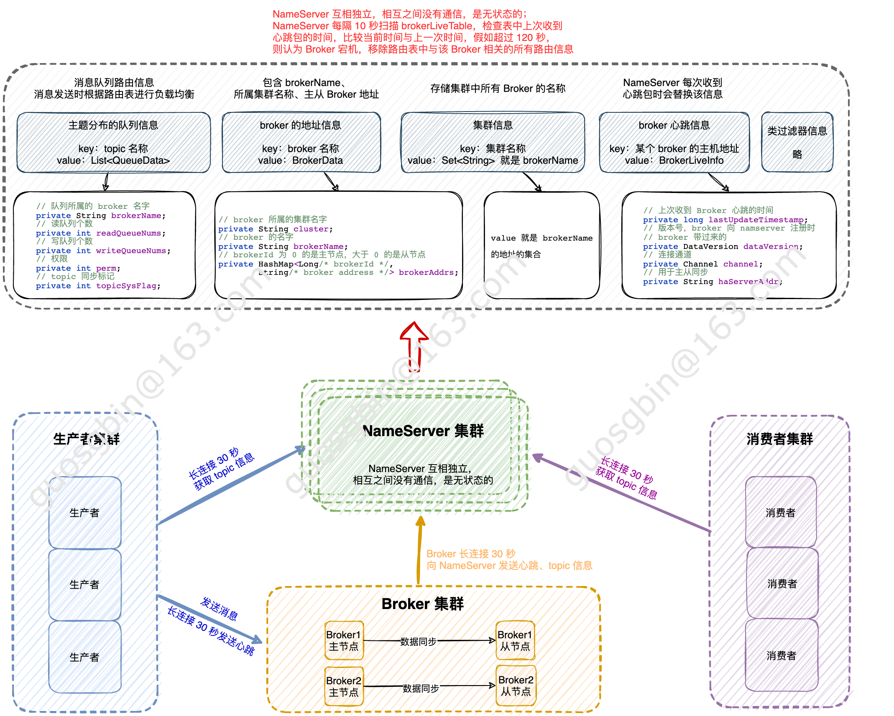
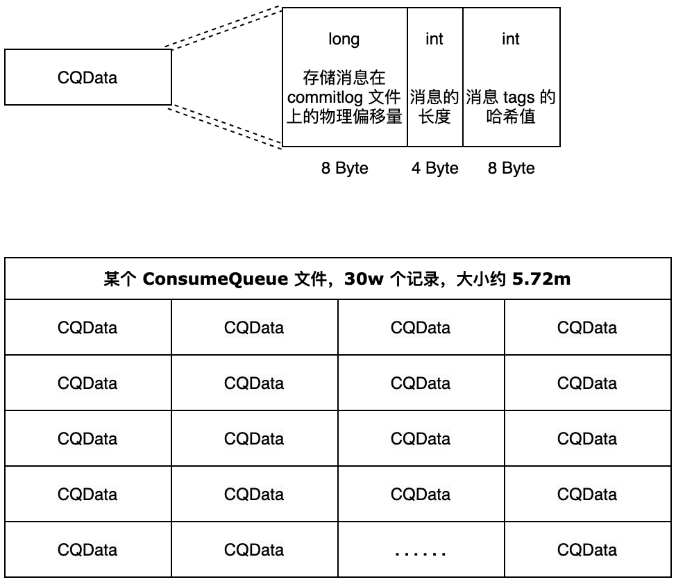
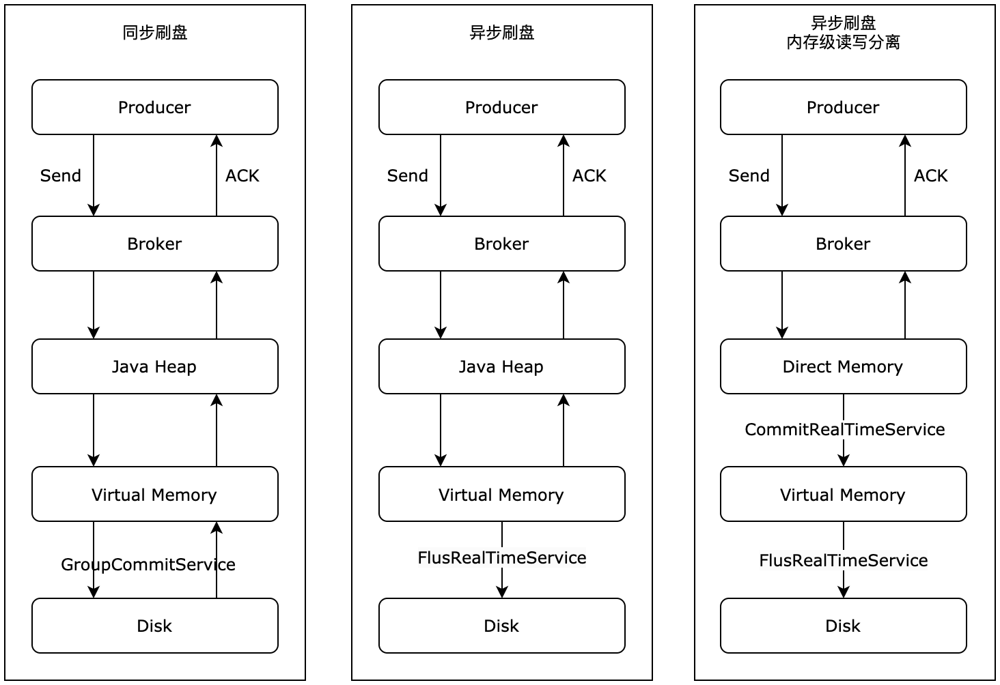
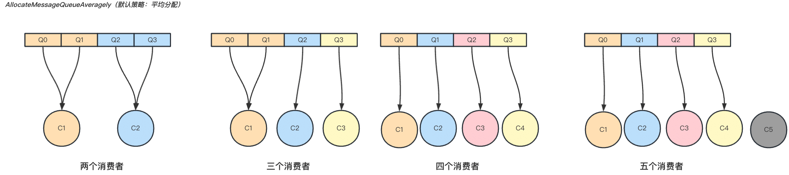
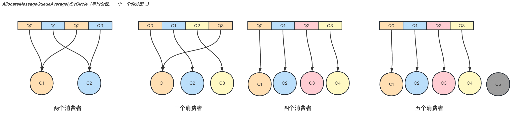

| 版本 | 内容                 | 时间                   |
| ---- | -------------------- | ---------------------- |
| V1   | 新建                 | 2025年04月21日22:30:51 |
| V2   | 修改错误点，完善文案 | 2026年06月23日14:12:28 |

## RocketMQ 各个角色



**Producer**

- 消息发布的角色，支持分布式集群方式部署。
- Producer 通过 MQ 的**负载均衡**模块选择相应的 Broker 集群队列进行消息投递，投递的过程支持快速失败并且低延迟；
- 支持消息重试机制，**其中同步发送模式默认开启自动重试**，异步发送与单向发送默认不生效。

---

**Consumer**

- 支持分布式集群方式部署；
- 支持 push 推、pull 拉两种模式对消息进行消费；**其中 push 模式底层基于长轮询 Pull 封装实现，由 Broker 在消息就绪时响应挂起的客户端请求，而非服务端主动推送**。
- 同时也支持集群方式和广播方式的消费；

---

**NameServer**

NameServer 是一个轻量级的 Topic 路由注册中心，支持 Topic、Broker 的动态注册与发现。

主要包括两个功能：

- **Broker 管理**：NameServer 接受 Broker 集群的注册信息并保存，作为路由信息的基础数据；同时**提供心跳检测机制**，定期扫描 Broker 心跳状态，**超过 120s 未收到心跳则将该 Broker 从路由列表中剔除**。

- **路由信息管理**：每个 NameServer 都会保存 Broker 集群的**完整路由信息和客户端查询所需的队列信息**；Producer 和 Consumer 通过 NameServer 获取整个 Broker 集群的路由信息，进而完成消息的投递与消费。


NameServer 属于几乎无状态节点，可集群部署，**节点之间无任何信息同步**。Broker 会向集群中每一台 NameServer 注册自己的路由信息，因此**每一个 NameServer 实例都保存一份完整的路由信息**。当某台 NameServer 下线时，Broker 仍可向其余 NameServer 同步路由信息，Producer 与 Consumer 也可动态感知 Broker 路由的变化。

---

**BrokerServer**

Broker 主要负责**消息的存储、投递和查询**以及服务高可用保证，为实现这些功能，Broker 包含以下几个重要子模块：

1. Remoting Module：整个 Broker 的实体，负责处理来自 Client 端的请求；
2. Client Manager：负责管理客户端( Producer / Consumer )和维护 Consumer 的 Topic 订阅信息；
3. Store Service：提供封装好的 API 接口，实现消息存储到物理硬盘与消息查询功能；
4. HA Service：高可用服务，提供 Master Broker 和 Slave Broker 之间的数据同步功能；支持同步复制与异步复制两种策略；
5. Index Service：根据指定的 Message Key 对投递到 Broker 的消息构建索引，实现消息的快速查询；

---

**Broker 部署规则**：采用 Master-Slave 架构，Broker 分为 Master 与 Slave 两种角色。一个 Master 可以对应多个 Slave，但一个 Slave 只能对应一个 Master。**Master 与 Slave 的对应关系通过相同的 BrokerName + 不同的 BrokerId 定义，BrokerId 为 0 表示 Master，非 0 表示 Slave**，Master 节点也支持多实例部署。

## RocketMQ 的 Reactor 多线程模型



RocketMQ 的 Reactor 多线程模型是其网络通信模块（基于 Netty 实现）采用的**高效异步事件驱动模型**，主要用于处理客户端与 Broker 之间的**网络连接管理、消息读写与协议处理**，具备高性能、低延迟、高可扩展性的特点。整体采用经典的主从多线程 Reactor 架构，按职责划分为四层处理链路，对应图示从左到右的流转流程。

- **Main Reactor 线程**：
  - **核心职责**：专门负责监听 TCP 端口，接收客户端的连接请求，完成 TCP 三次握手后将新连接分发给 Sub Reactor 线程池中的线程，同时处理连接建立、销毁等生命周期相关逻辑。
  - **实现细节**：在 RocketMQ Broker 中，Main Reactor 对应 Netty 的 Boss 线程组，默认配置为 1 个线程，单线程处理所有新连接的接入，避免多线程竞争监听端口。

- **Sub Reactor 线程池**：
  - **核心职责**：由多个 IO 工作线程组成，每个线程负责管理一部分已建立的连接，**监听并处理连接上的读写 IO 事件**。
  - **处理流程**：接收 Main Reactor 分配的连接后，**将连接注册到自身的事件循环中，监听读事件**；当连接上有数据可读时，完成数据的读取操作；需要返回响应时，负责将数据写回客户端。
  - **关键边界**：Sub Reactor 线程仅负责 IO 读写与 Pipeline 内的协议层处理，**不执行任何核心业务逻辑**，避免业务耗时阻塞 IO 线程，影响其他连接的响应。
  - **实现细节**：对应 Netty 的 Worker 线程组，**线程数量通常与 CPU 核心数挂钩**；线程全程采用事件驱动机制，无事件时阻塞等待，有事件时触发处理，避免线程空转。

- **处理器 ChannelHandler 的线程**：
  - **核心职责**：在 IO 线程读取到网络数据后、业务逻辑执行前，完成网络协议层面的前置处理，包括 SSL 验证、报文编解码、空闲连接检测、网络连接状态管理等。
  - **线程归属说明**：这部分逻辑以 ChannelHandler 的形式挂载在 Netty 的 Pipeline 中，**默认全部在 Sub Reactor（IO 线程）中串行执行**，并没有独立的专属线程池。只有为 Handler 显式配置独立 EventExecutorGroup 时才会切换线程。

- **业务线程池**：
  - **核心职责**：负责执行核心业务逻辑，是真正处理请求的环节。
  - 处理流程：
    - 协议层处理完成后，会根据请求的 `requestCode` 匹配对应的业务处理器 Processor；
    - Processor 将完整的业务处理逻辑封装为 Runnable 任务，提交到对应的业务线程池中异步执行；
    - 业务处理完成后，若需要返回响应，再通过 Sub Reactor 线程将响应数据写回客户端。
  - 实现细节：RocketMQ Broker 采用**按请求类型隔离线程池**的设计，而非统一线程池，例如发送消息、拉取消息、管理指令、心跳注册等不同请求分别使用独立的线程池，避免某类慢请求拖垮整体服务的处理能力，保障核心链路的稳定性。


---

**核心优点**

- **高并发处理能力**

  通过多 Sub Reactor 线程分担 IO 压力，配合分层的业务线程池隔离，可同时承载大量客户端连接与并发请求，充分利用多核 CPU 性能，显著提升系统吞吐量与并发处理能力。

- **低线程切换开销**

  基于事件驱动机制，仅在有 IO 事件或业务任务时触发线程执行，避免了传统阻塞 IO 模型中 “一连接一线程” 带来的大量线程上下文切换开销，降低系统资源消耗，提升响应速度。

- **灵活的可扩展性**

  可根据业务负载灵活调整 Sub Reactor 线程数、各业务线程池的核心线程数，按需扩容处理能力；各层职责边界清晰，网络层与业务层解耦，便于代码维护与功能扩展。

- **资源高效利用**

  IO 线程与业务线程职责分离，IO 线程专注处理网络事件，业务线程专注执行业务逻辑，避免线程闲置与资源浪费；线程池的隔离设计也能实现流量错峰与资源隔离，提升整体资源利用率。

## RocketMQ 的路由信息交互



NameServer 是 RocketMQ 的轻量级路由注册中心，采用无状态集群设计，负责维护 Broker 集群的全量路由信息，为生产者、消费者提供 Topic 路由查询能力，支撑消息的投递与消费全链路。

**一、NameServer 集群核心特性**

- NameServer 集群节点互相独立，节点之间无任何通信与数据同步，属于无状态节点。

- Broker 启动后会向集群中**每一台 NameServer 全量注册自身信息**，因此每个 NameServer 实例都保存完整的集群路由数据。

- 单台 NameServer 下线不影响整体路由服务，Broker 与客户端可自动切换到其他可用节点。

---

**二、NameServer 存储的核心路由元数据**

NameServer 内存中维护多组 Hash 结构存储路由信息，对应图示从上到下分别为：

**主题分布信息（topicQueueTable）**

- key：Topic 名称
- value：`List<QueueData>`，记录该 Topic 下所有队列的元数据
- 核心字段：所属 Broker 名称、读队列数量、写队列数量、队列权限、Topic 同步标记、系统属性标记
- 作用：消息发送时，生产者基于该表执行队列级负载均衡

**Broker 地址信息（brokerAddrTable）**

- key：Broker 名称
- value：`BrokerData`，记录单个 Broker 节点的集群归属与地址信息
- 核心字段：所属集群名称、Broker 名称、BrokerId（0 表示 Master 主节点，大于 0 表示 Slave 从节点）、Broker 地址集合
- 作用：维护 Broker 名称到实际物理地址的映射，区分主从节点

**集群信息（clusterAddrTable）**

- key：集群名称
- value：`Set<String>`，即该集群下所有 Broker 名称的集合
- 作用：维护集群与 Broker 的归属关系，存储集群中所有 Broker 的名称

**Broker 心跳信息（brokerLiveTable）**

- key：单个 Broker 的主机地址
- value：`BrokerLiveInfo`，记录 Broker 存活状态与连接信息
- 核心字段：上次收到心跳的时间戳、Broker 启动时间戳、数据版本号、连接 Channel、主从同步 HA 服务地址
- 作用：用于心跳存活检测，NameServer 每次收到心跳包时更新该信息

**过滤器信息**

- 存储消息过滤相关的配置元数据，常规路由链路中不涉及核心流程。

---

**三、Broker 注册与心跳保活机制**

1. **启动注册**

   Broker 启动后，会向配置的所有 NameServer 节点发送注册请求，上报自身全量信息，包括：

   - Broker 基础信息：名称、IP 端口、所属集群、主从角色（BrokerId）
   - 自身托管的所有 Topic 信息与队列配置

   注册完成后，NameServer 会同步更新上述所有路由元数据表。

2. **定时心跳保活**

   - Broker 端：每 **30 秒**向所有 NameServer 发送一次心跳包（本质为增量 / 全量注册请求），同步最新的 Topic 配置，同时刷新 NameServer 上的心跳时间戳。

   - NameServer 端：后台运行定时任务，**每 10 秒扫描一次 brokerLiveTable**，比对当前时间与上次心跳时间；若超过 **120 秒**未收到 Broker 心跳，则判定该 Broker 宕机，移除路由表中该 Broker 对应的所有信息。

---

**四、Producer 路由获取与消息投递**

1. **连接建立**：生产者启动后与 NameServer 集群建立长连接，默认**选择一个可用节点交互**。
2. **定时拉取路由**：生产者每 **30 秒**主动从 NameServer 拉取关注的 Topic 路由信息，更新本地缓存。
3. **即时拉取触发**：若发送消息时本地缓存无对应 Topic 的路由信息，生产者会立即向 NameServer 发起路由查询，无需等待定时周期。
4. **路由使用**：**本地缓存路由**信息包含 Topic 对应的 Broker 列表、队列分布，生产者基于路由表执行**队列级负载均衡**，选择目标队列完成消息投递。
5. **Broker 心跳**：生产者与所有关联的 Broker 节点维持长连接，每 30 秒发送心跳，维持连接与生产权限。

> **高可用保障：故障自动切换**
>
> 客户端内部会完整保存所有 NameServer 的地址列表。当当前连接的 NameServer 节点出现故障（连接断开、请求超时、响应异常）时，客户端会自动从地址列表中按顺序切换到下一个可用节点，重建连接并继续提供路由服务，不会因为单台 NameServer 宕机而影响业务可用性。

---

**五、Consumer 路由获取与消息消费**

1. **连接建立**：消费者启动后与 NameServer 集群建立长连接。
2. **定时拉取路由**：消费者每 **30 秒**从 NameServer 拉取订阅 Topic 的路由信息，更新本地缓存，明确 Topic 的消息分布在哪些 Broker 节点上。
3. **即时拉取触发**：订阅新 Topic 或本地路由缺失时，消费者会主动立即向 NameServer 查询路由。
4. **路由使用**：消费者基于路由信息确定需要连接的 Broker 节点，建立连接后执行消息拉取 / 推送、队列负载均衡等消费逻辑。
5. **Broker 心跳**：消费者与所有关联的 Broker 节点维持长连接，心跳默认 30 秒一次，作用是告知 Broker 消费者在线、同步订阅关系与消费组信息。消费进度（Offset）上报是独立任务，默认 **5 秒**执行一次.

---

**六、路由变更的感知机制**

Broker 宕机、扩容等路由变更场景下，客户端无法实时感知，存在一定延迟：

- 常规路径：**等待下一次 30 秒定时路由拉取，更新本地缓存后感知变更。**
- 快速感知：若客户端与 Broker 的长连接直接断开（如 Broker 进程退出、网络中断），客户端会立即感知连接异常，主动触发路由重拉与 Broker 重连，缩短感知延迟。

## RocketMQ 的服务端和客户端

RocketMQ 包含四大核心角色，区分 Netty 服务端、客户端的核心判定标准：**监听端口、被动接收 TCP 连接为服务端；主动发起 TCP 连接为客户端**。各角色在不同交互链路下的身份划分如下：

- **NameServer**：纯服务端
  - 自身固定监听端口，被动接收外部所有节点的连接请求；
  - Broker 主动连接它完成注册、心跳上报；Producer、Consumer 主动连接它查询 Topic 路由信息；
  - NameServer 永远不会主动向 Broker、生产者、消费者发起 TCP 连接。

- **Broker（master 和 slave）**：兼具服务端 + 客户端双重身份
  - 作为 Netty 客户端的场景
    - 与 NameServer 交互：Broker 主动发起连接，向所有 NameServer 注册自身信息、定时发送心跳保活；
    - 主从数据同步场景：Slave 主动建立 TCP 连接拉取 Master 的消息数据，此时 Slave 是客户端，Master 为服务端。

  - 作为 Netty 服务端的场景
    - Broker 监听业务端口，被动接收 Producer、Consumer 的连接，处理消息发送、消息拉取、心跳、消费进度提交等所有客户端请求。

- **Producer**：客户端。
  - 主动连接 NameServer，定时拉取 Topic 路由元数据；
  - 根据路由信息主动建立与对应 Broker 的长连接，完成消息发送、定时上报生产心跳。

- **Consumer**：客户端。
  - 主动连接 NameServer，拉取订阅 Topic 的路由信息；
  - 主动和 Topic 分布的全部 Broker 建立长连接，执行消息拉取、上报消费心跳、提交消费偏移量；
  - 补充关键细节：Push 消费只是上层封装语义，底层仍是 Consumer 主动发起长轮询 Pull 请求，Broker 不会主动推送数据，消费者永远不会开启监听端口充当服务端。


## Broker 注册、保活与宕机判定机制

**一、Broker 注册到 NameServer 的过程**

Broker 启动时会向配置的**所有 NameServer 节点发起注册**，完成自身元数据与 Topic 路由信息的全量上报，具体流程如下：

- **发起注册请求**

  Broker 启动后，主动与集群中每一台 NameServer 建立 TCP 连接，并发送注册请求。请求中携带完整的 Broker 元数据：Broker 地址（IP + 端口）、BrokerId（区分主从）、Broker 名称、所属集群名称、主节点地址（从节点携带）、消息过滤服务配置、全量 Topic 配置与队列信息等。

- **NameServer 数据更新流程**

  NameServer 收到注册请求后，由 `RouteInfoManager` 统一处理，全程通过可重入写锁（ReentrantReadWriteLock）保证并发场景下的数据一致性，执行以下更新操作：

  - 查找集群名称对应的 Broker 集合，不存在则新建集合，将当前 Broker 名称加入集合；

  - 初始化或更新 `BrokerData` 对象，维护 Broker 名称与主从地址的映射关系；
  - 更新 Topic 路由表（topicQueueTable），同步该 Broker 托管的所有 Topic 队列信息；
  - 在 `brokerLiveTable` 中写入 Broker 存活信息，包括当前时间戳、Topic 配置版本、连接 Channel、HA 服务地址等。

---

**二、Broker 在 NameServer 的保活机制**

Broker 通过周期性心跳维持在 NameServer 中的存活状态，同时同步 Topic 配置的动态变更：

- Broker 启动后，每隔 **30 秒**向所有 NameServer 节点发送一次心跳包；
- 心跳请求复用 `REGISTER_BROKER` 指令，请求头携带 Broker 基础信息，请求体携带最新的 Topic 配置，本质是周期性的增量 / 全量注册；
- NameServer 收到心跳后，更新 `brokerLiveTable` 中对应 Broker 的最后更新时间戳，同时同步更新 Topic 路由配置，实现 Topic 的动态扩缩容。

---

**三、NameServer 判定 Broker 宕机的机制**

NameServer 通过定时扫描 + 连接事件监听双机制判定 Broker 存活状态，具体规则如下：

- **定时心跳超时检测**

  NameServer 控制器初始化时，会启动定时线程池，每隔 **10 秒**执行一次 Broker 存活扫描任务：

  - 遍历 `brokerLiveTable` 中所有 Broker 条目，比对当前系统时间与该 Broker 的最后心跳更新时间；
  - 若时间差超过默认超时阈值 **120 秒**，则判定该 Broker 已宕机。

- **宕机后的处理动作**

  判定 Broker 宕机后，NameServer 会执行以下清理操作：

  - 主动关闭与该 Broker 对应的 TCP 连接 Channel；
  - 加写锁清理本地所有路由表中该 Broker 的相关数据，包括集群 Broker 集合、Broker 地址表、Topic 队列表、存活信息表等；
  - NameServer 不会向 Broker 发送注销请求，也不会主动向 Producer、Consumer 推送路由变更通知，仅清理本地数据。

- **连接断开的快速感知**

  除了定时心跳超时扫描，NameServer 还会监听 Channel 关闭事件。当 Broker 进程退出、网络中断导致 TCP 连接主动断开时，NameServer 会立即触发路由清理逻辑，感知速度远快于 120 秒的超时扫描。

---

**四、Broker 主动下线流程**

若 Broker 执行正常关机操作，会走主动注销流程，无需等待心跳超时：

- **Broker 主动发起注销**

  Broker 在进程关闭前，会向所有 NameServer 节点发送 `UNREGISTER_BROKER` 注销请求，告知自身即将下线。NameServer 收到请求后，加写锁清理该 Broker 对应的全部路由数据。

- **客户端路由变更感知**

  无论 Broker 是异常宕机还是主动下线，NameServer 都不会主动向 Producer、Consumer 推送路由变更通知。

  客户端通过两种方式感知路由变化：

  - 定时拉取：默认每 30 秒主动向 NameServer 拉取最新路由信息，更新本地缓存；
  - 连接异常触发：当客户端与 Broker 的连接断开时，会立即主动触发路由重拉，加快变更感知速度。

这种设计是为了简化 NameServer 的实现逻辑，保持其轻量、无状态的特性，避免维护大量客户端连接与推送状态，降低架构复杂度。

## 生产者消费者如何获取的路由信息

**一、与 NameServer 建立长连接**

Producer 和 Consumer 启动时，会根据配置的 NameServer 地址列表与 NameServer 集群建立长连接，支撑后续路由查询、元数据交互等操作。

- 单个客户端实例**同一时间仅与 NameServer 集群中的一个可用节点**建立长连接，并非同时连接集群内所有节点；
- 配置的全量地址列表用于故障自动切换：当当前连接的 NameServer 节点出现连接断开、请求超时等异常时，客户端会自动切换到地址列表中的下一个可用节点并重建连接，保障路由服务不中断。

---

**二、路由信息拉取机制**

客户端通过「即时触发 + 定时周期拉取」的组合机制获取路由，兼顾首次使用的实时性与运行过程中的时效性。

- **定时周期拉取**

  Producer 和 Consumer 后台均运行定时拉取任务，**默认每 30 秒**周期性地从 NameServer 拉取已关注 Topic 的最新路由信息，同步 Broker 扩容、宕机、Topic 队列调整等集群变更，保证本地路由与集群状态一致。

- **即时触发拉取**

  除了定时周期，以下场景会立即触发路由拉取，无需等待定时窗口：

  - Producer 发送某 Topic 的第一条消息时，若本地无对应路由缓存，会立刻向 NameServer 查询该 Topic 的完整路由（包含队列分布、Broker 地址等）；

  - Consumer 启动后执行 Topic 订阅动作时，会立即触发路由拉取，用于后续与 Broker 建连、消费队列负载均衡等前置操作；

  - 出现消息发送失败、与 Broker 连接断开、本地路由缺失等异常时，客户端会主动重拉路由，快速感知集群变化。

---

**三、本地路由缓存机制**

Producer 和 Consumer 获取到路由信息后，会将数据缓存到本地内存，避免每次消息收发都发起远程查询，提升处理效率。

- 本地路由缓存**没有主动过期机制**，每次拉取到最新路由数据后，直接覆盖本地旧数据完成更新；
- Producer 侧缓存 `TopicPublishInfo` 结构，包含 Topic 下的队列列表、Broker 地址映射等，用于消息发送时的队列级负载均衡；
- Consumer 侧缓存 `TopicSubscribeInfo` 结构，包含 Topic 的队列分布与 Broker 地址信息，用于消费队列分配与消息拉取寻址。

## 消息的类型

### 消息分类

RocketMQ 消息发送在发送方式上分为三种

1. **同步发送**：发送线程发出请求后阻塞等待，直到 Broker 返回发送结果（成功或失败）。可靠性最高，时延相对最高，适用于订单通知、重要数据同步等强可靠场景。
2. **异步发送**：发送线程发出请求后不阻塞，立即返回，通过注册的回调函数异步接收发送结果。兼顾性能与可靠性，适用于对响应时延敏感、同时需要感知发送结果的场景。
3. **单向发送**：发送线程发出请求后直接返回，不等待 Broker 响应，也不接收发送结果回调。性能最高、时延最低，但无法保证消息可靠送达，适用于日志上报、数据埋点等可容忍少量消息丢失的场景。

RocketMQ 在发送消息的类型分为以下几种

1. **普通消息**：无特殊功能属性的基础消息，是最通用的消息类型，无顺序、延迟等额外约束，适用于绝大多数异步解耦、流量削峰场景。
2. **批量消息**：将多条同 Topic、同 Tag 的消息打包为一次请求批量发送，可大幅减少网络 IO 次数，显著提升小消息场景下的发送吞吐量。
3. **顺序消息**：保证消息的消费顺序，分为两类：
   - 分区顺序：同一队列内的消息严格有序，是生产环境的主流实现方式；
   - 全局顺序：整个 Topic 内所有消息严格有序，吞吐量极低，仅适用于极小流量的特殊场景。
4. **延迟消息**：消息发送到 Broker 后，不会立即被消费者消费，需等待指定的延迟时长后才可被消费。RocketMQ 支持预设的固定延迟级别，适用于订单超时取消、定时提醒等场景。
5. **事务消息**：基于半消息 + 事务回查机制实现分布式事务，保证本地事务执行与消息发送的原子性，适用于需要保障数据一致性的分布式业务场景。

### 顺序消息

顺序消息是 RocketMQ 提供的一类具备有序语义的特殊消息，核心能力是保证**同一组关联消息的消费顺序与发送顺序严格一致**。其底层基于 MessageQueue 的 FIFO（先进先出）特性实现，分为全局顺序与分区顺序两种形态，其中分区顺序是生产环境的主流落地方案。

---

一、核心分类

根据有序范围的不同，RocketMQ 顺序消息分为两类，二者在实现成本、吞吐量上差异显著：

|   分类   |                           有序范围                           |                       实现方式                       |           吞吐量           |               适用场景               |
| :------: | :----------------------------------------------------------: | :--------------------------------------------------: | :------------------------: | :----------------------------------: |
| 分区顺序 | 同一业务标识（如订单 ID、用户 ID）的消息严格有序，不同标识间不保证顺序 | 相同业务 Key 的消息通过哈希路由到同一个 MessageQueue | 接近普通消息，性能损耗极小 | 绝大多数业务场景，是生产环境标准方案 |
| 全局顺序 |              整个 Topic 内所有消息全局严格有序               |     Topic 仅设置 1 个队列，所有消息进入同一队列      | 极低，受限于单队列读写性能 |    极小流量、强全局有序的特殊场景    |

1. **分区顺序**

分区顺序是 RocketMQ 顺序消息的核心设计，也是实际项目中唯一推荐的用法。它不追求全 Topic 全局有序，而是**按业务维度拆分有序范围**：

- 将同一个订单、同一个用户、同一个设备的消息归为一组，保证组内消息严格按发送顺序消费；
- 不同组的消息之间相互独立，可并行消费，以此兼顾有序性与吞吐量。

2. **全局顺序**

全局顺序是分区顺序的极端特例：**当 Topic 的队列数设置为 1 时，所有消息都进入同一个队列，天然实现全 Topic 全局有序。**

- 代价是整个 Topic 的读写能力完全受限于单台 Broker 的单队列性能，吞吐量下降一个数量级以上；
- 无法通过扩容 Broker 节点提升性能，仅适用于日志量极小的强一致场景。

---

**二、顺序保证的三层实现原理**

RocketMQ 从**生产端、Broker 存储端、消费端**三层协同配合，完整保障顺序消息的语义，三者缺一不可。

**① 生产端：保证同组消息写入同一队列**

顺序的前提是消息按顺序进入同一个队列，生产端负责将关联消息路由到同一个 MessageQueue。

- **核心机制**：通过 `MessageQueueSelector` 队列选择器，基于业务 Key（如 orderId、userId）做哈希取模，将相同 Key 的消息固定路由到同一个 MessageQueue 中。

- 发送方式约束：必须使用**同步发送**。

  若使用异步发送，可能因网络延迟、发送失败重试导致消息到达 Broker 的顺序与业务发送顺序不一致，直接破坏有序性；同步发送可保证前一条消息写入成功后，再发送下一条消息，严格控制入队顺序。

- **重试注意**：发送失败自动重试可能导致消息乱序（重试间隙中后续消息先写入队列），因此**顺序消息通常建议关闭自动发送重试**，由业务层自行处理发送异常，保证严格顺序。

**② Broker 存储端：队列天然 FIFO 有序**

RocketMQ 的存储设计天然支持队列内有序，是顺序消息的底层基础：

- MessageQueue 是逻辑上的先进先出队列，消息写入 CommitLog 后，会按写入顺序构建 ConsumeQueue 索引；
- 同一个 MessageQueue 内的消息，在 ConsumeQueue 中严格按偏移量递增排列，存储顺序与写入顺序完全一致；
- 消费者拉取消息时，按偏移量从小到大顺序拉取，从存储层面保证了消息读取的顺序性。

**③ 消费端：保证单队列单线程消费**

仅队列有序不足以保证消费有序，消费端必须通过机制避免并发消费打乱顺序。

- **必须使用顺序消费监听器**：消费端需注册 `MessageListenerOrderly`，而非普通并发消费的 `MessageListenerConcurrently`，二者核心差异就是有序性保证。
- **三层约束保障消费有序**：
  - **队列分配约束**：集群消费模式下，同一个消费组内，一个 MessageQueue 只会分配给一个消费者实例，避免多实例同时消费同一队列。
  - **消费锁机制**：消费者内部会为每个分配到的队列加消费锁，保证**同一时间同一个队列只会被线程池中的一个线程处理**，线程池为所有队列共享，既保证顺序又兼顾线程资源复用。
  - **失败阻塞重试**：顺序消费时，若某条消息消费失败，消费端会自动原地重试，**并且阻塞当前队列的后续消费**，直到该消息消费成功，避免跳过消息导致顺序错乱。

---

**三、核心特性与关键注意事项**

**① 消费失败的阻塞特性（与并发消费核心区别）**

这是顺序消息最容易踩坑的特性：

- 普通并发消费：单条消息消费失败，会转入重试队列，不影响后续消息的消费，不会阻塞队列。
- 顺序消费：单条消息消费失败，会持续原地重试，**阻塞当前队列的所有后续消息**，直到消费成功。

使用建议：

- **消费逻辑必须做好异常捕获、幂等校验，避免因偶发业务异常导致队列永久阻塞；**
- 可根据业务配置最大重试次数，超过阈值后转入死信队列并告警，人工介入处理。

**② 热点 Key 数据倾斜**

分区顺序依赖业务 Key 的哈希路由，若某个 Key 的消息量极大（如热点大订单、平台核心用户），会导致对应队列流量远高于其他队列，出现数据倾斜，成为整体吞吐量的瓶颈。

设计时需选择分布均匀的业务 Key，避免热点集中；极端场景下可对热点 Key 做二次拆分。

**③ 使用模式限制**

- 仅**集群消费模式**支持完整的顺序消费语义；广播模式下每个消费者都会消费全量队列，虽单消费者内部可保证顺序，但无全局有序意义，不推荐搭配使用。
- 顺序消息不支持并发拉取、异步消费等吞吐量优化，消费性能低于并发消费模式。

**④ Broker 故障的影响**

若某 Broker 节点宕机，其托管的队列会由从节点接管或转移到其他节点，**切换过程中可能出现短暂的消费中断，但恢复后队列内的消息偏移量顺序保持一致，不会出现乱序。**

### 延迟消息

延迟消息是 RocketMQ 的核心特性之一，核心定义为：消息发送到 Broker 后，不会立即被消费者消费，需等待预设的延迟时长后，才会被投递给消费者进行处理。该特性无需额外引入独立定时任务组件，即可实现分布式环境下的延时调度，广泛用于超时处理、定时触发类业务场景。

---

**一、版本差异与核心分类**

RocketMQ 的延迟消息实现分为两个大版本，设计思路和能力边界差异显著：

- **4.x 及更早版本**：仅支持**固定延迟级别**的延迟消息，灵活性有限但性能稳定，是生产环境长期主流的方案；
- **5.x 及之后版本**：新增**任意时间定时消息**，支持毫秒级精度、任意时长的延迟，能力大幅增强。定时时长最大值**默认为24小时**，不支持自定义修改。

---

**二、4.x 固定级别延迟消息**

这是最经典、应用最广泛的实现方案，通过预设的延迟级别控制延时，不支持自定义任意时间。

RocketMQ 内置 18 个固定延迟级别，级别从 1 开始计数，每个级别对应固定的延迟时长：

| 级别 | 延迟时长 | 级别 | 延迟时长 | 级别 | 延迟时长 |
| ---- | -------- | ---- | -------- | ---- | -------- |
| 1    | 1 秒     | 7    | 3 分钟   | 13   | 9 分钟   |
| 2    | 5 秒     | 8    | 4 分钟   | 14   | 10 分钟  |
| 3    | 10 秒    | 9    | 5 分钟   | 15   | 20 分钟  |
| 4    | 30 秒    | 10   | 6 分钟   | 16   | 30 分钟  |
| 5    | 1 分钟   | 11   | 7 分钟   | 17   | 1 小时   |
| 6    | 2 分钟   | 12   | 8 分钟   | 18   | 2 小时   |

**实现原理**

4.x 延迟消息的核心设计是「**临时主题存储 + 定时扫描转投**」，整体流程分为三步：

**① 消息写入：替换主题存入调度队列**

生产者发送延迟消息后，Broker 不会直接将消息存入业务 Topic，而是做一次主题与队列的替换：

- 将消息主题替换为系统内置调度主题 `SCHEDULE_TOPIC_XXXX`；
- 队列编号为「延迟级别 - 1」，即**每个延迟级别对应一个独立的逻辑队列**，互不干扰；
- 消息内部会记录原始业务 Topic、原始队列、目标投递时间等元数据。

所有延迟消息与普通消息共享 CommitLog 存储体系，持久化机制完全一致，保证数据可靠性。

**② 定时调度：按级别扫描到期消息**

Broker 后台的 `ScheduleMessageService` 组件负责延迟消息的调度：

- **每个延迟级别对应一个独立的调度线程**，彼此隔离，避免不同级别互相影响；
- **线程默认每 1 秒扫描一次对应队列的消息**，比对当前时间与消息的目标投递时间；
- 未到期的消息直接跳过，等待下一次扫描周期。

**③ 到期转投：还原为普通业务消息**

**当扫描到已到期的消息时，Broker 会将消息重新投递到原始的业务 Topic 队列中：**

- 重新写入一条消息到 CommitLog，主题还原为业务 Topic；
- 此时消息完全等同于普通消息，消费者可正常拉取消费。

**优缺点**

- 优点：实现简单、稳定性高、性能损耗小，与普通消息共享存储，无额外组件依赖。
- 缺点：灵活性差，仅支持 18 个固定时长，无法满足自定义任意时间的延迟需求；调度精度为秒级，存在最高 1 秒的理论误差。

---

**三、5.x 任意时间定时消息**

RocketMQ 5.0 正式推出定时消息（Timer Message）能力，打破了固定级别的限制，支持任意毫秒精度的延迟时长。但是默认精度为1000ms，即定时消息为秒级精度。

发送时可直接通过 API 指定延迟毫秒数，或指定消息投递的目标时间戳，无需再映射延迟级别，使用更灵活。

**实现原理**

5.x 基于「时间轮思想 + 专用定时存储」实现，核心流程如下：

- **核心组件**：
  - **TimerLog**：**定时消息元数据日志。**采用顺序追加写模式，只存储消息的调度元数据，不存完整消息内容，每条记录固定 52 字节，核心字段包括：消息在 CommitLog 中的物理偏移量与大小，用于到期后回查完整消息；消息到期时间戳、原始业务 Topic 哈希值；同槽位链表的前向指针，用于构建时间槽内的消息链表。
  - **TimerWheel**：**时间轮索引文件。**时间轮的磁盘物理载体，是固定大小的索引文件，默认 1 秒为一个时间槽，共 1209600 个槽，对应 14 天的物理窗口。每个槽固定 32 字节，记录：该槽对应的绝对到期时间戳；该槽对应消息链表的头尾指针（指向 TimerLog 中的偏移量）；该槽内的消息总数。
  - **TimerCheckPoint**：检查点文件：存储调度进度、刷盘位置等元数据，用于 Broker 重启、主从切换后恢复调度状态，保证消息不丢、不重复调度。
- **完整流程**：
  - **消息写入与索引构建**：
    - 生产者发送消息时指定目标投递时间戳，Broker 收到后先正常写入 CommitLog 持久化，同时分发到系统内置定时主题 `rmq_sys_wheel_timer`；
    - 入队线程消费该系统主题的消息，生成 TimerLog 元数据记录，顺序追加写入 TimerLog 文件；
    - 根据消息到期时间戳计算对应的时间轮槽位，更新该槽的尾指针、消息总数，将新记录接入该槽的消息链表尾部。
  - **时间轮指针调度**：调度线程按固定精度（默认 1 秒）匀速推进时间指针，无需全量扫描所有消息：
    - 指针每走到一个槽位，直接读取该槽的链表头指针；
    - 顺着 TimerLog 链表遍历该槽内的所有到期消息，无需扫描其他槽位；
    - 处理完当前槽的全部消息后，指针前进到下一个槽，循环往复。
  - **到期消息转投**：
    - 调度线程根据 TimerLog 记录中的 CommitLog 偏移量，读取完整的原始消息；
    - 将消息重新写入原始业务 Topic 的 CommitLog，生成 ConsumeQueue 索引；
    - 消息转为普通消息状态，消费者可正常拉取消费。


**核心优势**

- 灵活性强：支持任意毫秒级延迟，不再受固定级别限制；
- 调度高效：基于时间轮分片调度，避免全量扫描，高堆积场景下性能更稳定；
- 时长上限高：最长支持 2 年的超长时间延迟，满足长周期定时业务。

### RocketMQ 5 之前的精准精度延迟消息的实现

**方案 1：MySQL 延时任务完整落地方案（中小公司最通用）**

适用场景：自定义任意时分秒延迟、多天超长定时、无 Redis 依赖、中小公司通用方案

核心流程：

1. 业务产生延时需求 → 插入 `delay_task` 待执行任务表；
2. 分布式定时任务（XXL-Job）**60s 轮询一次**（不每秒扫），批量捞出到期任务；
3. 循环发送普通 RocketMQ 消息；
4. 发送成功：更新任务状态为已完成，异步归档到日志表；
5. 发送失败：保留原任务，下次轮询重试；超过最大重试次数标记失败，人工处理；
6. 凌晨低峰定时清理历史归档数据，避免表膨胀。

优点：

- 支持任意延迟时长：几分钟、几天、数月都能实现；
- 数据持久化可靠，服务重启任务不丢失；
- 实现简单，学习成本低，中小团队快速落地。

缺点：

- 精度最低 1 分钟，无法做到毫秒级；
- 高并发场景 MySQL 查询、更新存在性能瓶颈；
- 需要维护定时任务、分布式锁、归档清理一整套逻辑；
- 大量任务同时到期会堆积，延迟持续放大。

---

方案 2：Redis Zset 落地方案（秒级精度）

- 每个自然分钟对应一个独立 ZSet Key，到期任务天然分到对应分钟集合；
- 任务详情统一独立 String 存储，与分片 ZSet 解耦；
- 消费只扫描当前 / 近几分钟分片，无需遍历全量数据；
- 分片全部处理完可直接删除整个 ZSet，清理效率极高；
- 分片独立分布式锁，多服务实例可并行处理不同分钟，并发更强。

> **超长延时（>7 天）长期占用 Redis 内存**
>
> 规避：超过 7 天的任务不走 Redis，存入 MySQL 延时任务表，轮询 DB 提前将一批数据加载到 redis。

### 事务消息

事务消息是 RocketMQ 最核心的高级特性之一，本质是**基于半消息 + 两阶段提交 + 事务回查实现的分布式最终一致性方案**，核心目标是保证「生产者本地事务执行」与「消息投递」两个跨节点操作的原子性，避免出现 “本地事务提交成功但消息丢失”“消息投递成功但本地事务回滚” 的不一致问题。

**一、核心概念：**

- **半消息（Half Message）**：生产者第一阶段发送的暂存消息。消息已持久化到 Broker，但被存储在系统专属主题中，对所有业务消费者完全不可见，相当于事务的 “未提交状态”。
- **两阶段提交**：事务消息的核心执行模型，分为两个阶段：
- - 第一阶段：发送半消息，暂存到 Broker；
  - 第二阶段：根据本地事务执行结果，向 Broker 提交 Commit（确认投递）或 Rollback（回滚删除）。
- **事务回查**：兜底补偿机制。如果第二阶段的确认请求丢失、生产者宕机，Broker 长时间收不到事务状态，会主动回调生产者，查询本地事务的最终状态，保证最终一致性。
- **系统内置主题**：Broker 内部用于事务消息流转的专属主题，对业务透明：
- - `RMQ_SYS_TRANS_HALF_TOPIC`：存储所有半消息；
  - `RMQ_SYS_TRANS_OP_HALF_TOPIC`：事务操作日志，记录已提交 / 回滚的半消息，用于回查时过滤已处理的消息。
- **事务监听器**：客户端需要实现的接口，包含两个核心方法：执行本地事务、回查本地事务状态。
- **生产者组**：同一类事务生产者的分组标识，Broker 回查时会从同组内随机选择一个生产者实例发起回调，实现回查的高可用。

---

**二、完整执行流程**

**正常两阶段提交流程（无异常）**

1. **发送半消息**：生产者向 Broker 发送半事务消息，消息携带完整的业务内容与事务标识。
2. **Broker 暂存响应**：Broker 收到半消息后，将消息持久化到系统半消息主题 `RMQ_SYS_TRANS_HALF_TOPIC`，对消费者不可见；持久化成功后向生产者返回 “半消息写入成功” 的确认。
3. **执行本地事务**：生产者收到半消息写入成功的响应后，执行本地数据库事务（如创建订单、扣减库存等业务操作）。
4. 提交事务状态：生产者根据本地事务的执行结果，向 Broker 发送二次确认：
   - 本地事务执行成功 → 发送 `Commit` 请求；
   - 本地事务执行失败 → 发送 `Rollback` 请求。
5. Broker 处理确认请求：
   - 收到 `Commit`：将半消息从半消息主题中还原，重新写入原始业务 Topic，生成消费索引，消息对消费者正式可见；
   - 收到 `Rollback`：标记消息为回滚状态，不会写入业务 Topic，后续由过期清理机制删除。
6. **消费者正常消费**：消息进入业务队列后，消费者按普通消息的拉取逻辑正常消费，全程无感知。
7. **记录操作日志**：Broker 处理完 Commit/Rollback 后，向 `RMQ_SYS_TRANS_OP_HALF_TOPIC` 写入一条操作记录，标记该半消息已处理，避免后续重复回查。

**异常场景：事务回查流程**

当第二阶段的确认请求丢失、生产者宕机，导致 Broker 长时间收不到事务状态时，会触发兜底的事务回查机制，流程如下：

1. Broker 后台定时扫描半消息主题，过滤掉已在操作日志中标记处理的消息；
2. 对于超过超时阈值仍未确认的半消息，根据消息携带的生产者组，从组内随机选择一个存活的生产者实例；
3. 向该生产者发起事务回查请求，查询对应本地事务的最终状态；
4. 生产者收到回查请求后，查询数据库中该事务的持久化状态，向 Broker 返回 Commit / Rollback / 未知；
5. Broker 根据回查结果执行对应操作：提交、回滚，或等待下一轮回查。

通过回查机制，即使生产者中途宕机、确认消息丢失，最终也能保证事务状态的一致性。

> **事务消息不是全链路分布式事务**，它只保证单跳的「本地事务 ↔ 消息投递」原子性，不能直接保证 A→B→C 全局一致。

## 本地消息表+最终一致性

多服务消息串联：A 服务（订单）→ MQ 消息 → B 服务（库存）→ MQ 消息 → C 服务（物流）

**一、核心原理**

**无本地消息表的痛点**：业务数据库操作、发送 MQ 分属两个独立资源，无法原子绑定，存在两种不一致：

1. MQ 发送成功，数据库事务异常回滚 → 下游收到无效脏消息
2. 数据库事务提交成功，MQ 发送超时 / 宕机 → 下游收不到消息，业务断层

**原理**：

1. **剥离 MQ 发送逻辑出数据库事务**：事务内只做两件事：**执行业务 SQL、插入消息记录到本地消息表**，全程不调用 MQ 发送接口；
2. 事务要么全部成功，要么全部回滚：
   - 事务异常回滚：业务数据、消息记录一起消失，不会产生待发送消息；
   - 事务正常提交：业务数据、消息记录永久落库；
3. 判定**事务成功**（事务方法无异常正常返回）后，**立刻启用独立线程异步发送 MQ**，绝大多数消息毫秒级送达下游；**发送成功直接更新消息状态**，定时任务不再处理这条数据；
4. **后台定时任务周期性扫描消息表**，读取待发送记录，重试推送 MQ，依靠无限重试保证消息最终投递。

---

**二、A→B→C 全链路一致性原理**

1. 起点 A、中转 B 都必须实现这套本地消息表 + 即时发送 + 定时兜底；末端 C 无需发下游，只做消费幂等；
2. 每一段链路独立保证原子性：上游业务和发给下游的消息绑定同一事务；
3. 正常链路：A 即时推送 B → B 消费事务生成消息即时推送 C；
4. 业务不可恢复异常（如库存不足）：中转服务生成补偿消息，反向推送上游执行回滚，整条链路回归一致状态。

---

**三、补偿消息**

RocketMQ 消费重试只能处理**临时故障**（数据库超时、网络抖动、MQ 短暂宕机），等待一段时间后可自动恢复。

出现**业务永久性不可恢复异常**，重试永远不会成功，此时必须生成补偿消息：

示例：

- A 创建订单（已落库，扣用户余额）→ 消息发给 B 库存服务
- B 查询库存，库存数量 = 0，业务上永远无法扣减，无论重试多少次都失败。

此时链路卡住：订单存在、钱被扣，但不会生成物流单，数据永久不一致。

解决方案：B 生成补偿消息发给 A，让 A 取消订单、退款，整条链路恢复一致。

**补偿消息的投递**：补偿消息的投递逻辑和普通消息完全一致，补偿消息写入 `local_msg` 之后，复用整套发送机制：

1. 事务提交成功 → 异步线程即时推送补偿 topic；
2. 发送失败，定时任务 30s 轮询重试，阶梯退避；
3. 重试耗尽标记死信，人工排查。

> C 也维护本地消息表，消费失败时事务内生成补偿消息发给上游 B，B 再补偿 A，自动完成全链路回滚。

---

**四、异常场景**

**场景 1：即时发送成功（99% 流量）**

1. 业务事务无异常，订单、local_msg 记录入库；
2. 异步线程立刻推送 MQ，发送成功更新 status=1；
3. 定时任务扫描直接跳过，下游毫秒级收到消息。

**场景 2：即时发送失败（网络波动、MQ 宕机）**

1. 事务正常提交，消息 status 保持 0；
2. 异步发送报错，不修改数据库；
3. 30s 后定时任务扫描到该记录，自动重试推送。

**场景 3：事务提交后、即时发送前服务宕机**

1. 数据库已持久化 status=0 的消息；
2. 服务宕机，即时发送逻辑未执行；
3. 服务重启后，定时任务自动补发，无消息丢失。

## 消息发送的 Broker 故障规避机制

**一、Broker 故障生产者感知延迟根源：NameServer 推拉模型**

NameServer 采用**无状态、被动推送**设计，不会主动向生产者推送路由变更；

生产者默认每 `30s`（`pollNameServerInterval`）定时拉取 Topic 路由队列分布信息。

1. 若 Broker 宕机 / 下线，路由变更不会立刻同步给生产者，**存在最长 30s 感知延迟**；
2. 特殊场景优化：**发送消息抛出路由异常时，生产者会立即主动拉取最新路由**，无需等待定时周期；
3. 感知延迟窗口期内，生产者仍持有旧路由，会持续向故障 Broker 投递消息，引发发送失败，因此需要多层故障规避机制降低失败率。

---

**二、消息级基础容错（默认永久开启，无需配置）**

针对单条消息发送失败，队列粒度自动规避故障节点：

**重试策略**：

- 同步 / 异步消息发送失败时，会自动执行内部重试；重试逻辑会**规避本次发送失败的队列**，优先切换当前 Topic 下其他正常 Broker 的队列发送；
- 若 Topic 所有队列全部不可用，无其他队列可切换，则依旧重试原故障队列；

效果：避免单条消息反复冲击同一故障队列，减少网络阻塞、超时堆积。

---

**三、生产者级延迟故障软隔离（需手动开启 sendLatencyFaultEnable=true）**

属于进阶容错，基于消息发送耗时动态屏蔽高延迟 / 故障 Broker，粒度为 Broker：

1. 设定一个时间阈值 A，当消息发送时间小于 A 时，认为 Broker 正常；当消息发送时间大于 A 时，则认为 Broker 可能存在问题。
2. **判定规则**：消息发送耗时超过对应阈值，判定该 Broker 存在性能 / 故障问题；
3. **隔离逻辑**：在预设屏蔽窗口期内，生产者不再向该 Broker 分配发送队列；屏蔽结束后自动恢复使用；
4. **适用场景**：Broker 未完全宕机，但网络卡顿、响应缓慢，提前隔离保障发送吞吐。

## broker 的存储目录

```
store
├── abort
├── checkpoint
├── commitlog
│   └── 00000000000000000000
├── config
│   ├── consumerFilter.json
│   ├── consumerFilter.json.bak
│   ├── consumerOffset.json
│   ├── consumerOffset.json.bak
│   ├── delayOffset.json
│   ├── delayOffset.json.bak
│   ├── subscriptionGroup.json
│   ├── subscriptionGroup.json.bak
│   ├── topics.json
│   └── topics.json.bak
├── consumequeue
│   ├── ScheduledTopic
│   │   ├── 0
│   │   │   └── 00000000000000000000
│   │   ├── 1
│   │   │   └── 00000000000000000000
│   │   ├── 2
│   │   │   └── 00000000000000000000
│   │   └── 3
│   │       └── 00000000000000000000
│   ├── SCHEDULE_TOPIC_XXXX
│   │   ├── 1
│   │   │   └── 00000000000000000000
│   │   └── 2
│   │       └── 00000000000000000000
│   ├── TopicTest
│   │   ├── 0
│   │   │   └── 00000000000000000000
│   │   ├── 1
│   │   │   └── 00000000000000000000
│   │   ├── 2
│   │   │   └── 00000000000000000000
│   │   └── 3
│   │       └── 00000000000000000000
│   └── TopicTest2
│       ├── 0
│       │   └── 00000000000000000000
│       ├── 1
│       │   └── 00000000000000000000
│       ├── 2
│       │   └── 00000000000000000000
│       └── 3
│           └── 00000000000000000000
├── index
│   └── 20220411232202751
└── lock
```

Broker 默认存储根目录：`${ROCKETMQ_HOME}/store`，内部包含各类消息存储、索引、元数据文件，各子目录作用如下：

- **commitlog**：消息主体存储目录，所有生产者发送的消息原始数据顺序写入此处。

  文件命名规则：以文件**起始物理偏移量**高位补 0 命名；单文件默认 1GB，可通过 `mapedFileSizeCommitLog` 调整。

  消息体完整存在 commitlog，是所有索引数据的数据源。

- **consumequeue**：消费队列索引目录，目录层级 `./consumequeue/Topic名称/QueueId/文件`。

  每条记录仅保存 `commitLog偏移、消息长度、tag哈希`，不存完整消息体，作为 CommitLog 的轻量化索引。

  **作用：消费者按队列顺序拉取消息、维护消费位点，避免全量扫描巨大 commitlog，提升消费查询性能。**

- **index**：消息检索索引目录，IndexFile 采用哈希链表结构，基于消息 `keys` 构建索引；

  **支持根据消息 Key 精确查询、按时间区间批量查询消息；文件以创建毫秒时间戳命名。**

- **config**：Broker 元数据持久化目录，定时将内存 Topic、订阅、位点信息刷盘，宕机重启依靠该目录恢复元数据；每个配置文件配套 `.bak` 备份文件。

  - consumerFilter.json：消息过滤订阅配置
  - consumerOffset.json：集群模式消费位点
  - delayOffset.json：延迟消息队列消费位点
  - subscriptionGroup.json：消费组订阅配置
  - topics.json：Topic 路由与属性配置

- **lock**：Broker 进程独占锁文件，防止多进程同时挂载同一 store 目录造成数据损坏。

- **abort**：异常关闭标记文件；正常执行 shutdown 关闭 Broker 会自动删除该文件；宕机、kill -9 异常终止则保留。

  Broker 重启时检测到 abort 存在，判定非正常关闭，主动校验修复 commitlog、重建损坏 index 索引。

- **checkpoint**：存储 commitlog、consumequeue、index 文件的最后刷盘时间戳；文件固定 4KB，仅前 24 字节有效，用于重启快速判断文件修复范围。

## RocketMQ 的存储架构

RocketMQ 采用**混合式存储架构**：Broker 内所有 Topic、所有队列的完整消息实体统一写入一份 CommitLog；再通过后台线程异步生成两套索引文件 ConsumeQueue、IndexFile，实现数据与索引分离存储，兼顾顺序写性能与消费检索效率。

**完整流程：**

1. Producer 发送消息，Broker 顺序写入 CommitLog，根据配置同步 / 异步刷盘；
2. 后台线程 ReputMessageService 持续扫描 CommitLog 新增数据；
3. 异步生成两类索引：ConsumeQueue（消费索引）、IndexFile（检索索引）；
4. 消费者拉取指定 Topic+QueueId 的 ConsumeQueue 索引，根据索引内物理 offset 读取 CommitLog 完整消息；
5. 消费位点持久化至 `config/consumerOffset.json`，重启后恢复消费进度。

### CommitLog：消息完整实体存储文件

**基础特性**

存储 Producer 发送消息的**全部原始数据**：包含消息 body、topic、queueId、tag、keys、时间戳、事务状态、重试标识等完整元数据，消息长度不固定。

- 单文件默认大小 1GB，配置项 `mapedFileSizeCommitLog` 可修改；

- 文件命名规则：20 位数字，高位补 0，数值等于**文件起始物理偏移量**。

  例：`00000000000000000000` 起始 offset=0，写满 1GB 后新文件 `00000000001073741824`；

- 写入模式：严格顺序追加写入，磁盘 IO 性能极高。

**高性能优化：mmap 零拷贝机制**

为**消除用户态与内核态之间的数据拷贝开销**，RocketMQ 使用 mmap 将磁盘 CommitLog 文件映射至进程虚拟内存，底层依托操作系统 Page Cache 缓存文件页，Page 默认 4KB：

- 读取时：数据命中 Page Cache 直接返回，无需磁盘 IO；
- 写入时：直接操作映射内存，**由内核异步刷落到磁盘**，减少系统调用；

但是 page cache 也有脏页回写、内存回收、内存置换等情况，RocketMQ 通过内存预热、设定内存不置换等措施来优化。

**刷盘机制**

提供同步刷盘、异步刷盘两种模式，控制脏页落盘时机；**仅成功刷盘至磁盘，消息才永久不丢失**，异步刷盘场景下机器断电可能丢失内存中未落盘消息。

### ConsumeQueue：Topic 队列轻量化消费索引



CommitLog 是全局混合日志，若消费者直接遍历 CommitLog 按 Topic 过滤消息，性能极差；ConsumeQueue 是**按 Topic+QueueId 隔离的轻量化索引**，专门服务消费者拉取消息。

目录层级：`store/consumequeue/{topic}/{queueId}/xxx`，Topic 的每一条逻辑 MessageQueue 一一对应独立 ConsumeQueue 文件。

存储结构（CQData 单条目固定 20 字节，定长数组设计），每条索引记录三部分数据，总长度 20Byte，支持随机寻址：

1. 8Byte long：**消息在 CommitLog 中的物理起始偏移 offset**
2. 4Byte int：消息完整字节长度 msgSize
3. 8Byte int：消息 Tag 的哈希值 tagHash

```
单条目：8 + 4 + 8 = 20 Byte
单文件固定存储30万条索引：300000 * 20B = 6,000,000B ≈ 5.72MB
```

**定长设计优势**：通过消费逻辑位点 `logicOffset` 直接计算文件内偏移：`logicOffset * 20`，像数组一样快速定位单条索引，无需遍历文件。

**偏移量定义**

- minOffset：当前队列最早有效索引位点
- consumerOffset：消费者已处理完成的位点（消费进度）
- maxOffset：队列最新写入索引位点

消费者仅拉取 `consumerOffset ~ maxOffset` 之间的索引，通过索引内 commitLog 偏移，读取完整消息。

**Tag 过滤逻辑**

存储 tag 哈希仅用于 Broker 服务端快速过滤，存在哈希碰撞；客户端拉取后需要对比原始 Tag 字符串精准过滤。

**生成时机**

Producer 写入 CommitLog 后，后台线程 `ReputMessageService` 异步遍历新增消息，自动构建 ConsumeQueue 索引，写入 CommitLog 和生成索引存在短暂时间差。

###  IndexFile：消息 Key / 时间区间检索哈希索引


**作用**

提供基于消息 `keys` 精确检索、按时间范围批量查询消息的能力，仅做检索辅助，不参与正常消费流程。

- 存储路径：`store/index/{时间戳}`，文件名为创建毫秒时间戳；
- 单文件固定约 400MB，最多存储 2000 万条消息索引；
- 底层结构：哈希槽数组 + 单向链表，解决哈希冲突，模拟磁盘 HashMap；

**生成时机**

和 ConsumeQueue 由同一后台线程 `ReputMessageService` 异步构建。

## RocketMQ 针对存储做的优化

### 顺序追加写 CommitLog

**原理**：

RocketMQ 所有 Topic 的消息统一写入全局 CommitLog，采用**尾部顺序追加写入**。底层通过`MappedFileQueue`管理一组固定 1GB 大小的`MappedFile`内存映射文件；消息只会追加写入当前活跃文件末尾，文件写满后自动创建新文件，不会修改已有历史数据。

**优势**

- 机械硬盘 (HDD) 消除**磁头来回寻道的巨大耗时**，IO 性能提升数十倍；SSD 无磁头寻道，但顺序写依然能降低写入放大、拉高整体吞吐；
- **单文件连续追加，充分利用操作系统 Page Cache 预读**、批量刷盘机制，大幅提升磁盘 IO 吞吐，支撑百万级高并发消息写入；

### 存储文件预分配

**原理**：RocketMQ 采用**懒加载异步预分配**机制，不会在启动时一次性创建全部存储文件：

- CommitLog 单文件固定 1GB，当前活跃`MappedFile`临近写满时，后台线程提前异步预分配下一个完整 1GB 空洞文件，预先占用磁盘连续块；
- ConsumeQueue 单文件固定 30 万条索引，当现有索引文件写满时，预分配新索引文件磁盘空间；
- 预分配仅占用磁盘块占位（空洞文件），不会立刻执行 mmap 内存映射；只有业务读写该文件时，才通过`MappedFile`完成内存映射。

**优势**

1. 避免业务写入高峰期动态扩容文件，消除文件系统实时扩容带来的 IO 阻塞、卡顿；
2. 提前占用磁盘连续物理块，减少磁盘碎片，保证文件数据在磁盘上连续存储，优化顺序 IO 读写效率；
3. 运行期不再频繁调用文件创建、扩容系统调用，降低文件系统开销，稳定高并发写入性能。

### 刷盘策略优化

**原理**：RocketMQ 提供同步刷盘、异步刷盘两套可配置策略，底层通过独立后台线程做批量刷盘优化：

- **同步刷盘**

  消息写入 PageCache 后，生产者阻塞等待刷盘完成；提交刷盘任务至 `GroupCommitService` 分组提交线程，线程聚合短时内多条消息批量执行磁盘刷盘，刷盘完成后唤醒生产者返回响应。

- **异步刷盘**

  消息写入 PageCache 直接返回生产者，不阻塞业务；由后台 `FlushRealTimeService` 线程负责批量落盘，触发条件包含：固定时间间隔、消息积累条数、内存缓冲区达到阈值，支持两种细分模式：定时周期刷盘、至少 1 条即刷盘。

---

**优势**

策略可灵活切换，适配不同业务可靠性诉求：

- **同步刷盘**：消息必须持久化磁盘才响应，强可靠，适用于金融、支付等零丢失场景；代价是单次 IO 阻塞，**写入吞吐下降**；
- **异步刷盘**：利用 Page Cache 缓冲，批量合并刷盘请求，大幅提升写入吞吐；**仅存在进程异常宕机丢失少量未刷盘消息的风险**，适合高并发、可容忍极小概率消息丢失业务。

分组批量刷盘优化：无论同步 / 异步，都**会聚合多条消息一次刷盘**，减少频繁磁盘系统调用，平衡性能与 IO 压力。

### 内存映射文件（Memory-Mapped File）

**原理**

RocketMQ 底层基于 Java NIO `MappedByteBuffer` 实现内存映射，通过 mmap 系统调用将磁盘 CommitLog、ConsumeQueue 文件直接映射到进程虚拟内存地址空间。

业务读写时直接操作这片内存地址，**无需频繁调用 read ()/write () 系统调用拷贝数据**；如需强制数据落盘，仅额外执行`msync()`同步刷盘。

---

**优势**

- **实现零拷贝优化**：传统读写需要在用户缓冲区、内核 PageCache 之间完成一次数据拷贝；内存映射直接操作内核缓存页，省去用户态与内核态的数据复制，大幅提升顺序读写吞吐。
- **依托操作系统 PageCache 自动缓存热点文件页**：频繁访问的消息数据常驻内存，重复读取几乎无磁盘 IO，消费查询速度显著提升。

### 零拷贝（Zero - Copy）

**基础原理**

零拷贝是一种 IO 优化技术，核心目标是减少 CPU 参与的数据内存拷贝、减少用户态 / 内核态上下文切换，降低 CPU 与内存带宽开销。

传统磁盘读取 + 网络发送流程存在**两次 CPU 数据拷贝**：

磁盘数据 DMA 加载到内核 PageCache → CPU 拷贝到用户缓冲区 → CPU 再次拷贝到 Socket 内核缓冲区 → DMA 发送网卡；

mmap、sendfile 等系统调用可以消除其中一轮甚至两轮 CPU 拷贝，提升 IO 吞吐。

---

**RocketMQ 零拷贝实现（仅 mmap，无 sendfile/transferTo）**

RocketMQ 仅在**磁盘文件读写阶段**基于 `mmap` 实现零拷贝，未采用 `FileChannel.transferTo()`（sendfile）网络零拷贝：

1. 通过 Java NIO `MappedByteBuffer` 调用 mmap，将 CommitLog 磁盘文件直接映射到进程虚拟内存；
2. 生产者写消息、消费者读消息时，进程直接操作映射内存，**省去内核 PageCache 到用户缓冲区的 CPU 拷贝**；
3. 边界限制：消息通过网络返回给消费者时，**仍需要将映射内存的数据拷贝至堆缓冲区再写入 Socket，网络传输环节存在一次拷贝**，无法做到全链路零拷贝（与 Kafka 的 sendfile 方案有明显区别）。

---

**核心优势**

1. 降低 CPU 占用：消除一轮重量级内存拷贝，高并发场景下 CPU 负载显著下降；
2. 降低 IO 延迟：省去数据复制耗时，消息读写响应速度提升；
3. 提升系统整体吞吐：减少内存带宽占用，磁盘读写瓶颈被缓解，支撑更高并发消息收发。

### PageCache

**页缓存（PageCache）机制概述**

PageCache 是 Linux 操作系统内核提供的文件缓存机制，内核会划拨部分物理内存作为页缓存，缓存磁盘文件数据。

当文件热点数据全部驻留 PageCache 时，**程序顺序读写文件的性能几乎等同于直接读写内存**；内核通过预读、异步回写机制优化磁盘 IO，大幅降低磁盘访问次数。

---

**PageCache 的读写原理**

- **写入流程**

  应用写入文件不会直接落盘，数据先存入 PageCache 标记为**脏页**；操作系统后台 flusher 内核线程周期性异步将脏页批量刷入磁盘，无需应用同步等待。

- **读取流程**：读取文件时，优先查询 PageCache：

  - 缓存命中：直接返回内存数据，无磁盘 IO；
  - 缓存未命中：内核从磁盘加载对应 4KB Page，同时预加载后续连续多块相邻 Page 存入缓存，为后续顺序读取做预热。

---

**PageCache 的局限性与业务风险**

1. **性能毛刺**：系统内存紧张时，内核触发脏页回收、内存置换 swap，会同步阻塞应用读写，产生明显延迟抖动；
2. **消息丢失风险**：异步刷盘模式下，若 Broker 进程被`kill -9`强制杀死，PageCache 中未刷盘的脏页消息会永久丢失；
3. 内存占用：大文件会持续占用大量 PageCache，挤压业务进程可用内存。

---

**RocketMQ 对 PageCache 的写入性能优化策略**

Broker 写入 CommitLog 完全依托 PageCache 做缓冲：

生产者发送消息写入 mmap 映射内存，数据仅写入 PageCache 就可响应客户端，不会同步等待磁盘落盘。

两层异步刷盘配合保障吞吐：

1. OS 底层：flusher 线程后台自动批量回写脏页；

2. Broker 层：异步刷盘模式下，专属`FlushCommitLogService`线程主动批量调用 msync 落盘。

   配合 CommitLog 全局顺序追加写入特性，充分发挥 PageCache 预读、批量刷盘优势，实现高并发写入吞吐。

   同步刷盘模式则会主动等待 msync 刷盘完成再返回，牺牲部分性能换取消息零丢失。

---

**PageCache 对 RocketMQ ConsumeQueue 的性能加持**

ConsumeQueue 是 Topic 队列轻量化索引，单条记录仅 20 字节，单文件 30 万条仅 5.72MB，整体文件体积极小：

1. 消费按逻辑位点顺序读取，完美匹配内核预读机制；
2. 绝大多数场景下全部索引常驻 PageCache，几乎无磁盘 IO；

即使消息堆积，顺序读取也能持续命中缓存，消费性能稳定。

---

**RocketMQ CommitLog 文件的读取性能挑战与优化**

**正常消费场景（主流）**

消费者按 ConsumeQueue 有序位点拉取消息，对应 CommitLog 物理偏移量严格递增，属于标准顺序读，可充分利用 PageCache 预读，读取性能优秀。

**随机读场景（低频特殊场景）**

仅下述两种操作会产生 CommitLog 随机读，无法利用预读：

1. 根据消息 Key、时间区间检索消息（IndexFile 检索）；
2. 重置消费位点至久远历史位置，跨文件跳跃消费。

**硬件 & 系统优化手段**

1. HDD 机械硬盘：IO 调度器配置为`deadline`，优化寻道排队，降低随机 IO 延迟；
2. SSD 固态硬盘：无磁头寻道开销，推荐调度器配置为`noop`，减少内核多余 IO 调度开销。

### 消息索引优化

**原理**

RocketMQ 采用分层索引分离设计，基于完整消息存储文件 CommitLog，构建两套轻量化二级索引文件，各司其职：

1. ConsumeQueue：消费专用索引，按`Topic+QueueId`隔离，每条记录仅 20 字节，存储消息在 CommitLog 内的物理偏移、消息长度、Tag 哈希；专门支撑消费者顺序拉取消息，是正常消费流程必备索引。
2. IndexFile：消息检索专用索引，不参与消费流程；底层采用**哈希槽数组 + 单向链表**结构，用于根据消息`keys`标签、指定时间区间检索历史消息，仅用于运维排查、消息回溯查询。

两类索引均不存储完整消息体，仅保存 CommitLog 物理偏移量，文件体积极小，更容易常驻 PageCache。

**优势**

1. **消费侧优化**：ConsumeQueue 定长数组设计，消费者可通过消费逻辑偏移直接随机定位索引，无需遍历庞大 CommitLog，大幅提升消息拉取速度，海量消息堆积场景消费性能稳定；
2. **检索侧优化**：IndexFile 哈希索引支持快速按 key / 时间范围定位目标消息，满足线上故障排查、消息回溯定位的业务需求；
3. **轻量化收益**：索引文件体积远小于 CommitLog，能充分利用操作系统 PageCache 缓存，减少磁盘 IO。

## broker 刷盘机制



**同步刷盘**

- Producer TCP 数据包 → Netty 堆外缓冲区 → 拷贝至**JVM Heap**解码封装消息 → 直接写入 MappedFile 绑定的 PageCache

- 生产者发送消息到 Broker 后，消息首先被写入到内存的 PageCache 中。然后会将这些消息加入到一个待刷盘的组中，然后开始等待刷盘操作完成。只有当消息真正持久化到磁盘的物理文件后，Broker 才会向生产者返回消息发送成功的响应。
- 要等待落盘完成才响应给 producer，所有吞吐量也是最差的；

**异步刷盘**

- Producer 数据包 → Netty 堆外缓冲区 → 拷贝至**JVM Heap**解码封装消息 → 直接写入 PageCache

  → **写入 PageCache 瞬间立即返回 ACK**，不等待刷盘；

- 将 PageCache 中的消息数据异步地持久化到磁盘。生产者发送消息后，Broker 把消息写入 PageCache 就立即向生产者返回发送成功的响应，后续由后台线程按照一定的时间间隔或者消息积累量来批量执行刷盘操作。

- 但是如果写到 page cache，宿主机崩溃了，这部分数据就丢失了。这时系统吞吐量虽然高了，但是有丢失数据的风险；

**异步刷盘-内存级读写分离机制**

- Producer TCP 数据包 → Netty 堆外缓冲区 → 直接写入**TransientStorePool 堆外内存池 Direct Memory**（不拷贝进 JVM Heap）→ 写入堆外内存后立刻返回 ACK 给生产者；

- 消息首先会被写入到直接内存（Direct Memory），然后通过 commit 操作将堆外内存中的消息数据转移到操作系统的 PageCache 中，最后依赖操作系统的异步刷盘机制，将 PageCache 中的数据持久化到磁盘。
- 在写 page cache 和刷盘这两步都有丢失数据的风险；

> **TransientStorePool 是为了把“业务线程直接写 PageCache”改成“业务线程写 DirectBuffer + Commit 线程批量写 PageCache”，从而降低 mmap/PageCache 的竞争，提高高并发写入吞吐量。**这才是它真正的价值。
>
> 例如：普通模式一百个线程同时操作 mmap，而TransientStorePool模式是，100 个线程同时操作 DirectBuffer，然后一次性写到 PageCache

| 指标         | 同步刷盘    | 异步刷盘          | TransientStorePool + 异步刷盘          |
| ------------ | ----------- | ----------------- | -------------------------------------- |
| ACK 时机     | fsync 后    | 写入 PageCache 后 | 写入 DirectMemory 后                   |
| 数据安全性   | 高          | 中                | 低                                     |
| 数据可靠性   | 高          | 中                | 低                                     |
| 数据可用性   | 中          | 高                | 高                                     |
| 系统吞吐量   | **低**      | **高**            | **很高**                               |
| 数据丢失窗口 | 无（ACK后） | PageCache→Disk    | DirectMemory→PageCache、PageCache→Disk |
| 典型场景     | 金融交易    | 普通业务          | 日志/埋点/监控                         |

## broker过期文件删除机制

由于内存和磁盘都是有限资源，Broker 不可能永久保存所有消息数据，因此 RocketMQ 会定期清理过期文件。

RocketMQ 中涉及消息存储的三个重要文件：

- **CommitLog**：消息真实存储文件；
- **ConsumeQueue**：消费队列索引文件，记录消息在 CommitLog 中的物理偏移量；
- **IndexFile**：消息 Key 索引文件，用于根据 Key 查询消息。


RocketMQ 目前有两个情况会触发删除 commitLog 文件：

- 假如 commitLog 文件最后一次更新时间距离当前已经超过 **72 小时了**（不同版本默认值可能不一样，可配置）；
- 假如 commitLog 文件所在的**磁盘空间超过 85% 时**（不同版本默认值可能不一样，可配置），也会触发删除操作。

因为 CommitLog 文件会过期，那么其对应的 ConsumeQueue 和 Index 文件就没有必要再保留了，最终也是会删除。

## 生产者端负载均衡

**原理**

RocketMQ Producer 是**无状态客户端**，发送消息时的负载均衡，核心目标：

- 把消息均匀分发到 Topic 下所有 MessageQueue（队列）；
- 规避单队列消息堆积、单 Broker 压力过高；
- 支持自定义路由策略，满足顺序消息、事务消息、分区隔离等特殊场景。

Topic 在 Broker 上会拆分为多个逻辑队列 `MessageQueue`（默认 4 个 / Topic），生产者负载均衡本质就是**选择 MessageQueue 的路由算法**。


**实现方式**

- **轮询策略**：

  这是 RocketMQ 默认的消息队列选择策略。生产者会按照顺序依次选择 Topic 下的各个队列进行消息发送。例如，对于一个包含 4 个队列的 Topic，生产者会依次将消息发送到队列 0、队列 1、队列 2、队列 3，然后再回到队列 0 继续循环。

  路由信息会定时从 NameServer 更新，Broker 上下线、队列扩容后客户端自动感知；某 Broker 宕机、队列不可用时，客户端会自动剔除故障队列，仅在健康队列内轮询。

- **随机策略**：

  生产者随机选择一个队列来发送消息。这种策略可以在一定程度上避免某些队列负载过高，但可能会导致消息分布不够均匀。

- **根据消息的 key 进行哈希选择**：

  生产者可以根据消息的 key 计算哈希值，然后根据哈希值选择对应的队列。这样可以保证具有相同 key 的消息总是被发送到同一个队列中，适用于需要保证消息顺序性的场景。

> **故障容错机制**:
>
> RocketMQ 提供可选的延迟故障隔离机制（Latency Fault Tolerance）。开启 `sendLatencyFaultEnable=true`后，客户端会根据 Broker 的发送耗时和失败情况，对故障 Broker 进行临时隔离，优先选择健康 Broker 上的队列发送消息，从而提升发送成功率和系统可用性。该机制默认关闭。

## 消费者端负载均衡

**均衡对象**：Topic 的 `MessageQueue`（消息队列），一个 Topic 会拆分为多个队列分散在不同 Master Broker。

**均衡目标**：

- 将 Topic 下所有队列**均匀分配给当前消费组内所有在线消费者实例**；
- 避免部分消费者空闲、部分消费者积压大量消息；
- 保证**一个队列同一时间只会被一个消费者消费**（避免重复消费，保证分区有序）。

**触发时机**：

- 消费者启动、退出；
- 消费组新增 / 下线实例；
- Topic 队列数量扩容 / 缩容；
- RebalanceService 后台线程定时周期（默认 20s）主动重新负载均衡。

集群消费 CLUSTERING（默认），同一消费组下，**每条消息只被一个消费者处理**，队列会拆分分配给组内实例，是负载均衡最常用场景。RocketMQ 提供五种队列分配策略，这里分析两种常用的。

### 平均分配



总队列数 ÷ 消费者总数，尽可能均分；无法整除时，前面的消费者多分配 1 个队列。**

假如某个 topic 有四个队列

- 假如消费者组中有 2 个消费者：每个消费者分两个队列；
- 假如消费者组中有 3 个消费者：第一个消费者分两个队列，剩下两个消费者分别消费一个队列；
- 假如消费者组中有 4 个消费者：每个消费者分一个队列；
- 假如消费者组中有 5 个消费者：因为只有四个队列，所以**最后一个消费者无法消费**；

消息队列分配原则为一个消费者可以分配多个消息队列，但**同一个消息队列只会分配给一个消费者，如果消费者个数大于消息队列数量，则有些消费者无法消费消息。**

**优点**：分配最均匀，绝大多数业务通用；

**缺点**：消费者上下线、扩缩容时，大量队列会重新分配，Rebalance 范围大，容易重复消费。

### 平均环形分配



优点：增减消费者时，**只有少量队列发生迁移**，Rebalance 影响范围极小，大幅降低重复消费概率；

缺点：分配均匀度略低于普通平均分配。

### 一致性哈希分配

构建哈希环，消费者设置虚拟节点，队列按哈希映射到环上就近消费者；消费者扩容 / 缩容，**仅少量队列迁移**，Rebalance 开销最小；

### 负载均衡的动态调整

仅**集群消费模式**下会自动执行动态负载均衡；广播消费所有消费者持有全量队列，无队列分配逻辑，不会触发重平衡。

当出现以下两类变更事件，客户端会触发 Rebalance 重新分配 MessageQueue：

1. **消费者实例动态增减**：消费组内新增消费者、消费者正常退出 / 异常宕机下线时，会重新计算队列分配：

   - 新增实例：从现有消费者手中划拨部分队列给新实例，分摊消费压力；
   - 实例下线：该实例持有的全部空闲 / 正在消费队列，全部分配给组内其他在线消费者。

   > 缺陷：默认平均分配策略下，扩缩容会发生大量队列迁移，Rebalance 期间消费暂停，易产生重复消费。

2. **Topic 队列数量动态增减**：运维扩容 / 缩容 Topic 的 MessageQueue 队列总数后，消费者从 NameServer 拉取到新路由元数据，触发重平衡，重新均分全部队列，保证流量均匀分散。

3. **定时兜底触发**：消费者客户端每 20 秒会主动执行一次均衡校验，用于修复网络抖动、心跳丢失导致的队列分配不一致问题。

> Rebalance 执行期间，消费者会**停止拉取消息**，出现短暂消费延迟；

## RocketMQ 5 的消息粒度的负载均衡

**一、基础前提：两种均衡模式区分**

- **消息粒度负载均衡（POP 消费）**

  适用：`PushConsumer`、`SimpleConsumer`（5.x 新版 SDK）**默认模式**；均衡逻辑迁移到 Broker 服务端，**无客户端 Rebalance**RocketMQ

- **队列粒度负载均衡（传统 Pull 模式）**

  适用：`PullConsumer`、4.x 旧 Remoting 客户端兼容接入；客户端本地计算队列分配，一个队列同一时间仅绑定一个消费者。

---

**二、消息粒度负载均衡核心原理（POP 消费）**

**底层核心：POP 拉取机制**

不再是消费者固定绑定一批队列，**所有消费者都能访问 Topic 全部队列**，消息分发权交给 Broker 服务端，按单条消息粒度动态分配：

1. 消费者持续向 Broker 发送 POP 拉取请求；
2. Broker 维护每条消息投递状态（`inflight`投递中、`ready`待消费）；
3. 同一个队列内多条消息，可以并发分发给组内多个消费者并行处理；
4. 消费成功发送 ACK 确认，失败 / 超时则消息自动重回就绪队列，重新分发。

---

**三、关键核心特性**

1. **取消客户端 Rebalance**

   消费者上下线、扩容缩容**不会触发重平衡**，不存在消费停顿、批量队列迁移、大量重复消费问题，云原生弹性扩缩容更友好。

2. **无队列独占约束**

   传统队列粒度：1 个 Queue 同一时间只能 1 个消费者持有；

   消息粒度：单 Queue 消息打散给多个消费者，彻底解决「消费者数量超过队列数就空闲」的痛点。

   例：Topic 仅 1 个 Queue，启动 10 个消费者，10 个实例同时分摊消息，并发不受队列数量限制。

3. **动态按需流量均衡**

   Broker 根据各消费者实时处理速度分配消息：处理快的消费者分到更多消息，卡顿 / 慢的消费者少分配，天然解决实例性能不均导致的消息堆积。

   传统队列粒度一旦某个实例卡顿，绑定它的所有队列全部堆积，空闲实例无法介入。

4. **服务端精细化消息状态管理**

   不再只维护队列全局 offset，Broker 记录每条消息投递状态、不可见时间（invisibleTime）：

   - 消息被 POP 拉取后进入投递中状态，设置不可见窗口；
   - 窗口内未收到 ACK，消息自动释放，重新分给其他消费者。

## 说说 Topic 和 Queue 的区别与联系？

**概念维度**

- **Topic**：上层业务逻辑分类标识，用于区分不同业务类型消息，生产者发送、消费者订阅都基于 Topic，对业务开发透明。
- **Queue**：Topic 下的**逻辑分片单元**，不是底层物理存储；底层物理文件为 CommitLog（存完整消息）、ConsumeQueue（队列索引）。一个 Topic 拆分若干 Queue 分散在集群不同 Master Broker。

**功能用途**

- **Topic**：消息分类、订阅隔离，业务层统一入口，屏蔽底层存储分片细节。
- **Queue**：

  - 消息分发：生产者负载均衡路由，消息分散到不同 Queue；
  - 并行消费：多 Queue 支撑多消费者并发拉取，提升整体吞吐；
  - 局部有序：单个 Queue 内消息严格先进先出，实现分区顺序消息；

  - 消费负载均衡：集群模式下队列会均衡分配给消费组内消费者。

**包含关系**

- 一对多关系：**一个 Topic 包含若干个 MessageQueue**；
- 生产者发送至 Topic，客户端通过路由算法将消息分发到该 Topic 下某一条 Queue；
- 所有 Queue 共享 Broker 底层 CommitLog 物理文件，Queue 仅维护独立索引。

**协作完成消息传递**

- 消费者订阅 Topic，底层实际是订阅该 Topic 全部 Queue；
- 拉取消息时，只操作分配给自己的 Queue，通过 Queue 索引定位 CommitLog 内真实消息。

**负载均衡实现**

- 生产者侧：多条消息轮询 / 哈希分发到不同 Queue，分散 Broker 写入压力；
- 消费者侧：集群消费时，消费组内消费者均分所有 Queue，并行消费提升处理能力；
- 约束：同一 Queue 同一时刻仅被一个消费者持有；若消费者实例数 > Queue 数量，多出实例空闲无消息。

## 简述 RocketMQ 消息的生产和消费流程？

### 消息生产流程

1. **生产者启动**：

   - 生产者启动后与所有 NameServer 建立长连接，拉取目标 Topic 路由元数据（Broker 集群地址、Topic 下全部 MessageQueue 分布）；

   - 客户端本地缓存路由信息，并且每 30 秒定时向 NameServer 刷新路由，自动感知 Broker 宕机、队列扩容缩容。

2. **选择队列**：每次发送消息时，根据内置路由策略选择一条 MessageQueue：

   - 默认轮询策略：自增计数器对队列总数取模，均匀分发；
   - Hash 策略：根据业务 key 哈希，固定队列，实现局部顺序消息；
   - 随机策略、机房就近、最小延迟容错路由（sendLatencyFaultEnable 开启）；
   - 若选中队列所属 Broker 故障，会自动过滤，在健康队列内重新选择。

3. **发送消息**：生产者将消息发送到选择的队列所在的 Broker 节点。消息会先被写入 Broker 的内存（PageCache），之后根据刷盘策略（同步刷盘或异步刷盘）将消息持久化到磁盘。

4. **接收响应**：Broker 处理完消息写入操作后，会向生产者返回发送结果。如果是同步刷盘，Broker 会在消息真正持久化到磁盘后才返回响应；如果是异步刷盘，Broker 会在消息写入 PageCache 后立即返回响应。

### 消息消费流程

1. **消费者启动**：

   - 消费者启动后与所有 NameServer 建立长连接，拉取 Topic 路由（Broker 地址、全量 MessageQueue 队列）；客户端每 30s 定时刷新路由，感知集群变化。
   - 本地维护订阅关系，向 Broker 上报自身客户端 ID，Broker 记录当前消费组全部在线消费者实例。

2. **负载均衡**：

   ① 4.x 传统队列粒度均衡（Pull / 旧 Push）

   - 触发时机：消费者启停、队列扩容、每 20s 定时校验；
   - 集群消费：通过分配策略（平均、环形、一致性哈希、机房就近、固定配置）均分 Topic 队列；**一个队列同一时刻仅分配给一个消费者**；
   - 广播消费：不执行队列分配，每个消费者持有全部队列，无负载均衡。

   ② RocketMQ5.x POP 消息粒度均衡（新版 Push/SimpleConsumer）

   - 无客户端 Rebalance，队列不再独占；所有消费者可同时拉取同一队列消息，Broker 按单条消息动态分发。

3. **拉取消息**：消费者根据分配到的队列，向对应的 Broker 节点发送拉取消息的请求。Broker 接收到请求后，会从队列中读取消息并返回给消费者。

   - Broker 先读取对应 ConsumeQueue 索引文件，通过 offset 定位消息在 CommitLog 中的物理位置；
   - 从 CommitLog 读取完整消息体返回；
   - 支持主从分流配置，Master 压力高时自动从 Slave 拉取消息，减轻主节点 IO；
   - 5.x POP 模式：Broker 标记消息 inflight 不可见状态，临时锁定消息防止重复分发。

4. **消费消息**：消费者接收到消息后，会进行业务逻辑处理。处理完成后，消费者会向 Broker 提交消费进度，以便在下次启动时能够从正确的位置继续消费消息。

### 流程交互与协调

- **NameServer 的作用**：

  NameServer 是集群**轻量级无状态元数据中心**，多个 NameServer 节点相互独立、不互通数据。

  - Broker 侧：所有 Broker（Master/Slave）定时向全部 NameServer 上报心跳，注册自身地址、Topic 队列分布；长期失联的 Broker 会被标记为离线。
  - 客户端侧（生产者 / 消费者）：启动时拉取 Topic 路由元数据，本地缓存并定时刷新；发送 / 消费时依靠路由找到对应 Broker，自动过滤故障节点。
  - 核心职责：仅提供路由查询，不参与消息存储、不处理消息收发，无业务逻辑。

- **Broker 的角色**：Broker 是消息存储与业务处理核心节点，分 Master、Slave 主从架构：

  - 接收生产者消息，写入 CommitLog 持久化，根据同步 / 异步刷盘策略落地磁盘；异步构建 ConsumeQueue（队列索引）、IndexFile（检索索引）；
  - 处理消费者拉取请求，支持主从分流，Slave 可分担读流量减轻 Master IO 压力；
  - 维护消费组位点 Offset、重试队列、死信队列、事务消息状态存储；
  - 提供配套管控能力：消息流控、权限校验、顺序消费分布式锁、消息过期清理、POP 消费消息状态管理（5.x）。

- 组件整体协作流程

  1. Broker 启动后，持续向所有 NameServer 上报心跳，上报自身及绑定 Topic 的队列信息；
  2. 生产者 / 消费者启动，连接 NameServer 获取 Topic 路由，缓存本地并定时更新；
  3. 生产者依靠路由选择队列，将消息发送至对应 Master Broker；
  4. 消费者依靠路由定位队列，向 Broker 拉取消息，完成消费并提交位点。

## RocketMQ 如何实现高可用架构？

RocketMQ 从元数据层（NameServer）、消息存储层（Broker 主从 / DLedger）、消息投递容错、磁盘持久化、流量防护多维度设计，保障集群高可用。

### NameServer 集群高可用

NameServer 作为元数据中心，保证路由查询不中断：

- **无状态多节点部署**

  所有 NameServer 节点完全独立，节点间不通信、不同步数据，单节点故障不影响集群；横向扩容简单。

- **Broker 全量注册上报**

  每个 Broker 定时向**全部 NameServer**上报心跳、Topic 队列元数据；客户端配置多个 NameServer 地址，启动 / 定时拉取路由时自动轮询节点。某一台 NameServer 宕机，客户端可从其余节点获取路由。

- **故障 Broker 自动剔除**
- Broker 超过 30s 未上报心跳，NameServer 标记该 Broker 离线；生产者、消费者拉取路由时自动过滤故障节点，不会向宕机 Broker 收发消息。

### Broker 存储层高可用（两种集群模式）

**模式 1：普通 Master-Slave 主从复制**

一套 Master 搭配若干 Slave，Slave 实时同步 Master 全部消息与索引文件，实现数据备份。

- 两种复制策略

  - **异步复制**：Master 写完 PageCache 立刻返回发送成功，后台异步同步 Slave；性能高，Master 宕机会丢失未同步少量消息。

  - **同步复制**：Master 等待 Slave 同步完成后，才回复生产者；主从数据强一致，无消息丢失，发送延迟更高。

- **读写分离**：生产者仅写入 Master；消费者可配置优先从 Slave 拉取消息，分担 Master 读取压力。

- **故障切换限制**：**原生无自动切换**，Master 宕机后，需要人工将 Slave 提升为新 Master，业务重新发路由感知。

---

**模式 2：DLedger Raft 集群（推荐生产高可用）**

基于 Raft 共识协议，一组 Broker 自动选主，彻底解决手动切换痛点：

1. 集群内节点自动选举 Master，旧 Master 宕机后，剩余节点自动选出新主；
2. 消息至少同步到过半节点才返回发送成功，数据一致性更强；
3. **故障自动转移，读写流量自动切换至新 Master，无需人工干预**。

---

**磁盘持久化保障（防止单机断电丢消息）**

通过同步刷盘、mmap 内存映射机制保障落地：

- 同步刷盘：消息写入 PageCache 并调用 msync 落盘后，才返回 ACK，机器断电消息不丢失；
- 异步刷盘：后台线程批量刷盘，性能更高，存在极小丢失窗口。

### 消息投递容错机制（避免消息丢失、重复、阻塞）

**生产者消息重试**

发送出现网络超时、Broker 繁忙、节点故障时，客户端自动更换其他 Broker 队列重试；可自定义最大重试次数，保证消息尽可能投递成功。

**消费者重试 + 死信隔离**

- 消费失败不会放回原 Topic 队列，而是转入**消费组专属重试队列**，按延迟阶梯重试；
- 达到最大重试次数仍失败，消息转入死信队列，不再参与正常投递，避免无限重试阻塞业务；
- 业务侧建议通过幂等处理，应对重平衡、重试带来的重复消费。

### 故障快速感知与隔离

- 全链路心跳：Broker 与 NameServer、客户端与 Broker 互相定时心跳，快速识别离线节点；
- 生产者延迟故障隔离：开启`sendLatencyFaultEnable`，自动屏蔽高延迟、故障 Broker，短期不再路由流量；
- Broker 流量流控：写入、读取流量超限自动限流，防止单节点过载雪崩。

### 高可用配套优化（5.x POP 消费）

RocketMQ5.x POP 消息粒度均衡，取消客户端 Rebalance 重平衡：

消费者上下线、扩容缩容无消费停顿，不会出现批量队列迁移导致的消费中断，提升消费侧可用性。

## RocketMQ 死信队列（DLQ）

**一、基础定义与核心作用**

**概念**

死信消息（Dead-Letter Message）：集群消费模式下，消息多次消费失败、耗尽最大重试次数，仍无法正常处理的异常消息。

死信队列（DLQ）：专门存储死信消息的**特殊内置 Topic**，隔离异常消息，避免坏消息无限重试阻塞正常业务。

**核心价值**

- **保护正常消费链路**：异常消息不再反复重试挤占消费线程、IO 资源，防止大量消息堆积；
- **异常统一隔离排查**：所有失败消息归集到独立队列，通过控制台快速定位 BUG；
- **消息不丢失兜底**：不会直接丢弃失败消息，保留完整消息体、上下文用于事后修复重投；
- **可监控告警**：监控死信队列堆积量，快速感知业务故障（数据库宕机、接口报错、消息格式错误）。

**关键前置约束**

- **仅集群消费 CLUSTERING 支持重试 + 死信**；广播消费 BROADCASTING 消费失败直接丢弃，无重试、无死信队列；
- 顺序消息同样遵循重试规则，达到最大次数后进入死信；

---

**二、完整流转流程（正常消息→重试队列→死信队列）**

1. 消费者拉取消息执行业务逻辑，抛出异常 / 返回 `RECONSUME_LATER`，判定消费失败；
2. SDK 调用 `sendMessageBack` 将消息发送至**重试队列**：`%RETRY%ConsumerGroup`；
3. Broker 根据阶梯延迟策略延迟投递，重试次数 `reconsumeTimes` 自增；
4. 重复重试，直到 `reconsumeTimes >= maxReconsumeTimes`（默认 16 次）；
5. Broker 将消息转移至**死信 Topic** `%DLQ%ConsumerGroup`，从重试队列移除；
6. 死信消息不会自动投递给原消费组，等待人工排查、修复后手动处理。

**状态流转：正常消息 → 重试队列（阶梯延时重试） → 达到最大重试次数 → 死信队列（静止隔离）**

---

三、线上死信标准处理流程

**步骤 1：监控告警**

监控指标 `send_to_dlq_messages`，死信数量 > 0 立即告警，及时发现故障。

**步骤 2：定位失败根因**

1. 控制台查询死信消息，查看 body、keys、重试次数；
2. 核对业务日志，确认报错堆栈；
3. 区分是临时故障（接口抖动）还是永久 BUG（代码、脏数据）。

**步骤 3：分场景修复**

1. **临时故障（第三方恢复）**：控制台批量重发死信消息，重新走正常消费流程；
2. **代码 BUG**：修复代码后，批量重投；
3. **脏数据无业务价值**：直接删除死信消息，避免持续占用磁盘。

**步骤 4：长期优化避免死信堆积**

1. 消息前置参数校验，拦截非法消息；
2. 下游接口增加熔断、降级，减少频繁失败重试；
3. 合理调低最大重试次数（非核心业务设 3~5 次）；
4. 搭建死信消费程序，自动归档死信到数据库做离线分析。

## RocketMQ 的 rebalance 问题

**一、Rebalance 是什么**

Rebalance（重平衡）只作用于**集群消费 CLUSTERING**，广播消费无重平衡逻辑。

当消费组在线实例、Topic 队列数量发生变化时，所有消费者客户端本地重新执行队列分配算法，重新划分每个消费者持有的 MessageQueue，这个流程就是 Rebalance。

**集群模式约束**：同一个 MessageQueue 同一时间只能分配给一个消费者，保证单队列消息有序。

---

**二、触发 Rebalance 的所有场景**

- 消费组新增消费者实例、消费者正常退出 / 宕机下线；
- Topic 扩容、缩容队列数量；
- 客户端定时检测：默认每 20s 执行一次均衡校验（`rebalanceWaitInterval=20000`）；
- 网络断连、心跳丢失，Broker 将客户端剔除，下一轮检测触发重平衡；
- NameServer 路由刷新，感知 Broker 上下线。

---

**三、Rebalance 完整执行流程**

- 消费者从 NameServer 获取 Topic 全量队列 `mqAll`；
- 向 Broker 查询当前消费组全部在线客户端列表 `cidAll`；
- 使用分配算法计算当前消费者需要持有的队列集合；
- **释放不再属于自己的旧队列**：停止拉取、提交当前 offset、清理本地处理队列 ProcessQueue；
- 对新分配到的队列，初始化拉取任务，从对应 offset 开始拉取消息；
- Rebalance 执行期间，**消费者停止拉取消息**，出现消费停顿。

---

**四、Rebalance 带来的线上问题**

- 消费停顿，业务延迟上涨

  重平衡全程停止拉取，实例越多、队列越多，停顿时间越长；批量滚动发布时会连续多次触发 Rebalance，消费长时间卡住。

- 大量重复消费（最常见故障）

  释放旧队列时，若业务消息未处理完、offset 还未提交，队列被分给其他消费者后，新实例从旧位点重新拉取，造成重复消费。自动提交 offset 模式下该问题会被放大。

---

**五、Rebalance 全套优化方案（4.x 重点）**

**优化 1：更换队列分配策略，大幅减少队列迁移量（最有效）**

默认策略 `AllocateMessageQueueAveragely` 连续区间分配，扩缩容时大量队列迁移，重平衡耗时久、重复消费多。

- 方案 A：环形轮询（推荐通用）

  队列环形依次分给消费者，增减实例仅少量队列迁移，Rebalance 影响范围大幅缩小。

- 方案 B：一致性哈希

  消费者频繁弹性启停、云原生场景最优，仅极小部分队列迁移；调高虚拟节点保证分配均匀。

**优化 2：offset 提交机制优化，根治重复消费**

- 关闭自动提交，改为业务手动提交 offset（生产必用）

  自动定时提交存在窗口：消息处理成功但 offset 未上报，Rebalance 释放队列直接重复消费。

  业务消费完全成功后手动提交，精准控制位点，大幅降低重复概率。

**优化 3：参数调优，缩短单次 Rebalance 耗时**

- 调整重平衡检测间隔：业务稳定、极少扩缩容：调大至 30s，减少无效均衡；

**优化 4：从根源减少 Rebalance 触发次数（治本）**

- **分批灰度发布，禁止一次性批量启停消费者**

  错误：一次性重启全部实例，每启动一个触发一次 Rebalance，连续多次停顿；

  正确：分批滚动，每批间隔 30s 以上，错开重平衡窗口。

**优化 5：架构层面规避 Rebalance 压力**

- Topic 队列合理规划：**队列数 = 峰值消费者 2~3 倍，不要几百超大队列**；队列越多 Rebalance 计算、锁、offset 提交越慢。

**优化 6：业务兜底：幂等设计**（无论怎么优化都必备）

- 任何重平衡优化都无法 100% 杜绝重复消费，业务层必须幂等：

  - 使用 msgId、业务唯一主键做去重；

  - 数据库唯一索引、Redis 标记、状态机防重复处理。

---

**六、RocketMQ5.x 终极方案：POP 消费彻底消除 Rebalance**

使用 5.x 新版 SDK 的 `SimpleConsumer` / 默认 PushConsumer，底层 POP 模型自动生效，无需额外配置。

**核心优势**

- 无客户端队列分配、无 Rebalance 流程，消费者上下线无感；
- 单队列可多消费者并发消费，扩容不受队列数量限制；
- Broker 服务端按消息粒度动态分发，不会出现批量队列迁移、长时间停顿；
- 大幅减少重复消费，弹性云原生业务首选。

**唯一限制**：普通 POP 消费全局无序；如需局部有序，使用 `MessageGroup` 消息组锁定。

## RocketMQ 出现消息堆积时，如何处理？

消息堆积本质：**消息生产速率 > 消费处理速率**，分四大类场景分别处理：消费者能力不足、Broker 读取性能瓶颈、生产流量突增、重试 / 死信消息阻塞。

---

**一、消费者自身处理能力不足（最常见）**

**① 提升单实例并发处理能力**

- 调大消费线程池 `consumeThreadMin / consumeThreadMax`适用于**并发消费**；顺序消费单队列仅单线程处理，调线程无效。

- **开启批量消费、批量拉取**

  一次拉取多条消息批量处理，减少网络 IO 开销，大幅提升吞吐。

- **优化业务代码耗时**

  消除同步慢查询、同步远程调用、复杂计算；引入本地缓存、异步线程池处理下游逻辑。

**② 横向扩容消费者实例**

集群消费模式下，多实例分摊队列提升整体并发：

- 约束：Topic 队列数量 = 最大可并发消费者数；**消费者数量超过队列数，多余实例空闲无消息。**
- 配套操作：扩容消费者无效时，**同步增加 Topic 的 MessageQueue 队列数量**，扩容后重启消费者触发 Rebalance。

> 举例：Topic 共 4 个队列，最多同时 4 个消费者工作；开到 5 个消费者，1 个空闲，堆积无法缓解。

**③ 失败消息隔离，避免正常消息被阻塞**

大量消费失败消息会反复重试挤占消费资源：

- 排查异常原因修复业务 bug；
- 临时将堆积失败消息转入死信队列，不再循环重试，释放消费能力；
- 控制重试次数，减少无效重复消费。

**④ 应急兜底方案（线上大量堆积紧急恢复）**

- 临时新增一套消费组，分流堆积消息，原消费组处理实时增量；
- 业务允许的前提下，重置消费位点跳过历史堆积消息，只消费新消息；
- 拆分 Topic，生产者分流至多个 Topic，分散消费压力。

---

**二、Broker 侧读取性能瓶颈（消费者拉取消息慢）**

堆积不是业务处理慢，而是 Broker 拉取消息 IO 阻塞：

1. **主从读写分离**

   配置消费者 `consumeFromWhere=SLAVE_FIRST`，优先从 Slave 节点拉取消息，减轻 Master 磁盘 IO 压力，快速提升拉取速度。

2. **Broker 参数调优**

   增大读写缓冲区、调整 PageCache 内存占用、清理磁盘过期无用消息，释放磁盘 IO。

3. **扩容 Broker 集群**

   对 Topic 扩容队列并分散到多台 Broker，分散单节点读压力；

4. **优化磁盘介质**：更换 SSD 磁盘，降低随机读取延迟。

>  补充：同步 / 异步刷盘仅影响**生产者写入速度**，无法解决消费堆积，不要通过改刷盘策略处理堆积。

---

**三、长期架构层面预防堆积**

1. 日常监控 Topic 堆积量、消费延迟、消费 TPS，提前告警；
2. 队列数量按照峰值消费者 2~3 倍规划；
3. 重要业务做流量评估，预留弹性扩容空间。

## 消息幂等

**一、什么是消息重复消费？为什么会重复？**

重复产生三大根源

1. **生产者重试**：发送超时，但 Broker 已收到消息，客户端重试产生重复消息；
2. **消费端 Rebalance**：重平衡切换队列时 offset 未提交，新消费者从头拉取；
3. **消费超时 / 异常重试**：业务处理超时返回`RECONSUME_LATER`，消息进入重试队列重复投递。

幂等目标：**同一条消息多次投递，业务只执行一次，结果一致**。

---

**二、先分清幂等和非幂等两类业务操作**

**① 天然幂等操作（无需额外做幂等，重复执行结果不变）**

执行多次和执行一次，最终业务数据完全一致，不需要额外去重逻辑。

**常见场景**：

- **更新固定值（覆盖写）**
- **插入带唯一索引的数据**：唯一约束天然拦截重复插入，重复执行直接报错，业务可视为消费成功；
- **删除数据**
- **缓存覆盖写入**
- **日志、埋点、只读类业务**：
- 仅记录数据，不修改核心业务库存、余额。

> 核心：这类操作**具备原子覆盖特性**，重复调用不会产生数据错乱，不需要额外 Redis / 去重表。

**② 天然非幂等操作（必须手动实现幂等，重复执行会数据错乱）**

操作是**累加、扣减、新增流水**，多次执行会导致数据失真，是幂等处理的核心场景。

**典型高危场景**

- 余额加钱 / 扣钱（支付、红包、积分）
- 库存扣减
- 新增流水、账单、记录

---

**三、针对「非幂等操作」的原子化幂等方案（贴合数据库事务原子性）**

- **方案 1：业务状态机（数据库原子约束，最优推荐）**

  利用业务状态流转做前置判断，单条 SQL 原子执行，不依赖第三方中间件。适用：订单、支付、积分等有明确状态流转场景

- **方案 2：唯一索引约束（拦截重复新增流水）**

  针对`insert`新增类非幂等操作，给业务唯一主键建唯一索引，数据库原子拦截重复写入。

- **方案 3：Redis 原子标记去重（分布式场景通用）**

  针对无法使用数据库前置判断的场景，用 Redis 单条原子命令规避并发重复消费，不能拆分 GET+SET。

  原子命令：`SET business_key 1 EX 4d NX `过期时间大于消息保留时长（默认 3 天，设 4 天）。

## RocketMQ 和 Kafka 相比，有哪些优缺点？

**核心架构对比**

| 对比维度   | RocketMQ                                                     | Kafka                                        |
| ---------- | ------------------------------------------------------------ | -------------------------------------------- |
| 元数据组件 | 自研轻量级 NameServer，无第三方依赖                          | 强依赖 ZooKeeper，架构更重                   |
| 存储模型   | CommitLog 统一存消息 + 多份 ConsumeQueue 索引文件            | 分段日志文件，分区极简存储，无额外索引文件   |
| 主从高可用 | 普通主从手动切换；DLedger Raft 集群自动选主                  | 分区副本同步，控制器选主，无原生自动故障切换 |
| 均衡机制   | 4.x：队列粒度 5 种分配策略；<br />5.x POP 消息粒度均衡，无 Rebalance（5.x 新特性） | 分区粒度 Rebalance，扩缩容易停顿、重复消费   |

**业务功能特性**

| 对比维度         | RocketMQ                                                     | Kafka                                             |
| ---------------- | ------------------------------------------------------------ | ------------------------------------------------- |
| 事务消息         | 原生成熟分布式事务，适配金融场景                             | 支持幂等生产者 + 事务 API，功能约束多，开发成本高 |
| 顺序消息         | 原生分区有序，使用简单；<br /><mark>POP 消费支持 MessageGroup 分组有序（5.x 新特性）</mark> | 分区有序，无全局有序，配套能力薄弱                |
| 延迟消息         | 支持任意时长延迟（1s~ 数天）（5.x 新特性）                   | 仅固定层级延迟，不支持自定义时长                  |
| 死信队列         | 原生内置，自动隔离失败消息                                   | 无原生实现，需业务自行封装开发                    |
| 消息过滤         | 支持 tag、SQL 表达式过滤                                     | 仅基础 key 过滤，复杂过滤依赖消费端               |
| 消息轨迹、控制台 | 完善可视化管控平台，重置位点、死信管理                       | 基础监控，运维操作偏命令行                        |
| 消费模型         | <mark>新增 SimpleConsumer/POP 推送模型，服务端统一调度消息（5.x 新特性）</mark> | 仅传统拉取 / 长轮询模型                           |

**性能与吞吐**

| 对比维度 | RocketMQ                                                     | Kafka                                                     |
| -------- | ------------------------------------------------------------ | --------------------------------------------------------- |
| 吞吐能力 | 常规业务差距极小；海量日志场景弱于 Kafka，小消息索引文件多损耗 IO | 极致高吞吐，顺序写 + 零拷贝 + 批量压缩，百万级 TPS 无压力 |
| 磁盘利用 | 存在大量 ConsumeQueue 索引文件，文件句柄压力大               | 日志分段极简存储，磁盘读写效率更高                        |
| 堆外优化 | TransientStorePool 堆外内存池，降低 GC；<mark>POP 消费内存调度优化（5.x 新特性）</mark> | 底层批量压缩、页缓存复用，批量优化成熟                    |

**运维与使用成本**

| 对比维度 | RocketMQ                                                     | Kafka                                    |
| -------- | ------------------------------------------------------------ | ---------------------------------------- |
| 部署运维 | 仅 Broker+NameServer，部署简单，可视化控制台                 | 需维护 ZK+Broker，参数复杂，运维门槛高   |
| 故障影响 | <mark>5.x POP 无 Rebalance，消费者扩缩容无消费停顿、无批量重复消费（5.x 新特性）</mark>；4.x 环形分配减少队列迁移 | Rebalance 触发后长时间消费停顿、重复消费 |


**RocketMQ 适合**

1. 金融支付、订单流转、交易系统（事务消息、高可靠防丢失）；
2. 定时任务、短信推送、任意延迟场景；
3. 中小型业务在线业务，需要重试、死信、消息轨迹快速落地；
4. 国内企业、运维人力有限，追求简单易运维；
5. 不希望额外维护 Zookeeper 中间件。

**Kafka 适合**

1. 海量日志采集、用户行为埋点、服务器监控数据；
2. 大数据实时计算、数据同步、数仓入湖；
3. 超大流量数据流，追求极致吞吐；
4. 大数据技术栈体系，依赖 Flink/Spark 做流式分析。