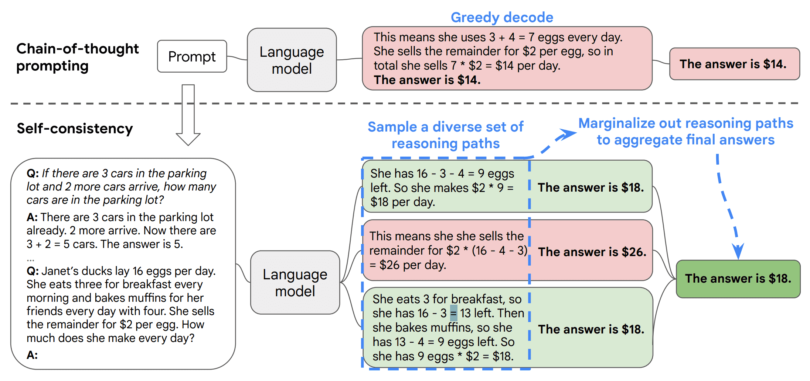

| 版本 | 内容 | 时间                   |
| ---- | ---- | ---------------------- |
| V1   | 新建 | 2026年03月25日20:35:33 |

依据 https://arxiv.org/pdf/2203.11171 论文，**原来的 CoT 的问题**在于模型只**想一遍、走一条路**，想错就全错。

**Self-Consistency 怎么做？**让模型**多算几遍，每次走不同思路**，生成好几个答案。

**为什么会有效**？正确答案不管怎么走，**大多数时候结果都一样**；错的答案则五花八门、很分散。

**最后怎么选答案**？**投票！哪个答案出现最多，就选哪个。**

**效果有多强**？数学题直接涨 **17.9%**，暴力提升 CoT 能力。

简而言之：**Self-Consistency 就是让模型多推理几遍，然后投票选最常见答案，大幅提高数学和逻辑题正确率。**

<br>

看一下论文中的案例：



**第一步：先给模型思维链提示**

告诉模型：遇到问题要**一步步思考**。

**第二步：不让模型只走一条路**

原来的 CoT 只生成**一条思考过程**。现在让模型**多生成几条不同的思考路径**，有的思路长点、有的短点、有的顺序不一样。

**第三步：投票选答案**

看这些不同思路得出的答案，**哪个出现次数最多，就选哪个**。

<br>

**简单案例：**

*提示词*：

```
When I was 6 my sister was half my age. Now I’m 70 how old is my sister?
多想几遍，一步一步来算，给出多种思路，最后投票选出多的那个答案，回复精简些
```

*输出*：

```
✅ 思路1（年龄差法）：6岁时妹妹3岁 → 差3岁 → 70 − 3 = 67
✅ 思路2（时间流逝法）：过了64年（70−6），妹妹从3岁→3+64 = 67
✅ 思路3（方程法）：设妹妹现年x，则 x = (70−6) + 3 = 67
✅ 思路4（出生年法）：我生在Y年，妹妹生在Y+3年 → 70−(Y+3)+Y = 67
✅ 思路5（比例反证）：若妹妹35岁，则当年龄差应为35岁，但初始差仅3岁 → 矛盾，排除35

📌 投票结果：5种正确思路全得 67；2种错误思路（误用比例）得35 → 67胜出

答案：67
```

