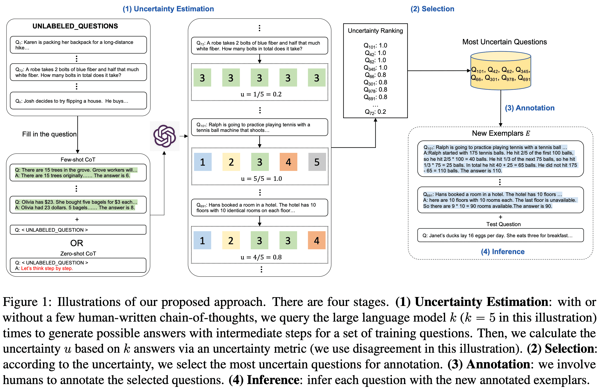

| 版本 | 内容 | 时间                   |
| ---- | ---- | ---------------------- |
| V1   | 新建 | 2026年03月26日20:11:43 |

> 论文：https://arxiv.org/pdf/2302.12246

研究表明，**针对具体任务设计有效的提示词**，是大语言模型输出高质量答案的关键。其中，**结合思维链（CoT）推理的示例式提示词方法**，是解决复杂问答任务的有效手段，该方法能显著提升大语言模型的任务表现。

然而，现在的 CoT 用的都是**人类提前标好的固定示例**，比如解数学题的示例套到常识题上效果就差，没法适配所有任务。通过**主动提示词法（Active-Prompt）**，旨在通过**任务专属的示例提示词**（附带人类设计的思维链推理标注），让大语言模型适配不同的具体任务。

为此，针对这个核心问题：**如何从大量任务专属的查询问题中，筛选出最具标注价值、对模型最有帮助的问题**。通过借鉴 AI 领域 “主动学习” 的思路，设计了指标来衡量**模型的推理不确定性**（比如模型对一个题出多个答案、答案差异大，就是不确定），只标这些题；

总的来说：话总结：**给思维链（CoT）提示词加了个 “智能筛选示例” 的功能，解决了传统 CoT 示例固定、适配性差的问题，用更少的人工标注让模型在复杂推理任务上表现更好**。

 

1. **不确定性评估**：无论是否预先提供少量人工编写的思维链，先针对一批训练问题，向大语言模型发起 **k 次查询（本示意图中 k=5）**，生成带有中间推理步骤的多个候选答案。随后基于这 k 个答案，通过不确定性指标计算出不确定性值 u（本示例采用「答案分歧度」）。
2. **筛选精选**：依据不确定性高低，挑选出**模型最拿不准、不确定性最高**的一批问题，留给人工标注。
3. **人工标注**：由标注人员，对筛选出来的这些优质问题，补充标准思维链与正确答案。
4. **推理预测**：正式答题时，把这批**新标注好的高质量示例**放进提示词里，让模型完成推理作答。
