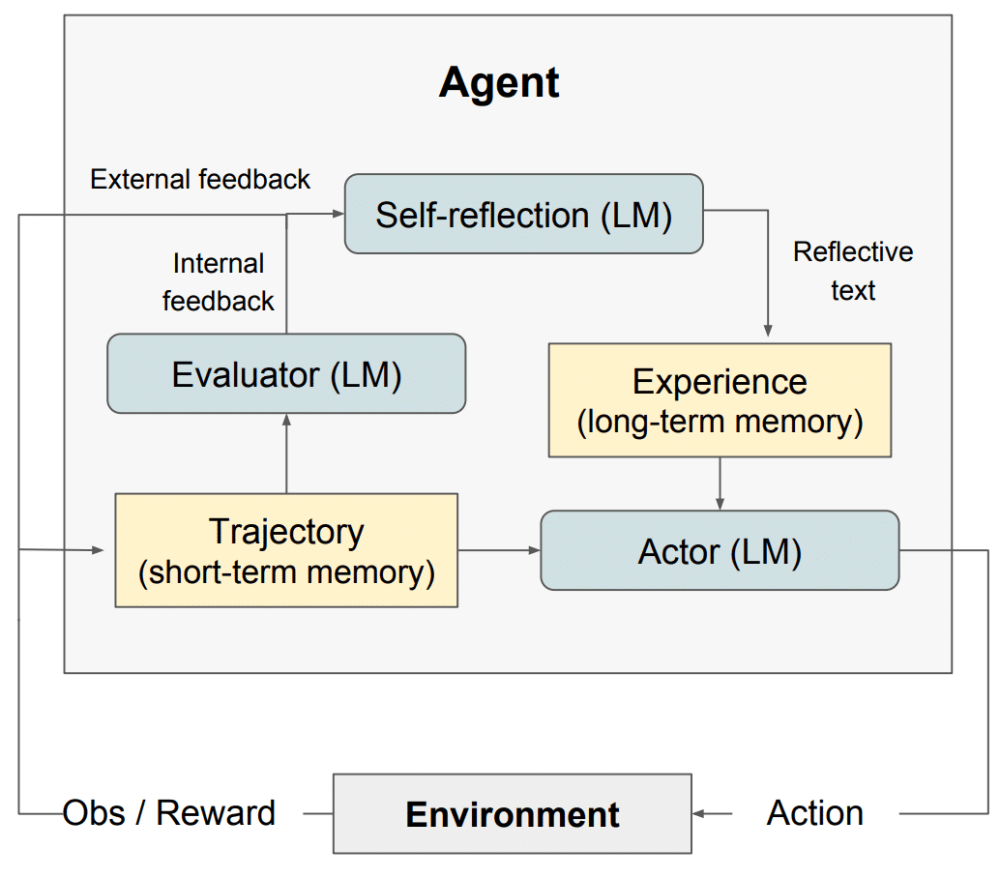
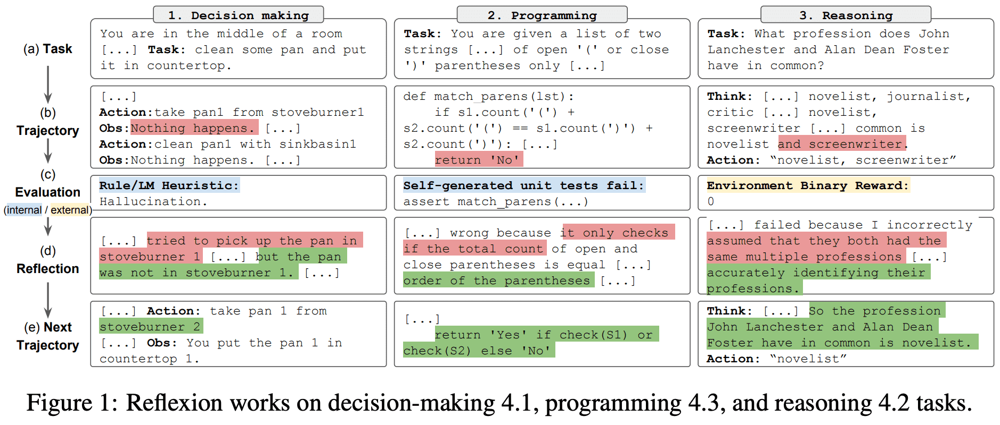

| 版本 | 内容 | 时间                |
| ---- | ---- | ------------------- |
| V1   | 新建 | 2026-03-27 15:17:54 |

## 简介

Reflexion（反思提示法）是一个**语言智能体强化框架**，本质是让大语言模型像人一样 “从错误中学习”—— 通过 “执行 - 评估 - 反思 - 迭代” 的闭环，将环境反馈转化为语言形式的自我反思，存储在记忆中并指导下一轮行为，无需微调模型即可实现性能提升。

传统提示方法（如 CoT、ReAct）的核心缺陷：

- 单次交互后无 “复盘” 机制，犯过的错误可能重复出现；
- 反馈形式单一（多为标量奖励，如 “正确 / 错误”），智能体难以理解错误根源；
- 缺乏长期记忆，无法积累跨轮次的学习经验。

Reflexion 通过 “语言化反思 + 记忆存储”，精准解决上述问题，让智能体具备 “持续迭代” 的能力。

## 工作原理

**Reflexion（自省 / 反思 AI）** 设计了一套模块化架构，包含三种独立模型：

1. **行动模型 Actor（Ma）**：负责生成文本、输出行动 / 答案；
2. **评估模型 Evaluator（Me）**：给 Actor 产出的结果打分、评判好坏；
3. **自省模型 Self-Reflection（Msr）**：生成文字版优化提示 / 改进意见，指导 Actor 自我迭代、变得更好。

还有一个 Reflexion 的长短记忆，核心依赖**短期记忆 + 长期记忆**：

- 短期记忆：本轮执行轨迹历史；
- 长期记忆：自省模型产出的历次反思总结。

推理时 Actor 同时看 “最近细节”+“过往踩坑经验”，模仿人类：既记得当下步骤，又记得长期教训。这是 Reflexion 相比普通 LLM 行动智能体的关键优势。

总而言之，Reflexion 的核心流程为：a) 定义任务；b) 生成推理轨迹；c) 评估；d) 进行反思；e) 生成下一轮推理轨迹。下图展示了 Reflexion 智能体如何通过迭代优化行为，解决决策、编程、推理等各类任务的示例。Reflexion 在 ReAct 框架的基础上进行了扩展，新增了自我评估、自我反思和记忆组件。

**(a) Task**：给定任务目标

**(b) Trajectory**：Actor 执行任务，生成行动序列和环境反馈（第一轮尝试）

**(c) Evaluation**：Evaluator 评估本轮结果，判断失败 / 错误

**(d) Reflection**：Self-Reflection 模型分析错误原因，生成自然语言改进建议

**(e) Next Trajectory**：Actor 带着反思建议，重新执行任务，得到正确结果

## 适用场景和局限性

Reflexion 最适用于以下场景：

1. 智能体需要从试错中学习：Reflexion 的设计初衷是帮助智能体通过反思过往错误，并将这些知识融入未来决策，因此特别适合需要试错学习的任务（如决策、推理、编程）。
2. 传统强化学习方法不适用：传统强化学习（RL）通常需要大量训练数据和昂贵的模型微调，而 Reflexion 提供了一种轻量级替代方案 —— 无需微调底层语言模型，在数据和计算资源上更高效。
3. 需要精细化反馈：Reflexion 利用语言形式的反馈，比传统强化学习中的标量奖励更精细化、更具体，能让智能体更好地理解错误，在后续尝试中进行针对性改进。
4. 可解释性和显式记忆很重要：与传统强化学习方法相比，Reflexion 提供了更具可解释性、更显式的情景记忆 —— 智能体的自我反思会存储在记忆中，便于分析和理解其学习过程。

Reflexion 在以下任务中效果显著：

- 序贯决策：在 AlfWorld 任务中提升性能（该任务需导航不同环境、完成多步骤目标）；
- 推理任务：提升智能体在 HotPotQA 上的表现（需跨文档推理的问答数据集）；
- 编程任务：在 HumanEval、MBPP 等基准上生成更优代码，部分场景达到当前最优水平。

Reflexion 的局限性：

1. 依赖自我评估能力：Reflexion 需要智能体准确评估自身性能并生成有用的自我反思，这在复杂任务中可能具有挑战性，但随着模型能力的提升，这一问题会逐步改善。
2. 长期记忆限制：Reflexion 采用固定容量的滑动窗口存储记忆，对于更复杂的任务，可能需要向量嵌入或 SQL 数据库等更高级的存储结构。
3. 代码生成的局限性：在测试驱动开发中，指定准确的输入 - 输出映射存在限制（如非确定性生成函数、受硬件影响的函数输出）。
