## skill

### 编解码

#### **Base 64**

Base64 是一种常见的用于将二进制数据转换为文本字符串的编码方式，它由 64 个字符组成，通常包括 A-Z、a-z、0-9 和两个额外字符作为填充符号。Base64 编码经常用于在网络传输、存储或者处理不支持二进制数据的场景下（图片二进制流的每个字节不可能全部是可见字符），比如在电子邮件、XML 文件、URL 参数等地方。

**基于64个可打印字符来表示二进制数据的办法。**

Base64 的码表只有 64 个字符， 如果要表达 64 个字符的话，使用 6 的 bit 即可完全表示( 2 的 6 次方为 64)。因为 Base64 的编码只有 6 个 bit 即可表示，而正常的字符是使用 8 个 bit 表示， 8 和 6 的最小公倍数是 24，所以 4 个 Base64 字符可以表示 3 个标准的 ascll 字符。

将字符串转换为 base64 时，会先把字符串转换为对应的 ascII 码，然后从左往右 6 位截取（6 位对应一位 base64 码），若最后不足 6 位（一个 base64 码）补 0，不足 3 个字符串则补 =（解码时会自动去掉）

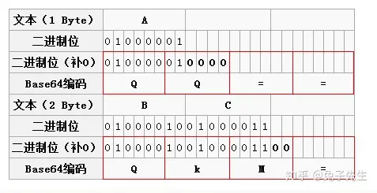

由于 = 字符也可能出现在 Base64 编码中，但 = 用在 URL、Cookie 里面会造成歧义，所以，很多 Base64 编码后会把 = 去掉。因为 base64 码的位数永远是 4 的倍数，所以解码时若位数不足可以在末尾补 =。

Base64 编码的优点在于其结果是纯文本，易于处理和传输，而且不会受到大部分文本编码的限制。然而，需要注意的是Base64 编码会使数据稍微膨胀，因为每 3 个字节的数据会编码成 4 个字符，所以编码后的数据会比原始数据略大。

将图片转换成 Base64 的编码方式是因为可以将图片直接嵌入到网页中，而不是从外部载入，这样就减少了 HTTP 请求。

总之，Base64 编码是一种常见的数据编码方式，适用于多种场景下的**二进制数据处理和传输，但需要注意编码后数据会膨胀**，适用场景需要谨慎选择。

#### **base62**

 其实就是 26 个小写字母 + 26 个大写字母 + 10 个数字 = 62，然后对一个数做 62 进制与十进制的映射。这种编码方式常用于生成短链接、加密传输等场景。

**短链的设计**：主要思路，维护一个全局自增的 id，每来一个长 url，将其与一个自增 id 绑定，然后利用 base62 将该自增 id 转换为 base62 字符串，即完成转换。

**我们 IM 项目用这个 base62 主要是用来做认证的 token 的设计**，比如 uid + appId + clientId 等..，每一个做 base62 的转换

### Netty 相关，网络相关

#### TCP 三次握手

> https://blog.csdn.net/qzcsu/article/details/72861891 看这个

TCP（Transmission Control Protocol）是一种常用的传输层协议，用于在网络中可靠地传输数据。在建立和终止TCP连接时，使用了三次握手和四次挥手的过程。

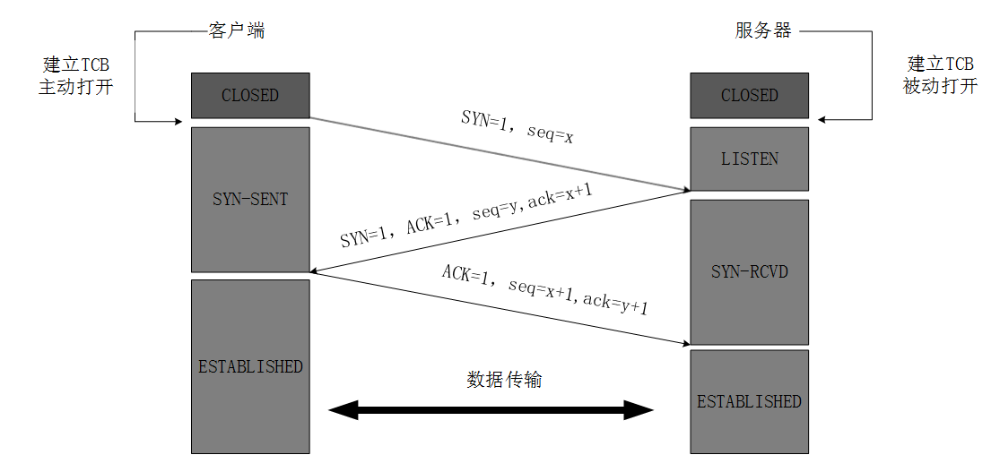

> **最开始的时候客户端和服务器都是处于CLOSED状态。主动打开连接的为客户端，被动打开连接的是服务器。**

1. **第一次握手（SYN）**：客户端向服务器发送一个带有 SYN 标志的数据包，表示客户端请求连接；
2. **第二次握手（SYN-ACK）**：服务器收到客户端的 SYN 请求后，会把客户端的请求存到半连接队列中去（SYN 队列），然后返回一个带有 SYN+ACK 的数据包，表示确认收到客户端的请求，并向客户端发出自己的连接请求；
3. **第三次握手（ACK）**：客户端收到服务器的连接确认后，会再次向服务器发送一个带有 ACK 标志的数据包，表示客户端也确认连接。这时服务器会将这个请求添加到全连接队列中去，等待服务调用 accept() 方法。


下面的是详细的，面试可不说这个，太长了：

1. TCP 服务器进程先创建传输控制块 TCB，时刻准备接受客户进程的连接请求，此时服务器就进入了 LISTEN（监听）状态；
2. TCP 客户进程也是先创建传输控制块 TCB，然后向服务器发出连接请求报文，这是报文首部中的同部位 SYN=1，同时选择一个初始序列号 seq=x ，此时，TCP客户端进程进入了 SYN-SENT（同步已发送状态）状态。TCP规定，SYN报文段（SYN=1的报文段）不能携带数据，但需要消耗掉一个序号；表示请求建立连接；
3. TCP 服务器收到请求报文后，如果同意连接，则发出确认报文。确认报文中应该 ACK=1，SYN=1，确认号是ack=x+1，同时也要为自己初始化一个序列号 seq=y，此时，TCP 服务器进程进入了 SYN-RCVD（同步收到）状态。这个报文也不能携带数据，但是同样要消耗一个序号；
4. TCP 客户进程收到确认后，还要向服务器给出确认，。确认报文的 ACK=1，ack=y+1，自己的序列号 seq=x+1，此时，TCP 连接建立，客户端进入 ESTABLISHED（已建立连接）状态。TCP 规定，ACK 报文段可以携带数据，但是如果不携带数据则不消耗序号；
5. 当服务器收到客户端的确认后也进入 ESTABLISHED 状态，此后双方就可以开始通信了；

> 为什么TCP客户端最后还要发送一次确认呢？
>
> 一句话，主要防止已经失效的连接请求报文突然又传送到了服务器，从而产生错误。
>
> 如果使用的是两次握手建立连接，假设有这样一种场景，客户端发送了第一个请求连接并且没有丢失，只是因为在网络结点中滞留的时间太长了，客户端迟迟没有收到服务器的确认报文，就会认为服务器没有收到，此时重新向服务器发送这条报文，此后客户端和服务器经过两次握手完成连接，传输数据，然后关闭连接。此时之前滞留的那一次请求连接，网络通畅了到达了服务器，这个报文本该是失效的，但是，两次握手的机制将会让客户端和服务器再次建立连接，这将导致不必要的错误和资源的浪费。
>
> 如果采用的是三次握手，就算是第一次失效的报文传送到服务器了，服务器接受到了那条失效报文并且回复了确认报文，但是客户端不会再次发出确认。由于服务器收不到确认，就知道客户端并没有请求连接，也就不会去建立连接了。

#### TCP 四次挥手

> 数据传输完毕后，双方都可释放连接。最开始的时候，客户端和服务器都是处于 ESTABLISHED 状态，然后客户端主动关闭，服务器被动关闭。 

四次挥手（Four-Way Handshake）是在客户端和服务器之间终止TCP连接时使用的过程。它的步骤如下：

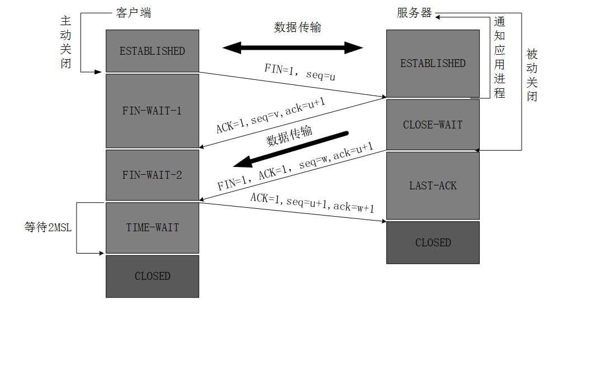

1. 第一次挥手（FIN）：客户端想要关闭连接时，会发送一个带有 FIN 标识的数据包给服务器，客户端不再发送数据，但仍然可以接收数据；
2. 第二次挥手（ACK）：服务器接收到 FIN 报文后，会给客户端返回一个 ACK 的确认报文，告知客户端已经收到关闭请求，此时，服务端就进入了CLOSE-WAIT（关闭等待）状态。即客户端已经没有数据要发送了，但是服务器若发送数据，客户端依然要接受；
3. 第三次挥手（FIN）：服务器将最后的数据发送完毕后，就会给客户端发送一个 FIN 数据包；
4. 第四次挥手（ACK）：客户端收到服务器的连接释放的 FIN 报文后，会给服务器发送一个 ACK 报文。此时，客户端就进入了 TIME-WAIT（时间等待）状态。注意此时TCP连接还没有释放，必须经过2 × MSL（最长报文段寿命）的时间后，才进入 CLOSED 状态；


下面的是详细的，面试可不说这个，太长了：

1. 第一步（FIN）：当客户端想要关闭连接时，发送一个带有 FIN（结束）标志的 TCP 报文段给服务器。客户端不再发送数据，但仍然可以接收数据。报文首部，FIN=1，其序列号为seq=u（等于前面已经传送过来的数据的最后一个字节的序号加1），此时，客户端进入FIN-WAIT-1（终止等待1）状态；
2. 第二步（ACK）：服务器收到连接释放报文，发出确认报文，ACK=1，ack=u+1，并且带上自己的序列号seq=v，此时，服务端就进入了CLOSE-WAIT（关闭等待）状态。TCP服务器通知高层的应用进程，客户端向服务器的方向就释放了，这时候处于半关闭状态，即客户端已经没有数据要发送了，但是服务器若发送数据，客户端依然要接受。这个状态还要持续一段时间，也就是整个CLOSE-WAIT状态持续的时间。
3. 第三步：客户端收到服务器的确认请求后，此时，客户端就进入FIN-WAIT-2（终止等待2）状态，等待服务器发送连接释放报文（在这之前还需要接受服务器发送的最后的数据）。
4. 第四步：服务器将最后的数据发送完毕后，就向客户端发送连接释放报文，FIN=1，ack=u+1，由于在半关闭状态，服务器很可能又发送了一些数据，假定此时的序列号为seq=w，此时，服务器就进入了LAST-ACK（最后确认）状态，等待客户端的确认。
5. 第五步（ACK）：客户端收到服务器的连接释放报文后，必须发出确认，ACK=1，ack=w+1，而自己的序列号是seq=u+1，此时，客户端就进入了TIME-WAIT（时间等待）状态。注意此时TCP连接还没有释放，必须经过2 × MSL（最长报文段寿命）的时间后，当客户端撤销相应的 TCB 后，才进入CLOSED状态。
6. 服务器只要收到了客户端发出的确认，立即进入CLOSED状态。同样，撤销TCB后，就结束了这次的TCP连接。可以看到，服务器结束TCP连接的时间要比客户端早一些。

<br>

>**为什么客户端最后还要等待 2MSL？**
>
>MSL（Maximum Segment Lifetime），TCP 允许不同的实现可以设置不同的 MSL 值。表示报文在网络中存活的最长时间，通常为 2 分钟。
>
>第一，保证客户端发送的最后一个 ACK 报文能够到达服务器，因为这个 ACK 报文可能丢失，站在服务器的角度看来，我已经发送了 FIN+ACK 报文请求断开了，客户端还没有给我回应，应该是我发送的请求断开报文它没有收到，于是服务器又会重新发送一次，而客户端就能在这个 2MSL 时间段内收到这个重传的报文，接着给出回应报文，并且会重启 2MSL 计时器。
>
>第二，防止类似与“三次握手”中提到了的“已经失效的连接请求报文段”出现在本连接中。客户端发送完最后一个确认报文后，在这个 2MSL 时间中，就可以使本连接持续的时间内所产生的所有报文段都从网络中消失。这样新的连接中不会出现旧连接的请求报文。
>
>因此，等待 2MSL 时间是为了保证连接的可靠关闭和防止出现连接混乱的情况。

<br>

> **为什么建立连接是三次握手，关闭连接确是四次挥手呢？**
>
> 建立连接的时候， 服务器在 LISTEN 状态下，收到建立连接请求的 SYN 报文后，把 ACK 和 SYN 放在一个报文里发送给客户端。
> 而关闭连接时，服务器收到对方的 FIN 报文时，仅仅表示对方不再发送数据了但是还能接收数据，而自己也未必全部数据都发送给对方了，所以服务器可以立即关闭，也可以发送一些数据给客户端后，再发送 FIN 报文给对方来表示同意现在关闭连接，因此，服务器的 ACK 和 FIN 一般都会分开发送，从而导致多了一次。
>
> 半关闭状态的存在使得两个方向上的数据传输可以分别控制，允许一方先关闭发送数据的能力，而另一方仍然可以接收数据。这样可以有效地进行双向通信的结束和连接的关闭。

<br>

> **如果已经建立了连接，但是客户端突然出现故障了怎么办？**
>
> TCP keep-alive
>
> TCP 还设有一个保活计时器，显然，客户端如果出现故障，服务器不能一直等下去，白白浪费资源。服务器每收到一次客户端的请求后都会重新复位这个计时器，时间通常是设置为 2 小时，若 2 小时还没有收到客户端的任何数据，服务器就会发送一个探测报文段，以后每隔 75 秒发送一次。若一连发送 9 个探测报文仍然没反应，服务器就认为客户端出了故障，接着就关闭连接。（总耗时：7200 秒 + 75 秒* 9 次 = 2 小时 11 分钟 ）
>
> TCP协议提供了保活机制，服务器端可以启用选项来监测连接的存活状态。当服务器端启用了保活机制，并在一定时间内没有收到客户端的响应时，会发送保活探测报文给客户端。如果一定次数内仍未收到客户端的响应，则会判断客户端已经出现故障，并关闭连接。
>
> 
>
>  Linux 系统下， TCP keep-alive 参数如下：
>
> - `net.ipv4.tcp_keepalive_time`：探测开始之前的空闲时间（我的线上服务器 1800s，也就是 30min）
> - `net.ipv4.tcp_keepalive_intvl`：两次探测之间的时间间隔（我的线上服务器 75s）
> - `net.ipv4.tcp_keepalive_probes`：探测重试次数（我的线上服务器 9 次）
>
> 查看具体数值：
>
>
> ```
> $ cat /proc/sys/net/ipv4/tcp_keepalive_time
> 1800
> $ cat /proc/sys/net/ipv4/tcp_keepalive_intvl
> 75
> $ cat /proc/sys/net/ipv4/tcp_keepalive_probes
> 9
> ```
>
> **为什么还需要应用层 keepalive ?**
>
> - 协议分层，各层关注点不同：
>   传输层关注是否“通”，应用层关注是否可服务？ 服务器连接在，但是不定可以服务（例如服务不过来等）。
> - TCP 层的 keepalive 默认关闭，且经过路由等中转设备 keepalive 包可能会被丢弃。
> - TCP 层的 keepalive 时间太长：默认 > 2 小时，虽然可改，但属于系统参数，改动影响所有应用。

#### 什么是黏包和半包？

概念：

- **黏包：一次性接收多条消息；**
- **半包：分好几次接收不完整的消息；**

产生原因：

- **产生黏包主要是因为每次写入的数据比较少，比如远远小于套接字缓冲区的大小。**此时，网卡往往不会立马发送，而是将数据合并后一起发送，这样效率也会高一些。但是，对方接收到的可能就是黏包。另外，如果接收方读取数据不够及时，也会产生黏包现象；
- **产生半包的原因**：**比如当发送方发送的数据大于套接字缓冲区的大小时，数据在底层必然会分成多次发送**，因此接收方收到的可能就是半包。另外一个非常重要的因素就是最大传输单元，数据是按 TCP/IP 逐渐封装后传输的。应用层数据在作为数据部分传递给数据链路层之前，需要加上传输层的头，才能逐层封装传递。既然要封装，就必然涉及数据内容的大小控制，否则就不存在封装的概念了。各层协议中报文内容的大小就由最大传输单元控制。当发送的数据大于协议各层的最大传输单元时，就必须拆包；

**Netty 是如何处理黏包的？**

- 使用的是 LengthFieldBasedFrameDecoder 解码器；
- 原理：在数据包中添加一个固定长度的长度字段，用来表示整个数据包的长度。`LengthFieldBasedFrameDecoder` 首先根据配置的偏移量、长度字段的长度等参数，从接收到的数据中读取长度字段的值。从而可以准确地分割出完整的数据包。

**Netty 是如何处理黏包的？**

- 使用的是 LengthFieldBasedFrameDecoder 解码器；
- 在接收数据时，可以维护一个缓冲区，等待接收到足够的数据以组成一个完整的数据包再进行处理。如果接收到的数据不足以构成完整的数据包，就继续等待后续数据的到达；

#### 各个 IO 模式

- **BIO：阻塞同步**，程序会阻塞一直等待数据，直到数据就绪；
- **NIO：非阻塞同步**，程序可以立即返回，无需等待数据就绪，数据就绪后系统会通知我们去处理；
- **AIO：非阻塞异步**，系统会把数据读好返回并回调给我们；

> I/O 复用是一种 I/O 模式，通过这种模式可以同时监听多个 I/O 事件，从而有效地管理多个 I/O 操作。在实际应用中，常见的 I/O 复用技术包括 select、poll 和 epoll。
>
> 1. **select**：`select` 是 POSIX 标准定义的一种 I/O 复用机制，它允许程序监视一组文件描述符，当其中任何一个文件描述符就绪时，`select` 将通知程序可以执行 I/O 操作。`select` 的缺点是效率较低，受到文件描述符数量的限制。
> 2. **poll**：`poll` 与 `select` 类似，也是一种基于事件驱动的 I/O 复用方式，不同之处在于 `poll` 不受文件描述符数量的限制。但是在大量文件描述符的情况下，`poll` 的性能也可能变得较低。
> 3. **epoll**：`epoll` 是 Linux 特有的一种 I/O 复用机制，可以对大量的文件描述符进行高效的 I/O 复用。`epoll` 使用了事件通知的机制，当文件描述符就绪时，内核会通知应用程序进行处理。相比于 `select` 和 `poll`，`epoll` 在大规模并发连接的情况下性能更好。
>
> I/O 复用的优势在于可以同时管理多个 I/O 事件，避免了传统阻塞模式下需要为每个连接创建一个线程或进程的开销，从而提高了系统资源利用率和性能。因此，在高并发的网络编程场景下，常常会选择使用 I/O 复用来实现高效的事件驱动的网络通信。

#### NIO 的 3 种 Reactor 模式

① **Reactor 单线程模式**，**接收连接、处理读写操作、注册事件、扫描事件等所有操作都由一个线程来完成**。显而易见，这个线程的压力很大，很容易称为系统瓶颈。

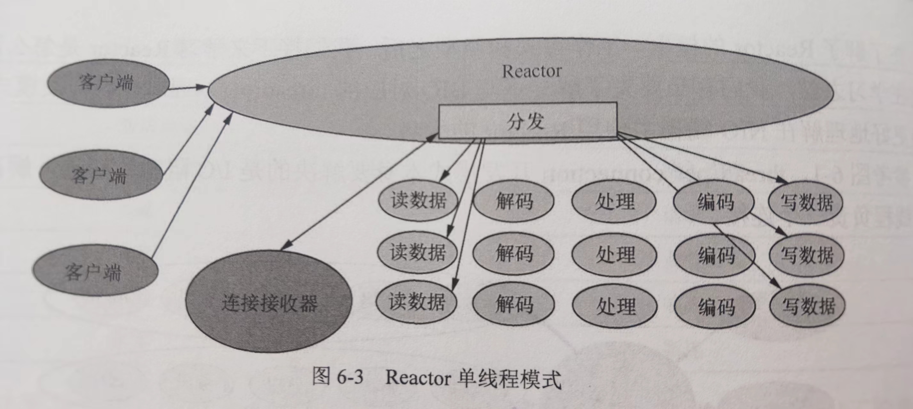

② **Reactor 多线程模式**，主 Reactor 负责监听事件，当有事件发生时，通过线程池将事件分发给工作线程进行处理。

它弥补了 Reactor 单线程模式中的缺陷，解码、处理、编码等比较复杂且耗时较长的操作将由线程池来做。

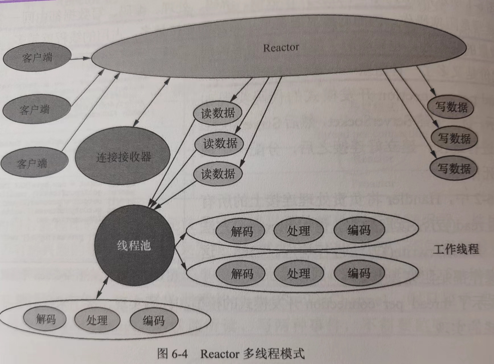


③ **Reactor 主从多线程**，包含一个主 Reactor 和从 Reactor。主 Reactor 负责监听连接事件，从 Reactor 负责处理读写事件。主 Reactor 接受新连接后，将其分配给从 Reactor 处理，可以有效减轻主 Reactor 的负担，提高并发处理能力。

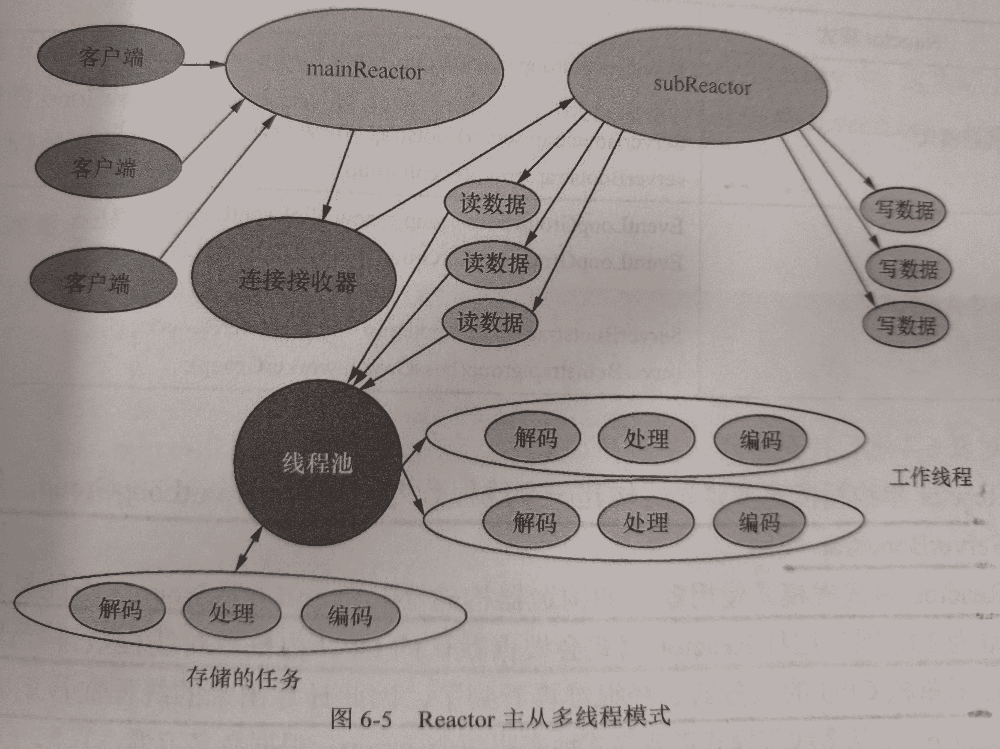

#### Netty 的参数调整

- 系统参数，有几个比较重要
  - 程序最多可以打开的文件数目。因为对于服务器网络应用来说，每个连接的建立都需要打开一个 「文件」。具体而言，**在建立 TCP 连接时，系统将为每个 TCP 连接创建一个 Socket 句柄，也就是文件句柄**。但是 Linux 系统对每个进程能够打开的文件句柄数量做了限制，如果超出限制就会报错，默认是 1024。通过 **ulimit -n [xxx]** 命令增大允许的文件句柄数目。可以考虑将 ulimit 命令作为启动脚本的一部分；
  
  
  ```
  [im_user@bjvpc22-202 ~]$ ulimit -a
  core file size          (blocks, -c) unlimited
  data seg size           (kbytes, -d) unlimited
  scheduling priority             (-e) 0
  file size               (blocks, -f) unlimited
  pending signals                 (-i) 61386
  max locked memory       (kbytes, -l) 64
  max memory size         (kbytes, -m) unlimited
  open files                      (-n) 655350
  pipe size            (512 bytes, -p) 8
  POSIX message queues     (bytes, -q) 819200
  real-time priority              (-r) 0
  stack size              (kbytes, -s) 8192
  cpu time               (seconds, -t) unlimited
  max user processes              (-u) 61386
  virtual memory          (kbytes, -v) unlimited
  file locks                      (-x) unlimited
  ```
  
  - **全连接队列长度**：min(backlog,somaxconn)，net.core.somaxconn，somaxconn 是Linux内核参数，默认128，可通过/proc/sys/net/core/somaxconn进行配置；业务的 listen(fd, backlog) 的 backlog；
  - **半连接队列长度**：tcp_max_syn_backlog，内核参数，通过/proc/sys/net/ipv4/tcp_max_syn_backlog来设置；net.core.somaxconn，somaxconn 是Linux内核参数，默认128，可通过/proc/sys/net/core/somaxconn进行配置；业务 tcp 调用 listen(fd, backlog) 的 backlog；
  
- Netty 系统参数调整：（目前只分析针对 NIO 的）

  1. SocketChannel
     1. **SO_SNDBUF**：TCP 数据发送缓冲区大小。如果发送缓冲区太小，发送方发送的数据可能会被阻塞，直到缓冲区有足够的空间来存储数据。如果发送缓冲区太大，可能会导致过多的内存占用；通常调成带宽和延时的乘积；
     2. **SO_RCVBUF**：TCP 数据接收缓冲区大小；通常调成带宽和延时的乘积；
     3. **SO_KEEPALIVE**：TCP Keepalive，长连接用的，通过周期性发送探测数据包来实现这个目标。如果在一段时间内没有数据或确认报文通过网络，这个特性就会触发，发送一个探测包到对端主机。如果接收到回应，连接就继续保持开启。如果没有收到回应，TCP Keepalive则会再次发送探测包，直到达到预设的次数，如果还没有收到回应，就会认为连接已经断开，并关闭这个连接；
     4. **SO_LINGER**：关闭 Socket 的延迟时间，默认禁用，socket.close() 方法立即返回，待发送的数据将由系统后台继续发送；0 表示立即关闭。
     5. **TCP_NODELAY**：设置是否启用 Nagle 算法。这种算法可将小的碎片数据连接成更大的报文来提高发送效率。如果需要发送一些比较小的报文，那么需要禁用 Nagle 算法；
  2. ServerSocketChannel
     1. **SO_RCVBUF**：
     2. **SO_BACKLOG**：连接请求的处理是围绕一个请求队列进行的。执行一次 accept() 方法就相当于处理请求队列中的一个请求并建立连接，没来得及处理的连接请求就会在请求队列中等待处理，SO_BACKLOG 就是设置这个等待队列的长度。

- Netty 非系统参数调整
  1. **高低水位**，最重要的；我们用的 8k，128k
  2. **高水位**：表示写缓冲区的上限。当写缓冲区的字节数超过高水位时，Channel 的 isWritable() 方法会返回 false，从而阻止继续写入数据，直到缓冲区中的数据量下降到低水位以下；
  3. **低水位**：表示写缓冲区的下限。一旦写缓冲区的字节数降到低水位以下，Channel 的 isWritable() 方法会再次返回 true，允许继续写入数据；
  4. 注意：需要在 write 的时候判断 channel 是否可写，否则这个高低水位没什么用；


查看 linux 默认和最大的发送缓冲区和接收缓冲区的大小：

```
cat /proc/sys/net/core/rmem_max | awk '{ print $1 / (1024 * 1024) }'
cat /proc/sys/net/core/wmem_max | awk '{ print $1 / (1024 * 1024) }'
cat /proc/sys/net/core/rmem_default | awk '{ print $1 / 1024 }'
cat /proc/sys/net/core/wmem_default | awk '{ print $1 / 1024 }'


cat tcp_wmem | awk '{print $2 / 1024}'
64
```

#### Netty 内存泄漏检测

（1）**Netty 中的资源管理**

- 初始化一个资源的时候它的引用计数为 1；
- 当你释放它的时候，它的引用计数会减 1，如果引用计数到 0 了，这个对象就会**释放并且它们的资源就能回到内存池**中；

如果一个 `ByteBuf` 没有执行完自己该做的 release，它就已经不可达了，JVM 就有可能对它们执行 GC。我们知道一旦一个对象被 GC 了，那就不可能再去调用它的 release 方法了。那这个 `ByteBuf` 就所占用的内存池资源就没法还回去，内存池上可用资源就会越来越少，换言之。这时候我们就产生了内存泄漏。

（2）netty 的内存泄漏检测机制需要完成两个任务：

- **在泄漏发生的时候，我们需要有个通知机制来知晓被 GC 的对象没有调用自己该有的 release 方法来释放池化资源**；
- 需要有个记录机制来记录这些泄漏的对象使用的地方，方便溯源；

**（3）Netty 内存检测的实现**

- 当申请资源时，例如使用 `ByteBuf buffer = ctx.alloc().buffer() `申请堆外内存，将引用计数加 1，同时定义**弱引用 DefaultResourceLeak 并将其添加到一个集合**`（#allLeak）`中；
- 当释放资源时，例如归还内存到内存池，会将引用计数减 1。当减到 0 的时候，自动执行释放资源的操作，并将弱引用从之前的那个集合中移除；
- 正常流程时会将 Bytebuf 和弱引用的断开，并将自己从 集合`（#allLeak）`中移除，这样该 ByteBuf 被 GC 时，就会进入到 refQueue，在遍历 refQueue 的时候回去尝试从 集合`（#allLeak）`中 移除元素，因为是正常 release 了，所以此时并没有出现内存泄露；
- 异常流程，没有正常调用 release 方法，也就是没有将自己从 集合`（#allLeak）`中移除，等到发生 GC 时，就会加入到 refQueue，在遍历refQueue 的时候发现集合`（#allLeak）`中有该 ref，说明发生内存泄露了。如果发生内存泄露，就会打出日志，可以通过配置指定是全样本检查，还是抽样检查 sample；

### Spring 循环依赖问题

Spring 中引起循环依赖有如下几个原因

1. 原型模式下的循环依赖（无法解决）；
2. 单例模式下的构造方法注入属性导致的循环依赖（无法解决）;
3. 单例模式下的 setter 方法注入属性导致的循环依赖（可以解决）；


Spring 检查原型模式的循环依赖的伪代码：ThreadLocal 实现的

```java
if (查询标记，bean 正在创建中) {
    抛异常...
}
标记 bean 正在创建中
创建 bean
标记 bean 创建完成了
```

Spring 的代理增强一般都是在实例初始化最后执行的，其实是 AbstractAutoProxyCreator 后置处理器的 postProcessAfterInitialization 创建代理对象的。但是假如发生循环依赖就需要提前创建代理对象了，因为别的实例需要注入这个代理对象，假如不提前创建那么注入的就是原始对象了，那就不符合要求了。

前面说了 Spring 的代理增强一般都是在实例初始化最后执行的，假如发生循环依赖就需要提前创建代理对象了。那么问题了，Spring 是如何防止重复创建代理对象的。发送循环依赖提前创建对象其实是调用的 AbstractAutoProxyCreator#getEarlyBeanReference 方法，提前创建会将Bean 的信息添加到 earlyProxyReferences 中，它是一个 Map。Spring 在初始化阶段做代理增强是在后置处理器 AbstractAutoProxyCreator 的 postProcessAfterInitialization 方法做的，可以看到这里面判断了 earlyProxyReferences 中是否之前代理过，假如代理过就不再重复代理了。


循环依赖总结

- 单例 set 方法的循环依赖，Spring 会使用三个级别的缓存来解决，无需额外的配置； 允许 Spring 在实例化和初始化 Bean 的过程中，暂时存储正在创建的 Bean 实例，以便在发生循环依赖时能够提前曝光（early exposing）。
  1. **一级缓存的对象是已经走完全部生命周期的对象**，也就是存储完全初始化的单例 Bean 实例；
  2. **三级缓存存放的对象是 bean 对应的工厂对象，发生循环依赖时，会从工厂对象获取产品（可能是原始 bean，也可能是代理后的 bean**）;
  3. **二级缓存存在，说明发生循环依赖了，存放的是从三级缓存中的工厂对象获取的对象（可能是原始 bean，也可能是代理后的 bean）**;
- Spring 在一般情况下都是在 bean 的初始化阶段去创建代理对象的，但是假如发生循环依赖就会提前给创建代理对象存放到二级缓存中；
- **二级缓存的意义**：假如提前创建了代理对象，在最后的阶段需要从二级缓存中获取该代理对象，保证最终返回的结果是代理后的对象；
- 构造方法和原型模式的循环依赖，Spring 自己是无法自动帮我们解决的，但是我们可以通过一些方案来规避这个问题； 
  - [@Lazy ]() 注解； 可以在 Bean 上使用 @Lazy 注解延迟加载 Bean，从而避免循环依赖问题。当 Bean 被标记为 @Lazy 时，Spring 容器会在第一次使用该 Bean 时才进行初始化。
  - ObjectFactory 和 ObjectProvider 接口；
  - Java 官方提供的 Provider 接口；
  - 上面的这些方案基本思路就是将真正获取对象的时机延迟了，这样就不会发送循环依赖问题了

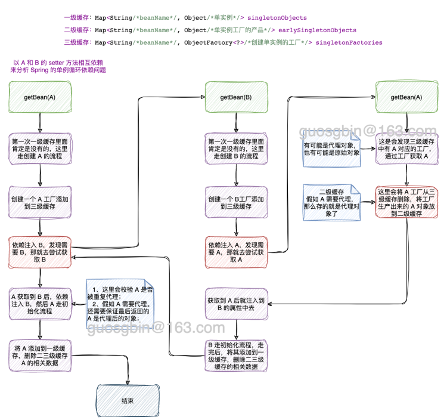


### 分布式事务本地消息表

消息表字段：id, biz_id, biz_type, msg, msg_result, msg_desc,atime,try_count。分别表示uuid，业务id，业务类型，消息内容，消息结果（成功或失败），消息描述，创建时间，重试次数， 其中biz_id，msg_desc字段是可选的。


1. Producer 端准备 1 张消息表，把 update DB 和 insert message 这 2 个操作，放在一个 DB 事务里面，也就是说保证业务操作和本地消息表的操作是原子性的。发送消息到消费方，如果消息发送失败，会进行重试发送。
2. 定时任务把消息表中的 message 传送给 MQ。失败了，不断重试重传。允许消息重复，但消息不会丢。
3. Consumer 端准备一个判重表。处理过的消息，记在判重表里面。实现业务的幂等。但这里又涉及一个原子性问题：如果保证消息消费 + insert message 到判重表这2个操作的原子性；


### SPI 机制，以及其在 Motan 中怎么用的

- API：当实现方提供了接口和实现，我们可以通过调用实现方的接口从而拥有实现方给我们提供的能力，这就是 API ，这种接口和实现都是放在实现方的；
- SPI：**当接口存在于调用方这边时，调用方定义接口规则，不同的实现按照这个接口规则去实现，提供各种的服务**；

有很多开源框架都涉及到了 SPI 技术，例如 **JDBC 的数据驱动**、**Motan 和 Dubbo 扩展的 SPI 机制**、Spring 的 SPI 机制、日志框架中的 SPI 机制。

#### JDK 的 SPI 机制源码分析

为什么要在 resource 的  `/META-INF/services`   文件夹下面创建文件呢？其实这个路径是 JDK 的 ServiceLoader 类源码中写死的，如下：

```java
private static final String PREFIX = "META-INF/services/";
```

这里我们分析下 ServiceLoader 实现 SPI 的机制，也就是分析上面的案例的代码是如何得到实现类对象的，案例测试代码如下：

```java
@Test
public void test() {
    // 初始化一个 ServiceLoader
    ServiceLoader<Loadbalance> s = ServiceLoader.load(Loadbalance.class);
    Iterator<Loadbalance> iterator = s.iterator();
    // 加载所有的 Service Provider
    while (iterator.hasNext()) {
        Loadbalance loadbalance = iterator.next();
        loadbalance.select("用户服务");
        loadbalance.setWeightString("100");
    }
}
```

老样子先看一下整体的流程图：

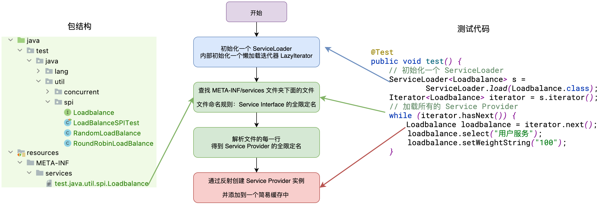

第一步：调用 java.util.ServiceLoader#load(Class) 方法获取一个 ServiceLoader 对象，这一步没有做什么特殊处理，就是初始化一个 ServiceLoader 实例，并且初始化了一个延迟加载 Service 的迭代器 lookupIterator。

```java
private ServiceLoader(Class<S> svc, ClassLoader cl) {
    service = Objects.requireNonNull(svc, "Service interface cannot be null");
    loader = (cl == null) ? ClassLoader.getSystemClassLoader() : cl;
    acc = (System.getSecurityManager() != null) ? AccessController.getContext() : null;
    reload();
}

public void reload() {
    providers.clear();
    // 创建一个懒加载用的迭代器
    lookupIterator = new LazyIterator(service, loader);
}
```

第二步：调用迭代器的 hasNext() 方法查看是否有 Service 实现可以获取，第一次获取会去前面说的延迟加载的迭代器 lookupIterator 中去尝试获取 Service 实现，最后会调用 java.util.ServiceLoader.LazyIterator#hasNextService 方法

```java
/* 是否有更多的 service */
private boolean hasNextService() {
    if (nextName != null) {
        return true;
    }
    if (configs == null) {
        try {
            // PREFIX = "META-INF/services/"
            String fullName = PREFIX + service.getName();
            if (loader == null)
                configs = ClassLoader.getSystemResources(fullName);
            else
                configs = loader.getResources(fullName);
        } catch (IOException x) {
            fail(service, "Error locating configuration files", x);
        }
    }
    while ((pending == null) || !pending.hasNext()) {
        if (!configs.hasMoreElements()) {
            return false;
        }
        pending = parse(service, configs.nextElement());
    }
    nextName = pending.next();
    return true;
}
```

上面 java.util.ServiceLoader.LazyIterator#hasNextService 方法的关键部分就是获取文件路径，也就是 `String fullName = PREFIX + service.getName();`，然后通过加载器去加载这个资源，最后调用 java.util.ServiceLoader#parse 方法去解析这个文件里面的内容，也就是我们写在里面的 Service 的实现类的全限定名称。该 parse 方法的实现如下

```java
private Iterator<String> parse(Class<?> service, URL u)
    throws ServiceConfigurationError
{
    InputStream in = null;
    BufferedReader r = null;
    ArrayList<String> names = new ArrayList<>();
    try {
        in = u.openStream();
        r = new BufferedReader(new InputStreamReader(in, "utf-8"));
        int lc = 1;
        while ((lc = parseLine(service, u, r, lc, names)) >= 0);
    } catch (IOException x) {
        fail(service, "Error reading configuration file", x);
    } finally {
       // ...... 省略关流处理 ......
    }
    return names.iterator();
}
```

这个方法的作用就是，没解析一行就去尝试将解析出来的 Service 实现类的全限定名存到 names 集合里面去。

第三步：调用迭代器的 next() 方法获取 Service 实现类的实例，ServiceLoader 中有缓存机制，这里就不分析它的缓存机制了。如果 Service 实现类的实例还没有创建，就会去调用 java.util.ServiceLoader.LazyIterator#nextService 去实例化 Service 实现类。

```java
private S nextService() {
    if (!hasNextService())
        throw new NoSuchElementException();
    String cn = nextName;
    nextName = null;
    Class<?> c = null;
    try {
        c = Class.forName(cn, false, loader);
    } catch (ClassNotFoundException x) {
        // ...... 省略异常处理 ......
    }
    if (!service.isAssignableFrom(c)) {
        // ...... 省略异常处理 ......
    }
    try {
        S p = service.cast(c.newInstance());
        providers.put(cn, p);
        return p;
    } catch (Throwable x) {
       // ...... 省略异常处理 ......
    }
    throw new Error();          // This cannot happen
}
```

其实就是通过反射去创建 Service 的实现类了。

#### Motan/Dubbo 中的 SPI 机制的提现

以 Motan 为例分析，Motan 自己实现了类似 JDK 的 ServiceProvider 的 SPI 机制，在 JDK 的 SPI 机制上做了自己的扩展。

com.weibo.api.motan.core.extension.ExtensionLoader 类是 SPI 机制的核心，它支持 JDK ServiceProvider 和注解方式去配置 SPI，获取 Service 实现类的实例核心代码如下：

```java
public T getExtension(String name, boolean throwWhenNotFound) {
    checkInit();
    
    // ...... 省略异常处理 ......

    try {
        Spi spi = type.getAnnotation(Spi.class);

        if (spi.scope() == Scope.SINGLETON) {
            // 单例处理
            return getSingletonInstance(name, throwWhenNotFound);
        } else {
            // 获取保存的 name 对应类的 Class 文件
            Class<T> clz = extensionClasses.get(name);

            // ...... 省略异常处理 ......

            // 反射创建实例
            return clz.newInstance();
        }
    } catch (MotanFrameworkException mfe) {
        // ...... 省略异常处理 ......
    }

    return null;
}
```

简单看一下 motan-core 包下的 `META-INF/services/` 中有多少个 LoadBalance 的实现类。

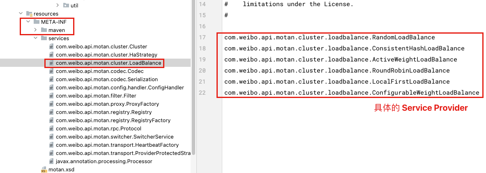

关于 Motan、Dubbo 的 SPI 机制后面有机会再详细分析。

## introduce

我叫 XXX，来自湖北黄冈。

我到目前已经有 4 年左右的 Java 后端开发经验了。

目前在这家公司已经有两年多的时间了，我在公司的角色是一个开发小组的组长，加我一起 3，4 个人吧。平时的工作主要是作为需求和一些海外项目的 Owner，跟进需求的进度，并持续推动。从需求评审、设计评审、分配任务、编码设计、Code Review 等一些列流程下来，让服务保质保量的按时交付。

工作中的一些碎片化的时间会利用起来去梳理当前我负责的服务上的现有逻辑，找出一些性能问题、逻辑漏洞，并推动解决他们。

平时下班后的时间会学习一些开源框架的源码设计，目前我已经看了 Netty、RocketMQ、JUC、Spring、Mybatis 的核心源码了，学习这些框架的目的是为了从中学设计模式的使用，和一些架构、设计思路，并且把学到的知识更好的运用在项目中。

## what did u do

### architecture

我们项目主要是分为 4 个部分，**直播业务、广播剧业务、小程序电商业务、小说业务**，这些业务基于一些共用的基础服务，例如用户服务，资金服务，订单服务等等。

我们组主要负责**直播间相关业务**和**自研 IM 服务**

一、直播间服务有哪些内容呢，如下：

1. 直播 PK；
2. 直播连麦；
3. 送礼；
4. 抽卡，扭蛋；
5. 粉丝团；
6. 各种排行榜；
7. 还有一些其他活动相关的业务；

二、自研 IM 服务主要业务如下：

1. 私聊；
2. 群聊；
3. 直播间弹幕；
4. 一些业务消息；

三、除开这些还有一些海外的套壳版本的 app 也是我们维护的。目前有日本的直播 app，美国的听剧的 app。

### what did I do

负责**直播间业务**和**海外业务**的需求迭代，**维护 IM 服务**。工作中主要是版本需求和技术优化各占一半吧。

我主要做的需求：

- 北美的套壳 app 都是我主导的；
- 自研 IM 服务从 0 到 1 参与设计和开发，目前这个服务也是由我和组长，总共两个人来维护的，其他开发的人都已经离职好久了。
  - 技术选型，功能设计，协议设计，编码落地都是有参与其中；
  - IM 中我主要负责 Netty 服务端基础服务的搭建，以及设计类似 SpringMVC 的那种过滤器链和接口映射关系。再就是其它 IM 相关的业务开发了；

我做了那些优化：

1. **通过 IM 的上行下行限流策略，降低公网流量，减少 50% 的运维费用；**
2. 大主播开播关播瞬时导致直播服务的 CPU 飚高，然后趋于稳定。通过缓存优化；
3. **大主播开播导致 IM 服务的 CPU 飚高。通过优化编解码的次数，降低 7 - 8% 的 CPU 使用率；**
4. **线上规律性的 CPU 峰刺**，
   1. 一小时一次的是因为日志量上来了，每个小时日志压缩都会导致 CPU 变高。通过将日志压缩转移到闲时压缩；
   2. 几分钟一次的 CPU 变高，是因为内存泄漏。解决内存泄漏的代码，服务恢复正常；
5. **Redis 的大 key 拆分**：之前有个备注名的业务，旧的实现是每个用户的备注列表是通过 hash 来实现的，也就是 field 是对方用户 uid，value 是给对方的备注。这样在用户给被人备注非常多的情况下，就会变成一个大 key。后面我给这个 hash 改成 string 来实现了，就消除了大 key；
6. **直播服务的慢查询次数降低 90 %**；
7. 设计手动服务降级策略，保证核心服务的稳定性；

## project introduce

### IM 系统设计

#### 自研背景

红豆客户端、有信客户端、红豆 H5 在用腾讯 IM 收发消息，稳定性、触达率、实时性都没有问题。

随着 DAU 越来越改，每月需要花费一笔很大的费用，使用腾讯 IM 每月产生费用 2W+，迁移到微博 IM 可以为我们节省费用。

#### 技术选型

```
Kafka,Redis,Netty,Hystrix,Nacos,Motan,Springboot
```

#### 功能设计

**消息优先级**

1. 实时性（如礼物消息要求快速到达，不能丢）；
2. 限流丢弃（如文本消息、点赞消息在超过一定频次后可以丢消息）；

**QOS**

1. 至少到达 1 次（有可能重复）（我们平台用的这个）
2. 至多到达 1 次（有可能丢消息）
3. 必达 1 次（不能重复）

**有限时效实时消息（有效期内到达，否则丢弃，不落地=如点赞）**    

**敏感词检查（否进行敏感词检查，如点赞/系统消息就不需要检查，评论消息必须检查）**


**群消息(群聊/聊天室)**

1. 直播间人数无上限
2. 直播间在线人数 ==> 支持查询用户在线状态
3. 直播间成员 ==>  支持查询在线直播间用户列表( ==>  这个在业务上去做)
4. 消息内容(业务级定义:文本/点赞/礼物/离线消息 ==> 这个目前业务进直播间有拉历史消息)
5. 支持游客态查询消息(游客态)


**C2C消息(单聊)**

支持用户与用户之间互发消息 （目前消息类型有:拉黑/增删管理员/PK和连麦发起）


**支持环境**(语言)

1. Android(Java)
2. iOS(ObjectC/Swift)
3. PC(C++)
4. WEB/H5(JS)


**多端支持**

1. 多端登陆
2. 多端消息同步(主要需求是主播多端操作的消息同步)


**服务端需求**

1. 消息回调
   1.    文本消息
   2.    礼物
   3.    点赞
2. 弹性伸缩
3. 故障转移
4. 降级
5. 监控
6. 消息染色/路径跟踪
7. 消息日志
8. 到达率(统计?)

#### 消息存储模型

消息存储模型，存储模型的选型直接影响着消息同步模块的实现。消息、会话、会话与消息组织关系的实现方式在业界各主流 IM 系统中都不尽相同，但无外乎两种形式：**写扩散读聚合**、**读扩散写聚合**。读、写扩散是消息在群组会话中的存储形式，其详细说明如下。

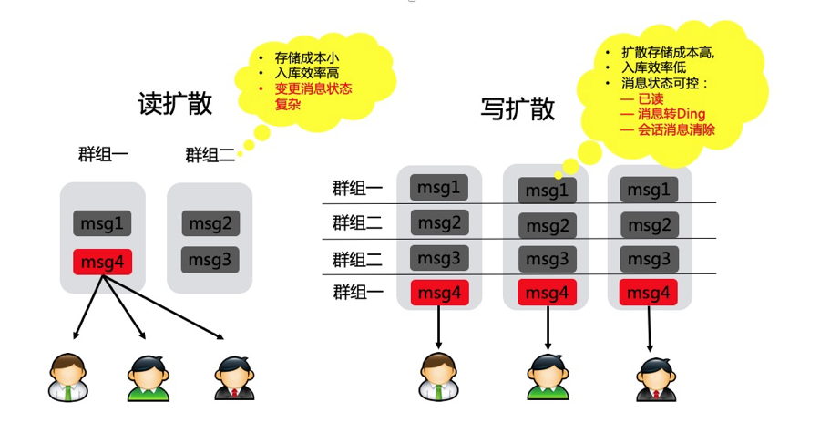

- **在读扩散场景中，消息归属于会话，相当于数据库中存储着一张conversation_message表，其中包含该会话产生的所有消息。这种存储形式的好处是消息入库效率高，只保存会话与消息的绑定关系即可。**
- 在写扩散场景中，会话产生的消息投递到message_inbox表中，该表类似于个人邮件的收件箱，其中保存着个人的所有会话，会话中的消息按其产生的时间顺序排列。这种存储形式的好处是能实现灵活的消息状态管理，会话中的每条消息在面向不同的接收者时可以呈现出不同的状态。

**读扩散和写扩散的优缺点：**

- **采用读扩散的方式，在大并发修改数据的场景下，数据一致性处理效率和数据变更效率会成为系统性能瓶颈。**
- 采用写扩散的方式实现消息存储模型，以更高的存储成本支持更高的更新性能。

**我们系统怎么实现的呢？**

- IM 系统并不做真正存储的操作，在业务服务器会提供消息真正发送前后发送后的 callback 服务；
- 在 callback 服务中去做参数校验、落库、消息箱通知、push 等逻辑；

#### 系统整体架构

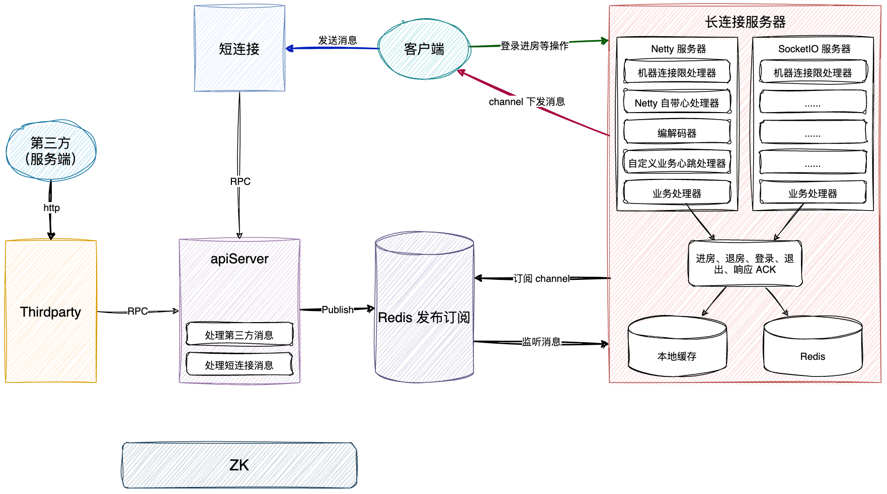

#### 认证 token 设计

| 版本号(2位) | uid(12位) | `appId(4位)` | `tick(登陆计数器)(3位)` | `clientId(客户端类型)(1位)` | uidtype(用户类型)（1位） | 随机字符(8位) | ` 加密串(6位)` |
| :---------- | :-------- | :----------- | :---------------------- | :-------------------------- | :----------------------- | :------------ | :------------- |
| 0-2         | `2-14`    | `14-18`      | `18-21   `              | `21-22`                     | `22-23`                  | `23-31`       | `31-37`        |


IM 系统接入流程

**从 KilaServer 拿 access_token(1) -> 调用 dispatch -> 获取长连接地址:端口和 access_token(2) -> 长连接登录(进入直播间) ->轮询(收发消息)**

#### 协议设计

主要包括请求头和请求体了

请求头就是一堆 key，value，比如：

- token
- requestid
- 机型，安卓或者iOS
- appid
- 请求消息的类型，是群发，单发，获取长连接等类型；

对应请求体：

- 不同的类型的协议的，需要携带的请求体的 key，value 不一样；

#### probuf 序列化

不是我做的，不看了

#### ACK 机制

并不是所有消息都需要进行 ACK，一些重要的消息进行 ACK，重要的消息给客户端返回一个需要响应 ACK 的标记，客户端接收到消息后就会发送一个 ACK 消息到 IM 系统。

经过线上验证 IM 系统的消息到达率 99.9%

#### 压测数据参考

- ​    api-server(收发消息服务层，登录session，房间成员、关系/消息收发消息等业务处理) 
- ​    api-exchange(第三方消息回调，包含腾讯/微博的回调以及回调给KilaServer的消息)
- ​    center-connect (上行发消息，称短连接)
- ​    api-connect(下行收消息，称长连接) 

下行(收消息)

压测环境 阿里云ECS 16核 32G 专用网络 最大100M，redis(pub/sub 4台 1G 4.0高配2W连接数)

api-sever 1台(192.168.5.55)， api-connect 1台(192.168.5.34)，center-connect 1台 独立机(192.168.5.35)，redis(pub/sub 4台 1G 4.0高配2W连接数)

- ​    单台 ECS 空消息情况下 TCP 连接数峰值 2.5W (由于测试客户端限制，还没有达到最大值，预估 3W 左右）
- ​    单台 ECS 空消息 WebSocket 连接数峰值 2W (由于测试客户端限制，还没有达到最大值，预估 2.5W 左右）
- ​    有消息收发的情况下，连接数预估 1W 左右，因为消息会占用很大的网络流量(**微博的机器是按照单实例 1W 的连接分布**)

#### IM 系统部署

- 长连接：41 台，按一台抗 1w 长连接，抗 40w 用户同时在线轻轻松松；
- 短连接：6 台；
- 群组服务：6 台；
- thirdparty 第三方：3 台；
- service 核心服务：6 台；

### IM 系统设计 2

#### 平台支持

- Android、iOS、Mac、Windows、Web、H5、小程序、嵌入式 Linux（ARM，MIPS）
- 服务端（含管理类 API 接口）、是否有 Demo 应用以及源码、是否有视频教程、是否提供 UI 组件

#### 部署节点

- 公有云
- 专有云
- 私有云：企业将系统直接部署到企业自己的服务器上，数据直接保存在本地。即时通信 IM 已支持私有化部署功能，可以协助企业进行私有化版本的部署、实施、运营维护。
- 是否支持海外节点

#### 消息类型

- 文本消息：消息内容是普通文本
- 图片消息：消息内容为图片 URL 地址、尺寸、图片大小等信息
- 表情消息：表情消息为开发者自定义
- 语音消息：语音数据需要提供时长信息，以秒为单
- 地理位置消息：消息内容为地理位置标题、经度、纬度信息
- 文件消息：消息内容为文件的 URL 地址、大小、格式等信息，格式不限
- 短视频消息：消息内容为视频文件的 URL 地址、时长、大小、格式等信息
- 自定义消息：开发者自定义的消息类型，例如红包消息、石头剪刀布等形式的消息
- 系统通知消息：包含内置的系统通知消息和开发者自定义系统通知消息
- 群 Tips 消息：系统性通知消息，例如有成员进出群组，群的描述信息被修改，群成员的资料发生变化等
- 透传消息：透传消息可视为一条指令，通过发送这条指令给对方，通知对方要执行的操作，对方收到消息可自定义处理；

#### 消息功能

- 消息下载：App 管理员可以通过该接口获取 App 中最近7天某天某小时的所有单发或群组消息记录
- 离线消息：用户登录后退到后台，当有用户给其发消息时，即时通信 IM 支持离线推送
- 漫游消息：在新设备登录时，将服务器记录(云端)的历史消息存储进行同步
- 多端同步：多终端消息同步，可同时收到消息
- 历史消息：支持本地历史消息和云端历史消息
- 消息撤回：撤回投递成功的消息，默认撤回 2 分钟内的消息。撤回操作仅支持单聊和群聊消息，不支持直播群的撤回
- 已读回执：查看点对点会话中对方的已读未读状态
- 消息转发：将消息转发给其他用户或群组
- @功能：群内 @ 消息与普通消息没有本质区别，仅是在被 @ 的人在收到消息时，需要在 UI 上做特殊处理
- 正在输入：可以通过在线消息实现
- 离线推送：支持苹果 APNs、小米推送、华为推送、魅族推送、OPPO 推送、vivo 推送、Google FCM 推送
- 消息删除：使用消息的 remove 方法可以在本地删除消息
- 红包功能：红包消息与@消息类似
- 全员推送：基于即时通信 IM 通信架构实现的一组 REST API，用以支持 App 应用的全员推送、标签推送、属性推送等消息推送需求，客户端可通过 SDK 在线推送、离线推送（Android 后台通知和 APNs）接收推送的消息
- 本地消息搜索：支持搜索好友，搜索群组、群成员；搜索消息，按照会话分组
- 第三方回调：发送方消息发出后，应用服务器可据此进行必要的数据同步，或者根据业务需求干预事件的后续处理流程，比如鉴权校验，校验通过后方进行投递，否则消息不投递
- 离线推送：离线推送是指当应用被杀死时，通过厂商推送接收消息。iOS 设备使用苹果推送通知服务（APNs），Android 设备为谷歌云消息传递服务（FCM）、华为推送、小米推送、魅族推送、OPPO 推送和 vivo 推送。

#### 关系链功能

- 查找好友：可通过用户账号 ID 查找好友
- 申请添加好友：要选择默认是否需要申请理由，目前是默认不需要
- 添加好友：发送添加好友请求
- 导入好友：支持批量导入单向好友
- 更新好友：支持批量更新同一用户的多个好友的关系链数据
- 删除好友：成为好友后可以删除好友
- 获取所有好友：获取所有好友，默认只拉取基本资料
- 同意/拒绝好友：收到请求加好友请求的系统通知后，可以通过或者拒绝
- 添加用户到黑名单：把任意用户拉黑，如果此前是好友关系会解除好友关系
- 移除黑名单：把用户从黑名单中移除
- 获取黑名单列表：拉取用户黑名单列表
- 好友备注：成为好友后可以给好友备注
- 设置好友自定义资料：最多20个好友自定义字段
- 创建好友分组：创建分组时，可以同时指定添加的用户，同一用户可以添加到多个分组
- 删除好友分组：删除好友分组
- 校验好友：支持批量校验好友关系
- 校验黑名单：支持批量校验黑名单
- 添加好友到某分组：将好友添加到好友分组
- 从某分组删除好友：将好友从好友分组中删除
- 重命名好友分组：重命名好友分组
- 获取指定好友分组信息：获取指定的好友分组
- 获取所有好友分组：获取所有分组信息，另外，通过获取所有好友也可以获取分组信息
- 关系链资料存储：SDK 可以对关系链资料进行存储
- 好友资料变更系统通知：好友资料变更可以收到系统通知
- 关系链变更系统通知：关系链变更可以收到系统通知

#### 数据统计

- 活跃用户数：与服务器产生连接交互的去重用户数
- 新增注册用户数：新增注册 ID 数量
- 累计注册用户数：查看所有注册用户数
- 上行消息数：可以选择时间查看上行消息数
- 发送消息人数：可以选择时间查看发送消息人数
- 最高同时在线人数：可以选择时间查看在线同时在线人数
- 单聊上行消息数：可以选择时间查看单聊上行消息数
- 单聊发消息人数：可以选择时间查看单聊发消息人数
- 群聊上行消息数：可以选择时间查看群组中上行消息数
- 群聊发消息人数：可以选择时间查看群组中发消息的人数
- 发消息群组数：可以选择时间查看发消息群组数
- 新增群组数：可以选择时间查看新增群组数
- 累计群组数：可以选择时间查看累计群组数
- 导出数据：可以选择时间导出数据

#### 在线状态

每个用户的状态类型有以下三种：

- 前台运行状态（Online）
- 后台运行状态（PushOnline）
- 未登录状态（Offline）

> 后台运行状态（PushOnline）只有手机端（Android、iOS、iPad、Mac）会存在，PC、Linux、小程序和 Web 端不存在该种状态。

- **前台运行状态（Online）**：是指客户端和即时通信 IM 服务端保持有顺畅的 TCP 网络连接，客户端可以发消息给即时通信 IM 服务端，也可以收到来自即时通信 IM 服务端推送的消息。**当用户打开 App 后，状态即为前台运行状态（Online）。**App 启动后，客户端和即时通信 IM 服务端建立 TCP 长连接，即时通信 IM 服务端保存客户端的在线信息，例如客户端的网络链路信息，客户端的平台版本等。App 在运行过程中，IM SDK 会定时发送心跳来确认用户的在线状态。
- **后台运行状态（PushOnline）**：是指客户端和即时通信 IM 服务端的 TCP 长连接断开。此时可收到消息的离线推送。 以下场景用户的状态为后台运行状态（PushOnline）：
  - 用户使用完 App ，把 App 切后台后进程被手机操作系统 kill 掉，或者用户主动 kill 掉 App 进程。 如果 App 在手机操作系统的保活白名单中，用户把 App 切后台，进程并不会被手机操作系统 kill 掉。此时状态仍然为前台运行状态（Online）。前台运行状态（Online）和后台运行状态（PushOnline）判断的标准之一是 App 进程是否被 kill ，即客户端和即时通信 IM 服务端的 TCP 长连接是否断开。
  - 用户主动关闭客户端网络（例如打开手机飞行模式），或者客户端网络完全不可用（例如进入完全没有网络信号的隧道）。 在这种特殊情况下，客户端连 TCP 协议的 FIN 包或 RST 包都无法发出，即时通信 IM 服务端需要等待 400 秒后发现心跳包超时，状态才会变成后台运行状态（PushOnline）。

- **未登录状态（Offline）**，是指用户没有输入账号和密码登录前的状态，此时无法收到消息的在线推送，也无法收到消息的离线推送。 以下场景用户的状态为未登录状态（Offline）：
  - 用户主动登出，或下载 App 后还未进行过登录时。
  - 用户状态变成后台运行状态（PushOnline）后，7天内没有再登录过，此时状态变为未登录状态（Offline）。

#### 状态变更感知的实时性

**Android/iOS/iPad/PC/Mac/Linux**

对于绝大多数情况，用户状态的变化都能实时感知，例如：

- 用户主动登录，状态变成前台运行状态（Online）。
- 用户主动登出, 状态变成未登录状态（Offline）。
- 用户主动 kill 客户端进程，或者用户切后台后，客户端进程被手机操作系统 kill 掉，状态变成后台运行状态（PushOnline）。

只有以下一种特殊情况，IM 云服务器需要等待400秒的心跳超时时间才能感知状态变更： 当网络完全不可用时，客户端连 TCP 协议层的 FIN 包或 RST 包都无法发出时，IM 云服务器需要等待400秒的心跳超时时间才能感知到状态变成后台运行状态（PushOnline）。常见的场景有用户主动关闭客户端的网络（例如开启手机的飞行模式），或者进入完全没有网络信号的隧道。


**Web**

用户主动登录 Web 端时，IM 云服务器可以实时感知到状态变成前台运行状态（Online）。

各种场景的退出/断线的状态变更实时性如下：

- 直接关闭页面，可以实时感知，状态变成未登录状态（Offline）。
- 页面不关闭时，网络断开，需要 60s 才能感知到，状态变成未登录状态（Offline）。
- 主动调用 destroy 接口，可以实时感知，变成未登录状态（Offline）。


**小程序**

用户主动登录小程序端时，IM 云服务器可以实时感知到状态变成前台运行状态（Online）。

各种场景的退出/断线的状态变更实时性如下：

- 点右上角退出，5s 内感知到状态变成未登录状态（Offline）。
- 断网(如手机开启飞行模式) ，60s 感知到状态变成未登录状态（Offline）。
- 微信切后台，30s 左右状态变成未登录状态（Offline）。
- 杀掉微信进程，可以实时感知，变成未登录状态（Offline）。
- 主动调用 destroy 接口，可以实时感知，变成未登录状态（Offline）。

#### 多端登录

- 互踢：IM SDK 在同时登录多个终端（如同时登录 PC、Android）时，会进行互踢，只有最后一个登录的设备可以在线，之前登录的都会被踢下线；
- 同时在线：Android、iPhone、iPad、Windows、Mac、Web；

#### 登录逻辑

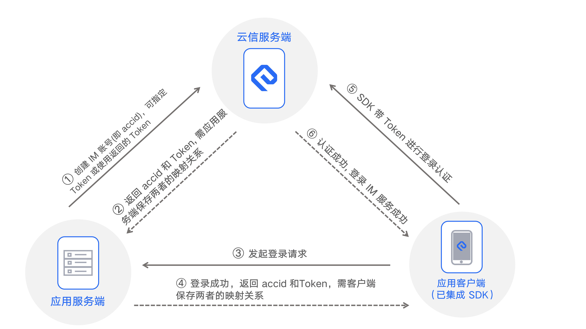

#### 其他

- 聊天室消息优先级；
- 反垃圾；
- 数据加密；
- 协议设计；


群组和聊天室的区别：

群组：

- 群组是支持多人沟通的即时通讯系统，**成员关系相对稳定**。所有群成员可在群中收发送消息。**当群成员离线时，可以收到推送消息**。群组分为公开群和私有群，公开群可以被搜索到，非群成员可以加入；私有群不能被搜索到，需要群主或群管理员添加用户进入。群组成员支持多种角色：群主、群管理员、群成员。群组提供丰富的管理能力，例如，群组禁言、黑名单和白名单等。

聊天室：

- 聊天室是支持多人加入的组织。**聊天室中的成员没有固定关系**，用户离线后，超过 2 分钟会自动退出聊天室。聊天室成员在离线后，不会收到推送消息。聊天室可以应用于直播、消息广播等；

### IM 过滤器链，异常处理，url 映射

Spring 容器初始化完成后，我们可以监听初始化完成的事件，**ApplicationListener 接口**

- 初始化过滤器链；
- 初始化异常处理器；
- 初始化 url 映射；

#### 过滤器链

```java
Map<String, Object> beansWithAnnotation = applicationContext.getBeansWithAnnotation(WesyncFilter.class);
```

获取带有 @WesyncFilter 的所有类的 beanName 和实例，然后给这些过滤器通过 @Order 排序一下，放到链子集合 wesyncFilterChain 中

```java
private WesyncFilterChain wesyncFilterChain = null;
```

#### url 映射

获取带有 @WesyncURL 的所有类的 beanName 和实例，带了 @WesyncURL 注解的就说明是有映射关系的，需要找到那个方法去处理这个协议。

根据前面查找到的 @WesyncURL 的类的 class 文件，获取他的父类，或者接口，遍历这些类中的所有方法，查看上面是否有 @WesyncURL 注解。


映射信息如下：

```java
public class UrlMapping {

    String name; // 协议名
    String tag; // 协议

    Object realBean; // 实例
    String realMethod; // 协议对应的方法
 
    // ......
}
```

初始化映射关系：

```java
private void initUrlMappings(ApplicationContext applicationContext) {
    if (urlTagMapping == null) {
        logger.debug("begin init urlMappings..");
        urlTagMapping = new HashMap<String, UrlMapping>();

        Map<String, Object> beansWithAnnotation = applicationContext.getBeansWithAnnotation(WesyncURL.class);
        UrlMapping urlMapping = new UrlMapping();
        Object realBean = null;
        for (String key : beansWithAnnotation.keySet()) {
            realBean = beansWithAnnotation.get(key);
            urlMapping.setRealBean(realBean);
            initHandlerMethods(realBean.getClass(), urlTagMapping, urlMapping);
        }

        logger.debug("end init urlMappings...");
    }
}
```


### 直播间多级缓存优化

#### 突发流量多级缓存优化

背景：由于大主播开关播，用户同时进入直播间会有大量的接口调用，导致系统 QPS 激增，对系统的冲击比较大，为了应对突发流量，设计了直播间的多级缓存优化。

目前系统中有基本上所有数据都有 Redis 缓存层，但是 QPS 调用量大的接口里面可能需要查询各种各样的信息，导致接口的跨度比较大，可能会查询很多次 Redis 或者 DB。

比如接口需要返回一个 RoomStart 的对象，但是这个对象的数据组装来自很多个 service 的接口调用，考虑提前将数据组装好，将 RoomStart 对象存放到本地缓存和 Redis 中，就是一个镜像数据。（前提是这些数据的更新频率不高）

主要流程如下，两层缓存；

- 本地缓存：并为存储所有数据，而是存储上次刷新时间戳，实现定时刷新 Redis 缓存的目的；
- Redis 缓存：当本地缓存的刷新时间戳失效后，调用 Service 接口刷新 Redis 缓存；

#### 本地缓存回种超时优化（异步刷新）

背景：礼物的数据更新的频率不高，使用本地缓存去存储，但是假如本地缓存过期回种的时候只会允许一个线程去刷新数据，其他线程就会等待，导致 RPC 超时，给用户不好的体验。

优化：针对礼物这种静态数据但请求量大的业务场景，通过异步刷新本地缓存 , 保证本地缓存的数据是最新的。

- 查询时先获取上次刷新的时间 , 如果到了需要刷新的时间仍然返回缓存中的结果, 同时启动异步刷新缓存的任务；
- 这样可以避免在用户请求线程中回种导致用户请求超时；
- 例如有些业务 比如查询主播自定义礼物单次从查询回种需要查询 1900+ 条数据回种必然超时可以使用这个工具类异步刷新本地缓存；

主要优化思路：

- 一个业务需要保存两个本地缓存的 key，一个实际数据和上次刷新时间；
- 如果从本地缓存没有获取到数据，那么还是要同步等待数据刷新；
- 如果从本地缓存获取到了数据，但是距离上次刷新时间已经到期了。此次会返回旧数据，然后异步刷新数据；

#### 本地缓存的问题

问题：本地缓存会出现 「数据漂移」的现象。具体体现为集群中的多个服务中的本地缓存的刷新时机不一样，两台机器内的本地数据的不一样，用户两次请求分别打到了这两个机器上，导致用户看到的效果不同。

解决：无法解决，使用本地缓存的场景就是为了存储数据变更频率不高的场景，那么对这种数据不一致性是可以接受的。

### 国际版迁移

没啥好说的，就是重构一下代码，数据隔离兼容多 app，为后续新建 app 缩短时间。

### 慢查询优化

**慢查询优化主要有下面几个方向：**

- 重新设计索引；
- 优化查询语句；
- 建立缓存，对于变化频率不大数据可以考虑建立 本地缓存+定时刷新 的策略；
- 冷数据备份；


**本次慢查询优化，降低了 90% 的慢查询次数，主要就是按照上面的几个策略去处理的：**

- 有的 SQL 并不需要查所有的字段，只查询需要的字段；
- 有的查询无法走索引，所以需要重新设计索引，优化查询效率；
- 有的慢查询虽然设计了缓存，但是它过期时间比较快，导致访问数据库的次数也比较多，针对一些变化频率不高，或者时效性不高的数据可以直接存在 redis 中，不设置过期时间；
- 对于一些记录类型的表，可以做冷数据备份，因为一般记录性的操作端上露出的也就一年或者半年的数据；

### 内存泄漏

**内存泄漏产生背景：**

- 背景：我们需要统计一下直播间维度的某个数据，使用我们的一个打日志的工具类，传入某个指标的key，就会定时打印统计日志了；

**上线一台机器后发现问题：**

- CPU 每隔几分钟就会打满，十分有规律；
- 通过服务器的监控和 TOP 命令的查询，发送就是服务器频繁 GC，垃圾回收器占满了 CPU；

**定位问题：**

- 很明显就是此处加的统计代码导致的内存泄漏；
- 首先查看服务 JVM 的一些信息，使用 jstat、jmap 等命令，jmap 可以查看堆中那个对象占用比较大；
- 发现是统计的日志打印的工具类中的一个 Map 非常大，很明显就是没有移除 Map 的元素导致内存泄漏了。

**处理：**

- 因为工具类中有个隐藏的 Map，而且它对外没有提供 remove 方法，导致越来越大，发生内存泄漏。
- 工具类增加该 Map 的移除方法，解决；

### CPU 峰刺问题

**在我工作的时候遇到的 CPU 的蜂刺问题不少，具体遇到的有下面的情况：**

1. 大主播开播导致的服务器的 CPU 的飙升，对于服务来说瞬时 QPS 可能会突然翻好几倍，会导致服务请求堆积，响应变慢：
   - Push 服务 CPU 飙升；
   - 涉及到的 Redis CPU 飙升；（这可能会影响到在该 Redis 实例上的其他业务的响应速度）
2. 发生内存泄漏导致 CPU 规律性的飙升，就是垃圾回收线程在清理垃圾；
3. 由于某些定时操作导致 CPU 的规律性飙升，例如某些业务的定时任务，也有可能是日志定时压缩导致的 CPU 飙升；


**大主播开关播的 CPU 峰刺是怎么优化的呢？**

- 定位问题和数据分析：通过监控分析 CPU 激增前后的接口的 QPS 的变化情况，定位那些接口导致的 CPU 激增；
  - 定位到了导致开关播峰刺的主要接口 8 个；
  - 双端关播接口存在差异，关播时安卓比 iOS 多调用了15个接口；
  - 关播瞬间 Android 多调用的接口瞬时 QPS 占总 QPS 的 55%；
- 优化方向：
  - 通过链路追踪来分析是接口的跨度那部分占比大，减少循环 RPC 或者访问 Redis 的情况；
  - 针对 Redis 的热 key 和大 key 进行拆分，分散热点数据，也可以将拆分后的 key 部署到 redis 集群上；
- 确定优化方案：
  - 将大主播开关播使用的接口数据整合到 Redis 和本地缓存中；
  - 在开播、关播、数据变更时预先加载数据到缓存中，同时定时刷新缓存数据；
  - 减少不必要的接口调用，精简接口字段；
  - 缓存采用 “算法路由 + 多节点负载” 的架构，保证请求均匀分发到多个实例，避免单节点压力；

## project QPS

广播剧服务：

- 单台机器：闲时平均 60，高峰期平均 160
- 总体：闲时平均 1800，高峰期平均 4800
- 采样 24 台

直播服务：

- 单台机器：闲时平均 50，高峰期平均 130
- 总体：闲时平均 1250，高峰期平均 3250
- 采样 25 台机器

核心 service 服务，Motan RPC TPS：

- 采样 49 台
- 单台机器：闲时平均 400，高峰期平均  1100
- 总体：闲时平均 24500，高峰期平均  53900

IM 服务 QPS：

- apiserver 总体：闲时平均 166，高峰期平均 1242
- thirdparty 总体：闲时平均 100，高峰期平均 574
- 长连接 总体：闲时平均 1000，高峰期平均 4078
- 短连接 总体：闲时平均 116，高峰期平均 450

## IM down stream data

总体：

- 闲时平均每秒 10000 消息下发
- 高峰期平均每秒 100 0000 消息下行

抽样单台：

- 闲时平均每秒 500 消息下发
- 高峰期平均每秒 5 0000 消息下行

## JVM data

线上 service 使用的垃圾回收器

进程信息

```
tomcat   13195     1 88 06:46 ?        03:25:32 /opt/java/jdk/bin/java -Xms12g -Xmx12g -Xmn3g -Xss512k -XX:+ExplicitGCInvokesConcurrent -XX:+UseParNewGC -XX:+UseConcMarkSweepGC -XX:CMSInitiatingOccupancyFraction=70 -XX:+UseCMSCompactAtFullCollection -XX:CMSFullGCsBeforeCompaction=5 -XX:+PrintGCDetails -XX:+PrintGCDateStamps -XX:SurvivorRatio=8 -XX:MaxTenuringThreshold=15 -XX:+HeapDumpOnOutOfMemoryError -XX:HeapDumpPath=/data/soft/logs/bak -Xloggc:/data/soft/logs/gc.log.20230703_064617 -Djava.net.preferIPv4Stack=true -classpath /手动打码/WEB-INF/classes:/手动打码/WEB-INF/lib/* com.uxin.zb.bootstrap.Provider
```

根据提供的信息，这是关于Tomcat服务器的启动命令和参数配置。下面是对该命令和参数的分析：

- `-Xms12g`：设置JVM的初始堆大小为12GB。
- `-Xmx12g`：设置JVM的最大堆大小为12GB。
- `-Xmn3g`：设置新生代（Young Generation）的大小为3GB。
- `-Xss512k`：设置线程栈大小为512KB。
- `-XX:+ExplicitGCInvokesConcurrent`：启用显式触发并发垃圾回收。
- `-XX:+UseParNewGC`：指定使用并行的新生代垃圾回收器。
- `-XX:+UseConcMarkSweepGC`：指定使用并发标记-清除（CMS）垃圾回收器。
- `-XX:CMSInitiatingOccupancyFraction=70`：设置CMS垃圾回收器触发标记阈值为70%。
- `-XX:+UseCMSCompactAtFullCollection`：指定在进行完整垃圾收集时使用压缩算法。
- `-XX:CMSFullGCsBeforeCompaction=5`：设置在进行压缩前进行完整垃圾回收的次数为5次。
- `-XX:+PrintGCDetails`：打印详细的垃圾回收信息。
- `-XX:+PrintGCDateStamps`：打印垃圾回收事件的日期时间戳。
- `-XX:SurvivorRatio=8`：设置幸存者空间（Survivor Space）与伊甸园空间（Eden Space）的大小比例为8:1。
- `-XX:MaxTenuringThreshold=15`：设置对象晋升到老年代的最大年龄阈值为15。
- `-XX:+HeapDumpOnOutOfMemoryError`：在发生OutOfMemoryError时生成堆转储文件。
- `-XX:HeapDumpPath=/data/soft/logs/bak`：指定堆转储文件的路径为`/data/soft/logs/bak`。
- `-Xloggc:/data/soft/logs/gc.log.20230703_064617`：将GC日志输出到`/data/soft/logs/gc.log.20230703_064617`文件中。
- `-Djava.net.preferIPv4Stack=true`：设置Java虚拟机首选使用IPv4网络栈。
- `-classpath /手动打码/WEB-INF/classes:/手动打码/WEB-INF/lib/*`：指定类路径，包括应用程序的类和依赖库。
- `com.uxin.zb.bootstrap.Provider`：要启动的主类。

## interview question

### didichuxing 1 打车业务

- 项目：你负责那些业务，挑一个你负责的业务说说？
- 项目：说一下你的 IM 服务的架构，以及发送消息的整个流程？
- 说一下线程池的各个参数的作用，你是怎么设置的？为什么要这样设置？
- 多个线程同时执行，多个线程的任务都执行完后，执行一个任务，说思路？
- 算法：简单的二进制转换的题；

### didichuxing 2 打车业务

- 项目：你负责那些业务，挑一个你负责的业务说说？
- 慢查询优化怎么做的，有哪些方向？
- 那些会导致慢查询？
- TCP 断开过程？timewait 在那边？它的作用是什么？
- https 为什么安全？
- 一个日志文件，如何用 shell 脚本查询出出现频率最高的 IP 地址；
- 滴滴打车，用户打完车后，累加此次的打车里程，需要准确的计算他超过了多少个百分比的用户，怎么设计？
- 短链如何设计，如何存储？
- 算法：简单的双指针题目；

### xiaohongshu 1 IM 方向

- 说一下你们的 IM 系统架构，发消息的流程；
- Netty 有那些组件，它们的作用是什么？
- Netty 服务端的启动流程；
- ChannelHandler 如何绑定一个 EventLoop 线程；
- 你们 IM 的 ACK 机制是怎么做的；
- 说一下你们 IM 的消息的存储机制；
- 长连接 CPU 优化怎么做的；
- 私聊如何确保一定送达，发送网络不通的情况如何处理；
- ReentrantLock 原理？AQS 原理？
- 写一个两个线程交替打印数据的题目；

### Ali  sumaitong 1 这个人妥妥的傻呗

- 说一下你们 IM 服务？
- 说一下你的直播服务？主要做什么的，有那些业务模块？
- 说一下你们线程池怎么用的，拒绝策略是什么样的？拒绝的任务怎么处理？
- 你们怎么保证送礼业务的最终一致性；
- 你做了那些优化？我说了优化机器的 CPU 使用率？
- 为什么大主播开播你们服务的 CPU 就上去了？QPS 增高和 CPU 有什么联系？
- 你怎么发现 CPU 增高的？ arthas 的 profiler 火焰图；
- CPU 的峰刺你是怎么优化的？怎么定位的？
- 你做过 JVM 调优吗？有线上定位 JVM 问题的经验吗？
- 你说解决了内存泄露，为什么内存泄漏了，有哪些 GC Root 对象，整体分析一下；