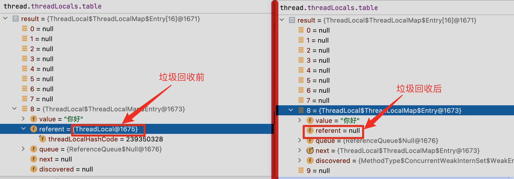
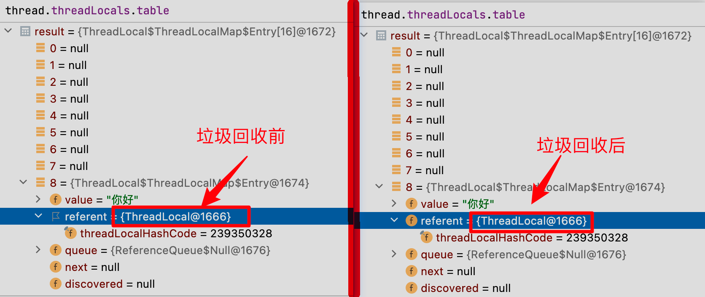
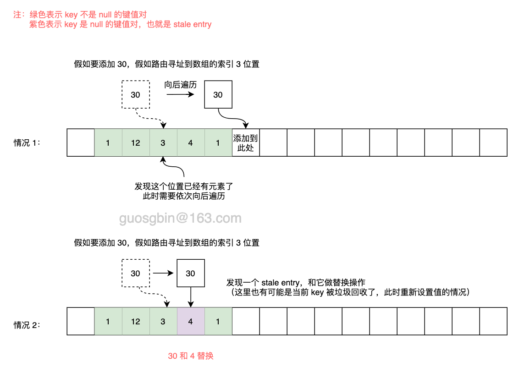
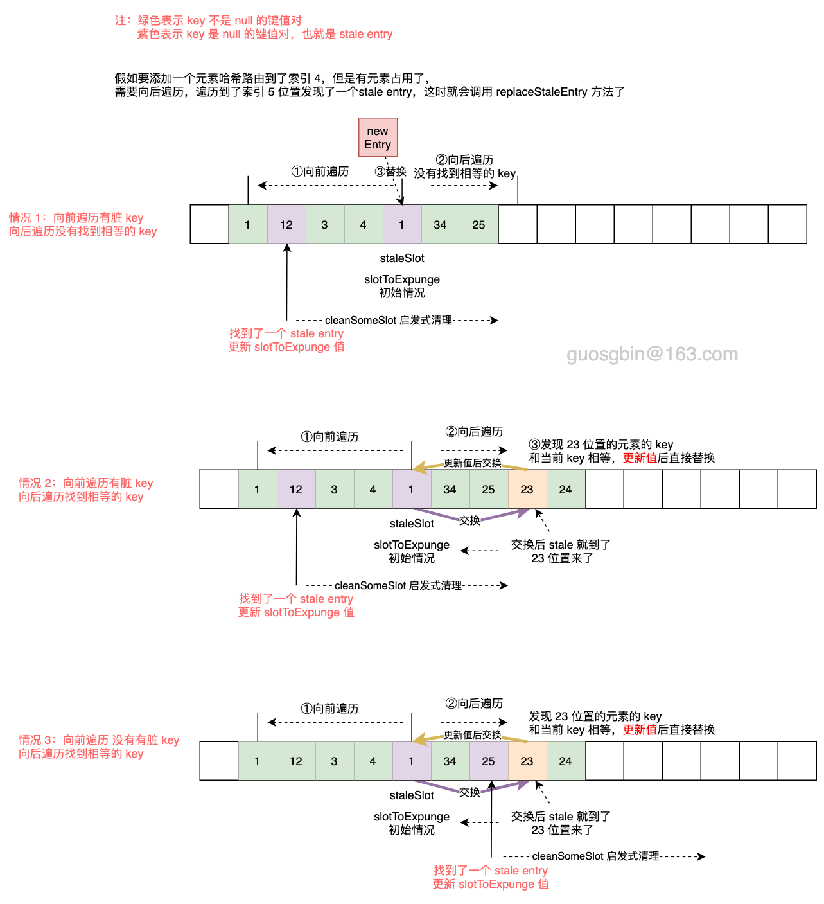
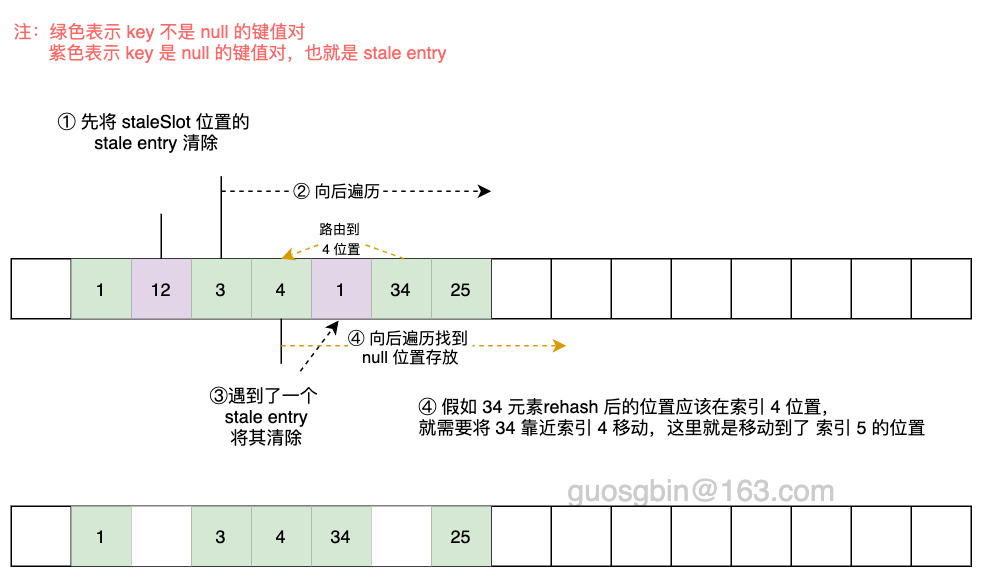

| 版本 | 内容 | 时间                |
| ---- | ---- | ------------------- |
| V1   | 新增 | 2023-11-01 14:46:29 |

[[TOC]]

## ThreadLocal 概述

在多线程编程中线程安全问题的核心在于多个线程会对同一个共享资源进行操作，ThreadLocal 将一些资源保存到线程本地，也就是每个线程都有自己的资源，是一种空间换时间的方案。

## Thread、ThreadLocal 和 ThreadLocalMap 的关系

在看这三者之间的关系前需要简单看下 ThreadLocalMap 是如何创建的。

```java
/* 创建一个 ThreadLocalMap 到 Thread 的属性中 */
void createMap(Thread t, T firstValue) {
    t.threadLocals = new ThreadLocalMap(this, firstValue);
}
```

上面的代码里的 this，就是当前的 ThreadLocal 对象，可以看到将新创建的 ThreadLocalMap 对象赋值给了 Thread 的 threadLocals 属性。

在 Thread 类中有如下的属性

```java
/* ThreadLocal values pertaining to this thread. This map is maintained
 * by the ThreadLocal class. */
ThreadLocal.ThreadLocalMap threadLocals = null;
```

小结下它们的关系 Thread 的一个属性保存了当前线程的 ThreadLocalMap，ThreadLocalMap 的 key 是 ThreadLocal 对象，value 是真正存的数据。 ThreadLocalMap 是一个自定义的哈希表，仅用于保存线程本地变量。**只能通过 TheadLocal 类来访问这个哈希表**。这个类是包私有的，允许类在 Thread 中声明字段，为了帮助处理非常大且长时间粗活的对象，**哈希表的键值对的键使用弱引用**。

虽然 Thread 可以引用 ThreadLocalMap，但是不能调用任何 ThreadLocalMap 中的方法，这也就是我们平时都是通过 ThreadLocal  来获取值和设置值的原因。

## ThreadLocalMap 键值对 Entry 类

```java
static class Entry extends WeakReference<ThreadLocal<?>> {
    /** The value associated with this ThreadLocal. */
    Object value;

    Entry(ThreadLocal<?> k, Object v) {
        super(k);
        value = v;
    }
}
```

可以看到 Entry 继承了 WeakReference 弱引用，key 是 ThreadLocal 对象，key 是弱引用。key 使用弱引用按照源码注释的说法是：To help deal with very large and long-lived usages, the hash table entries use WeakReferences for keys.

这里需要说明的是， 当哈希表中的 key 是 null 时，表示 key 被垃圾回收了，因此这个 entry 可以从表中删除。这些 entry 被在这里被称为 "stale entries"。
## ThreadLocal 的内存泄漏问题

ThreadLocalMap 的键值对有 Entry 封装，Entry 的 key 是弱引用的。当哈希表中的 key 是 null 时，表示 key 被垃圾回收了，因此这个 Entry 可以从表中删除。

```java
static class Entry extends WeakReference<ThreadLocal<?>> {
    /** The value associated with this ThreadLocal. */
    Object value;

    Entry(ThreadLocal<?> k, Object v) {
        super(k);
        value = v;
    }
}
```

ThreadLocal 会出现内存泄漏问题，原因就在这个弱引用这里。试想一下假如我们在业务中用了 ThreadLocal 保存了数据，用完之后我们没有做特殊处理，这时假如发生了垃圾回收，因为 Entry 的 key 是弱引用的，所有会直接被垃圾回收。这时就会出现内存泄漏了，因为 key 被回收了，永远无法访问到这个 value 了，还无法删除。

下面看两个案例

```java
/**
 * 测试内存泄漏
 * 因为 ThreadLocal 没有强引用，所以下面垃圾回收后哈希表中的 key 会被回收
 */
@Test
public void testMemeroyLeak01() throws InterruptedException {
    Runnable task = () -> {
        Thread thread = Thread.currentThread();
        new ThreadLocal<>().set("你好");
        System.out.println("打断点的地方..."); // 看垃圾回收前的 ThreadLocalMap
        // 主动触发一次垃圾回收
        System.gc();
        System.out.println("打断点的地方..."); // 看垃圾回收后的 ThreadLocalMap
    };
    Thread thread = new Thread(task, "testThread");
    thread.start();
    thread.join();
}
```

在上面两个打印的地方打断点，看下这两个时候的 ThreadLocalMap 的情况是怎么样的：



可以看到因为 ThreadLocal 对象没有强引用，在一次垃圾回收后弱引用就被垃圾回收了，此时 value 还存在在内存中。既然 ThreadLocal 没有强引用的时候 ThreadLocalMap 的 key 会被垃圾回收，那么我们再看一个有强引用的案例：

```java
/**
 * 测试内存泄漏
 * 因为 ThreadLocal 有强引用，尽管执行了一次垃圾回收，key 是不会被回收的
 */
@Test
public void testMemeroyLeak02() throws InterruptedException {
    Runnable task = () -> {
        Thread thread = Thread.currentThread();
        ThreadLocal<String> threadLocal = new ThreadLocal<>();
        threadLocal.set("你好");
        System.out.println("打断点的地方..."); // 看垃圾回收前的 ThreadLocalMap
        // 主动触发一次垃圾回收
        System.gc();
        System.out.println("打断点的地方..."); // 看垃圾回收后的 ThreadLocalMap
    };
    Thread thread = new Thread(task, "testThread");
    thread.start();
    thread.join();
}
```

案例结果：



可以看到，这次 ThreadLocal 的强引用还存在的时候，尽管垃圾回收了，此时 ThreadLocalMap 的 key 是不会被垃圾回收的。

因此，我们一般在项目中使用 ThreadLocal 的时候，都是使用 static 修饰放到类的静态成员上去的，如下：

```java
public static final ThreadLocal<String> TL = new ThreadLocal<>();
```

## 黄金分割数

ThreadLocal 中有个常量 0x61c88647，这个数是黄金分个数

```java
private static final int HASH_INCREMENT = 0x61c88647;
```


设一个数列，它的最前面两个数是*1、1*，后面的每个数都是它前面的两个数之和。例如：*1，1，2，3，5，8，13，21，34，55，89，144*·····这个数列为“斐波那契数列”，这些数被称为“斐波那契数”。

经计算发现相邻两个斐波那契数的比值是随序号的增加而**逐渐逼近黄金分割比**，黄金分割比是$(\sqrt5-1) \over 2$，约等于0.618。由于斐波那契数都是整数，两个整数相除之商是有理数，而黄金分割是无理数，所以只是不断逼近黄金分割。

求出 32 位有符号和无符号的整数的黄金分割比：

```java
long unsignedNum = (long) ((1L << 32) * (Math.sqrt(5) - 1) / 2);
System.out.println("32位无符号整数的黄金分割数: " + unsignedNum);

int signedNum = (int) unsignedNum;
System.out.println("32位有符号整数的黄金分割数: " + signedNum);
```

控制台：

```
32位无符号整数的黄金分割数: 2654435769
32位有符号整数的黄金分割数: -1640531527
```

ThreadLocald 的 HASH_INCREMENT 就是1640531527，16 进制为 0x61c88647，为了让哈希码能均匀的分布在 2 的 N次方的数组里。

```java
public class Demo06 {
    private static final int HASH_INCREMENT = 0x61c88647;

    public static void main(String[] args) {
        hash(4);
        hash(8);
        hash(16);
    }

    private static void hash(int capacity) {
        int keyPosition;
        // i * HASH_INCREMENT用来模拟hash值
        for (int i = 1; i <= capacity; i++) {
            keyPosition = (i * HASH_INCREMENT) & (capacity - 1);
            System.out.print(keyPosition + " ");
        }
        System.out.println();
    }
}
```

控制台

```
3 2 1 0 
7 6 5 4 3 2 1 0 
7 14 5 12 3 10 1 8 15 6 13 4 11 2 9 0 
```

可以看到这样计算的结果均匀的放到散列表中，假如散列表长度为4，那么它是按照`3 2 1 0 3 2 1 0 ...`这个顺序的。

## set 方法详解

### ThreadLocal 的 set 方法

ThreadLocal 的 set 方法

```java
/* 设置线程本地变量的值 */
public void set(T value) {
    Thread t = Thread.currentThread();
    ThreadLocalMap map = getMap(t);
    if (map != null)
        // 设置
        map.set(this, value);
    else
        // 创建一个新的 ThreadLocalMap
        createMap(t, value);
}

ThreadLocalMap getMap(Thread t) {
    return t.threadLocals;
}
```

首先会尝试从 Thread 的 threadLocals 属性中获取线程对应的 ThreadLocalMap 对象，假如获取到了就设置值，没有获取到就创建一个新的 ThreadLocalMap。从这里也看出来哈希表是延迟初始化的。接下来看下创建 ThreadLocalMap 的流程。

```java
/* 创建一个 ThreadLocalMap 到 Thread 的属性中 */
void createMap(Thread t, T firstValue) {
    t.threadLocals = new ThreadLocalMap(this, firstValue);
}
```

创建一个 ThreadLocalMap 对象，键值对是 Entry 对象封装的，key 是 ThreadLocal，value 是我们保存的数据。ThreadLocalMap 的初始化工作就是

1. 创建一个数组；
2. 将键值对封装成一个 Entry 对象，根据哈希路由到指定的位置存放；
3. 最后设置扩容阈值；

```java
/* 创建一个 ThreadLocalMap，ThreadLocalMap 是延迟创建的，也就是说只有在第一次添加键值对的时候才创建 */
ThreadLocalMap(ThreadLocal<?> firstKey, Object firstValue) {
    table = new Entry[INITIAL_CAPACITY];
    // 取模求所有
    int i = firstKey.threadLocalHashCode & (INITIAL_CAPACITY - 1);
    table[i] = new Entry(firstKey, firstValue);
    size = 1;
    // 设置扩容阈值
    setThreshold(INITIAL_CAPACITY);
}
```

上面是分析了第一设置值的时候需要去初始化 ThreadLocalMap。假如不是第一次添加元素，那就需要调用 ThreadLocalMap 的 set 方法了。

### ThreadLocalMap 的 set 方法

```java
/* 添加或者替换值 */
private void set(ThreadLocal<?> key, Object value) {
    Entry[] tab = table;
    int len = tab.length;
    // 取模求索引位置
    int i = key.threadLocalHashCode & (len-1);

    for (Entry e = tab[i];
         e != null;
         e = tab[i = nextIndex(i, len)]) {  // 环形数组的下一个索引
        ThreadLocal<?> k = e.get();

        if (k == key) {
            // 找到位置了，直接赋值
            e.value = value;
            return;
        }

        // 弱引用的对象 k 为 null，则说明被垃圾回收了
        // 调用 replaceStaleEntry 方法替换掉 stale entry
        if (k == null) {
            replaceStaleEntry(key, value, i);
            return;
        }
    }

    // 走到这里说明已经遍历到了一个位置没有元素了，就可以创建新的 entry 保存起来了
    tab[i] = new Entry(key, value);
    int sz = ++size;
    // cleanSomeSlots 清除一些 stale entry，该方法只要清除了一个 Entry 就返回 true
    // 当未清除 stale entry 且当前 ThreadLocalMap 的长度大于等于阈值 threshold
    // 就调用 rehash 方法再次 stale entry，再进行一次判断是否需要扩容
    if (!cleanSomeSlots(i, sz) && sz >= threshold)
        rehash();
}
```

在分析这个方法前，需要声明一下是 ThreadLocalMap 和 HashMap 的不同之处：

1. HashMap 发生哈希碰撞时，使用的是链表+红黑树；
2. ThreadLocalMap 使用的是线性探测法，就是说假如哈希路由命中的位置已有元素了，就沿着当前位置继续向后查找空位置的元素；

ThreadLocalMap 为什么使用这种线性探测法呢？因为 ThreadLocalMap 设计出来，一般不会往里面存放大量的数据，而且有 `0x61c88647` 数来让哈希均匀的分布在 2 的 N 次方长度的数组里，很少会出现冲突。并且 ThreadLocalMap 经常需要清除 stale entry，使用纯数组更加方便。

按照线性探测法来分析，上面大代码就很好看懂了，大致流程如下：

1. 哈希路由定位到当前 ThreadLocal 对象应该放到数组的那一个位置；
2. 从当前位置开始遍历环形数组，直到遇到一个 stale entry 或者 null 位置就停止；
3. 遍历过程中
   1. 假如找到了相等的 ThreadLocal 的地址，说明这时是更新值，直接更新返回；
   2. 假如在遍历的过程中，发现了一个 key 是 null 的键值对，肯定是垃圾回收的时候把弱引用的 key 回收了，这时需要调用 replaceStaleEntry 去替换它的位置；（replaceStaleEntry 方法后面详细分析）
4. 假如遍历过程中没有找到相等的地址，且没有找到 stale entry，那么此时退出循环就是 e == null 的情况，此时直接在此位置创建一个 Entry 并放入；
5. 最后调用 cleanSomeSlots 方法启发式删除 stale entry，并尝试判断是否需要扩容；

简单画图分析下这段逻辑：最简单的情况就是哈希路由到的位置没有元素，就直接创建 entry 放到该位置，下图没有展示出来。



这里面有三种情况没有分析

1. 在遍历过程中，发现 stale entry 是如何做替换操作的？
2. 假如没有发现 stale entry ，最后的启发式清理 stale entry 是如何实现的？
3. 扩容的操作是什么情况才会触发的？如何扩容？

这在后面的小节分节详细分析。

### replaceStaleEntry 如何替换 stale entry

本节主要分析在 set 的遍历过程中，遇到 stale entry 是如何做替换操作的。主要分析 replaceStaleEntry 方法

```java
private void replaceStaleEntry(ThreadLocal<?> key, Object value,
                               int staleSlot) {
    Entry[] tab = table;
    int len = tab.length;
    Entry e;

    // 第一步：stale entry 的初始位置
    // slotToExpunge 表示启发式清理的开始位置，会在下面的代码中更新位置
    int slotToExpunge = staleSlot;
    // 第二步：向前遍历
    // 从当前 stale entry 的位置向前遍历，直到 i 位置的元素为 null
    // 这样做是为了把 staleSlot 位置前面 stale entry 也清除
    for (int i = prevIndex(staleSlot, len);
         (e = tab[i]) != null;
         i = prevIndex(i, len))
        // 条件成立说明被垃圾回收了
        if (e.get() == null)
            // 找到 stale entry，重新将 slotToExpunge 赋值为i
            slotToExpunge = i;

    // 第三步：向后遍历，直到 tab[i] == null
    for (int i = nextIndex(staleSlot, len);
         (e = tab[i]) != null;
         i = nextIndex(i, len)) {
        ThreadLocal<?> k = e.get();

        // 若我们找到了 key，那个么我们需要将它与 stale entry 交换，以保持哈希表的顺序。
        // 然后，可以将新的 stale slot 或其上方遇到的任何其他 stale slot 发送到 expungeStaleEntry，以删除或重新刷新运行中的所有其他 entry。
        if (k == key) {
            // 覆盖值，并将当前脏 Entry 和 i 位置的 Entry 交换
            e.value = value;
            tab[i] = tab[staleSlot];
            tab[staleSlot] = e;

            // slotToExpunge == staleSlot 说明前面的向前查找没有找到 stale entry
            // 因为当前 i 位置的元素是 staleSlot 位置替换过来的，所有此处 i 是替换过来的 stale entry
            // 需要把 slotToExpunge 赋值为 i，后面从 i 开始向后启发式清理
            if (slotToExpunge == staleSlot)
                slotToExpunge = i;
            cleanSomeSlots(expungeStaleEntry(slotToExpunge), len);
            return;
        }

        // 当遍历到的 k 不是 key 时
        // 条件1：k == null 表示是 stale entry
        // 条件2: slotToExpunge == staleSlot，成立则说明向前遍历的时候没有找到 stale entry，需要在此处更新 slotToExpunge
        if (k == null && slotToExpunge == staleSlot)
            slotToExpunge = i;
    }

    // 走到这里，说明遍历过程中没有找到相等的 key，
    // 这里将原来的 value 置为 null，防止内存泄漏的。然后创建一个新的 Entry 放入
    tab[staleSlot].value = null;
    tab[staleSlot] = new Entry(key, value);

    // 条件成立，说明在上面的处理中 slotToExpunge 是有更新过的，更新就说明有别的 stale entry
    // 需要做一些启发式清理操作
    if (slotToExpunge != staleSlot)
        cleanSomeSlots(expungeStaleEntry(slotToExpunge), len);
}
```

该方法的详细流程请看注释，接下来分析它的流程。当前传入的 staleSlot 参数是在 set 方法中找到的一个 stale entry 的位置，本方法的主要目的就是创建一个新的 entry 替换掉这个 stale entry。同时在替换的过程中，会尝试探测去找出其他可能出现 stale entry 的位置，并尝试清理它们。

代码里面展示了有向前查找 stale entry，和向后查找 stale entry 的步骤。下面列举了几种情况，看懂了下面几种情况，其他情况应该就能自己分析了，大致都差不多。



到这里我们就把 set 方法的大致过程讲清楚了。接下来分析清理 stale entry 的流程。

## 探测性清理 stale entry

```java
private int expungeStaleEntry(int staleSlot) {
    Entry[] tab = table;
    int len = tab.length;

    // expunge entry at staleSlot
    // 清除 stale entry 的 value
    tab[staleSlot].value = null;
    tab[staleSlot] = null;
    size--;

    // Rehash until we encounter null
    // 重新计算哈希值直到遇到了 null
    Entry e;
    int i;
    // 从 staleSlot 的下一个节点开始向后遍历，退出条件是 tab[i] == null
    for (i = nextIndex(staleSlot, len);
         (e = tab[i]) != null;
         i = nextIndex(i, len)) {
        ThreadLocal<?> k = e.get();
        // k 为 null 时，说明找到了 stale Entry，设置值和 Entry 为 null，Help GC
        if (k == null) {
            e.value = null;
            tab[i] = null;
            size--;
        } else {
            // 这里主要的作用是由于采用了开放地址法，所以删除的元素是多个冲突元素中的一个
            // 需要对后面的元素作处理，可以简单理解就是让后面的元素往前面移动
            // 为什么要这样做呢？主要是开放地址寻找元素的时候，遇到 null 就停止寻找了
            // 你前面 k == null 的时候已经设置 entry 为 null 了，不移动的话，那么后面的元素就永远访问不了了
            // 先计算当前遍历到的 k 的哈希路由的位置
            int h = k.threadLocalHashCode & (len - 1);
            // 它们不相等，说明是经过 hash 是有冲突的
            if (h != i) {
                tab[i] = null;

                // Unlike Knuth 6.4 Algorithm R, we must scan until
                // null because multiple entries could have been stale.
                // 当 h 位置元素不是 null 时，从 h 位置向后找一个 null 的位置，并将 e 放到该位置
                while (tab[h] != null)
                    h = nextIndex(h, len);
                tab[h] = e;
            }
        }
    }
    return i;
}
```

在前面分析 replaceStaleEntry 方法的时候，最后会调用 expungeStaleEntry 方法去进行探测性清理。看下这个方法的逻辑。

1. 首先第一步就是清除入参 staleSlot 位置的 stale entry；
2. 然后从 staleSlot 的下一个位置开始遍历查找 stale entry；
   1. 遇到 key 是 null 的（也就是 stale entry），直接清除该位置的 Entry；
   2. 不是 null 的需要将正常的 entry 向 `k.threadLocalHashCode & (len - 1)`位置移动。这样做的原因是前面可能吧某些 stale entry 已经移除了，而在查找元素的时候遇到了 null 就不继续查找了，这里需要把正常 entry 向前移动；



## 启发式清理 stale entry

官方注释：Heuristically scan some cells looking for stale entries.

```java
/* 清除一些槽位，这个方法会在插入新元素和移除垃圾 entry 节点的时候会被调用，
   使用 n >>>= 1其实是为了使扫描的时间复杂度是log级别的。 */
private boolean cleanSomeSlots(int i, int n) {
    boolean removed = false;
    Entry[] tab = table;
    int len = tab.length;
    do {
        i = nextIndex(i, len);
        Entry e = tab[i];
        // 假如 entry 不为 null，且 entry 的引用为 null，则需要进行移除
        if (e != null && e.get() == null) {
            n = len;
            removed = true;
            i = expungeStaleEntry(i);
        }
    } while ( (n >>>= 1) != 0);
    return removed;
}
```

此处需要从传入的位置i的下一个位置开始判断删除的原因是：在 set 方法里，当 tab[i] == null 时，此时会创建节点直接插入i位置，那么此时i位置的 entry 肯定不是 stale entry。

清除一些槽位，这个方法会在插入新元素和移除 stale entry 的时候会被调用，使用 n >>>= 1其实是为了使扫描的时间复杂度是 log 级别的

- 插入元素，不清除 stale entry ，这不扫描，插入元素肯定很快，但是会有垃圾残留；
- 插入元素，扫描所有的 stale entry ，扫描了所有，时间复杂度为O(n)，虽然把垃圾都清除了，但是可能会导致插入元素的时间变长了；
- ThreadLocal 采用的方法是：
  - 如果没有遇到 stale entry 就整个扫描过程持续 log2(n) 次；
  - 假如遇到了 stale entry ，有一句代码`n = len;`将 n 的值赋值成了当前 table 数组的长度 len。这个时候 n 变大了，相当于扩大了搜索范围，所以会再次扫描 log2(n) 次；
  - 这样的好处就是，既删除了部分 stale entry ，也使得插入元素的效率变高了；

## ThreadLocalMap 的扩容机制

在 ThreadLocalMap#set 方法中，最后部分的代码如下：

```java
if (!cleanSomeSlots(i, sz) && sz >= threshold)
    rehash();
```

这说明在进行扩容之前需要，先调用 cleanSomeSlots 方法去启发式清理一下，启发式清理完后再去判断当前 Map 的元素个数是否达到扩容阈值了，假如到扩容阈值了就调用 ThreadLocalMap#rehash 方法去尝试扩容：

```java
private void rehash() {
    expungeStaleEntries();

    // Use lower threshold for doubling to avoid hysteresis
    if (size >= threshold - threshold / 4)
        resize();
}
```

先用 expungeStaleEntries 方法清除所有的 stale entry，然后用设置的阈值的 3/4 去判断是否需要扩容。

```java
private void expungeStaleEntries() {
    Entry[] tab = table;
    int len = tab.length;
    for (int j = 0; j < len; j++) {
        Entry e = tab[j];
        if (e != null && e.get() == null)
            expungeStaleEntry(j);
    }
}
```

那么最关键的就到了  resize 方法了，这个方法还是比较简单的

```java
/* 数组扩容 */
private void resize() {
    Entry[] oldTab = table;
    int oldLen = oldTab.length;
    int newLen = oldLen * 2;
    // 2 倍旧数组的长度
    Entry[] newTab = new Entry[newLen];
    int count = 0;

    // 遍历旧数组
    for (int j = 0; j < oldLen; ++j) {
        Entry e = oldTab[j];
        if (e != null) {
            ThreadLocal<?> k = e.get();
            if (k == null) {
                // 是 stale entry
                e.value = null; // Help the GC
            } else {
                // 不是 stale entry，计算在新数组中的位置
                int h = k.threadLocalHashCode & (newLen - 1);
                // 假如发送哈希冲突就用线性探测法找到合适的位置
                while (newTab[h] != null)
                    h = nextIndex(h, newLen);
                newTab[h] = e;
                count++;
            }
        }
    }

    setThreshold(newLen);
    size = count;
    table = newTab;
}
```

小结一下扩容流程：

1. 先判断是否达到扩容阈值 threshold；
2. 假如到达了扩容阈值 threshold，就在 rehash() 方法中调用方法将数组中所有 stale entry 先清除一遍；
3. 清除完后，再次判断是否到达扩容阈值 threshold 的 2/3 ，假如到达了就真正去扩容了；
4. 扩容两倍，发生哈希冲突用线性探测法解决；

## get 方法详解

java.lang.ThreadLocal#get

```java
public T get() {
    Thread t = Thread.currentThread();
    // 获取当前线程对应的 ThreadLocalMap
    ThreadLocalMap map = getMap(t);
    if (map != null) {
        ThreadLocalMap.Entry e = map.getEntry(this);
        if (e != null) {
            @SuppressWarnings("unchecked")
            T result = (T)e.value;
            return result;
        }
    }
    // 没有获取到当前线程的 ThreadLocalMap，初始化一个
    return setInitialValue();
}
```

简单分析 get 方法的逻辑：

1. 如果当前线程 Thread 的 threadLocals 属性的 ThreadLocalMap 不为 null，就调用 getEntry 方法去获取值；
2. 如果当前线程 Thread 的 threadLocals 属性的 ThreadLocalMap 是 null，就创建一个新的 ThreadLocalMap；


ThreadLocalMap#getEntry 和 ThreadLocalMap#getEntryAfterMiss

```java
private Entry getEntry(ThreadLocal<?> key) {
    // 取模求所有
    int i = key.threadLocalHashCode & (table.length - 1);
    Entry e = table[i];
    if (e != null && e.get() == key)
        // 取模得到的索引命中存放该 Entry 的位置，直接返回
        return e;
    else
        // 取模得到的索引位置不是存放该 Entry 的，那就是发生哈希碰撞了，需要向后查找
        return getEntryAfterMiss(key, i, e);
}

/* 发生哈希碰撞后，需要向后查找 entry */
private Entry getEntryAfterMiss(ThreadLocal<?> key, int i, Entry e) {
    Entry[] tab = table;
    int len = tab.length;

    while (e != null) {
        ThreadLocal<?> k = e.get();
        if (k == key)
            // i 位置命中了 entry，直接返回
            return e;
        if (k == null)
            // i 位置没有元素，但是因为走到循环里的时候，i 位置 entry 不是 null，说明需要清除，走清除 Stale entry 的动作
            expungeStaleEntry(i);
        else
            // 循环数组找下一个位置
            i = nextIndex(i, len);
        e = tab[i];
    }
    return null;
}
```

首先在 ThreadLocalMap#getEntry 方法中计算哈希路由到数组的索引，

1. 假如该位置的 key 就是当前 ThreadLocal，那就直接返回；
2. 假如该位置的 key 不是当前 ThreadLocal，那就说明发生过哈希碰撞，需要调用 ThreadLocalMap#getEntryAfterMiss 往后查找数组，就是挨个查找，假如中途遍历到了 stale entry 就去探测性清理 stale entry；

## remove 方法详解

java.lang.ThreadLocal#remove

```java
public void remove() {
    ThreadLocalMap m = getMap(Thread.currentThread());
    if (m != null)
        m.remove(this);
}
```


java.lang.ThreadLocal.ThreadLocalMap#remove

```java
/* 移除键值对 */
private void remove(ThreadLocal<?> key) {
    Entry[] tab = table;
    int len = tab.length;
    // 取模求所有
    int i = key.threadLocalHashCode & (len-1);
    for (Entry e = tab[i];
         e != null;
         e = tab[i = nextIndex(i, len)]) { // 循环数组找下一个位置
        if (e.get() == key) {       // 比较的是地址
            e.clear();              // 引用清掉
            expungeStaleEntry(i);   // 探测式清理
            return;
        }
    }
}
```

这里找到要移除的键值对后做了两件事情，第一件就是将弱引用清空，然后探测式清理。

## ThreadLocal 的应用场景

- 线程间数据隔离；
- 方便同一个线程使用某一对象，避免不必要的参数传递；
- 全链路追踪中的 traceId 或者流程引擎中上下文的传递一般采用 ThreadLocal；
