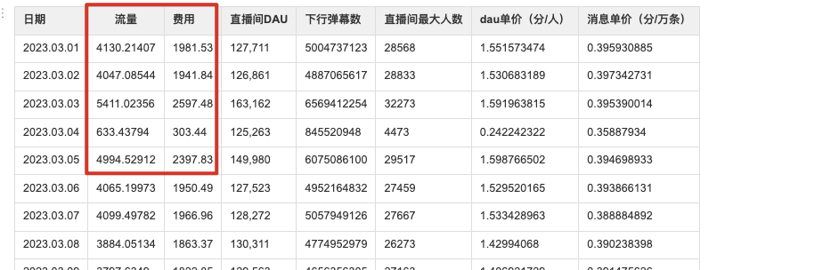

[[TOC]]

## 背景和期望目标

随着直播间 DAU 上涨，现有的 IM 的公网流量费用高昂，公司运维成本明显提升。

目的是期望基于现有的 IM 功能，在不影响用户体验的前提下降低 IM 的公网流量费用。

> 这次 IM 限流是服务端主导的优化，也就是我，产品和客户端配合服务端完成这个需求。

## 问题分析过程

### 定位那些消息可以进行限流

主要是通过日志分析出各个业务消息的下发情况，针对每个消息有下面 3 个维度的考虑：

1. **各个类型消息的下发次数排序统计；**
2. **各个类型消息的下发平均长度排序统计；**
3. **各个类型消息的总体消耗流量的统计；**

上面是平台整体的一个统计信息，我们还**按照上面的 3 个维度针对某个大主播（10w 人）做了统计**，用来看下大直播间的的消息分布情况；

> 数据统计来源是，我们有自己的数据统计的工具类，通过打印日志记录一个时间段内的平均值，然后通过日志采集到 Granfa 中进行图形化展示。

通过上面就可以看到到一些**下发频率高、平均长度长、消耗流量多**的消息类型了，进而可以定位公网下行流量消耗高的那些消息类型了。

通过上面的统计数据，根据消息是否重要来制定不同的策略：

1. **有些并不重要的消息就可以做限流处理**，例如点赞消息、非付费用户的直播间进场消息，免费礼物消息等。
2. **对于那些用户花钱消费的消息就不能限流处理了**，例如用户的付费送礼消息，特权用户的进场特效，直播间 C2C 消 息等；

### 定位限流指标（直播间人数）

统计一段时间内，平台内直播间人数 TOP 100 的人数分布。

主要是获取主播开播时平均直播间人数的各个梯度，给直播间人数分层。比如 0 - 4000，4000 - 8000 等等。

### 消息流量占比 TOP4 以及限流它们的原因

2-14 号流量大盘情况（注: 岑先生开播了），Top4 类型消息占每天流量的 96%。那后续就针对以下 Top4 做限流；


**在大流量直播间针对这四个消息做限流的原因**

- **点赞消息**：在大流量直播间，直播间热度不再需要点赞维持，与产品和运营同学确认，当直播间人数超过基准线后，点赞消息无意义，去掉点赞对用户体验影响较小。 ；
- **弹幕消息**：大流量直播间，弹幕刷屏速度非常快，基本是看不清的程度；限流后弹幕消息变少，反而能看清，用户体验更好；
- **进场消息**：客户端最短的进场动画 3s，以一场直播 3 个小时为例，最多能展示 3600 个进场动画。然而直播间已超过1W 人，肯定是不可能展示完的，所以需要做取舍，我们倾向优先展示贵族、特权、座驾等华丽进场效果；
- **礼物消息**：免费礼物（克拉之星，应援棒）占总礼物的 77%，对免费礼物做丢弃，可以大幅降低流量。同时减少免费礼物可以提高付费礼物的曝光，对流水有正向作用；

### 礼物消息占比

免费礼物占比比较大。


### 某大主播直播间用户群体人数分布

分群策略原因：主要围绕不同身份用户关注其核心的价值：

- 主播端主要还是让主播关注到人气，可以互动，可对违规用户操作，保持的是全量消息；
- 对金主层面就是要照顾其花钱的价值和感受，有面；花钱的用户是很关注自己的等级和状态的；
- 对普通用户可以在本已经看不清的情况下减少消息；


### 竞品现象

其实当时看了下抖音直播，应该是也是针对某些消息在大流量的直播间做了限流；

| 竞品 | 功能   | 实测现象                                                     | 预估结论                               |
| :--- | :----- | :----------------------------------------------------------- | :------------------------------------- |
| 抖音 | 弹幕区 | 两个用户发送的弹幕，有时可以看到，有时看不到<br />两个用户对比同一时间内的弹幕消息不一致 | 弹幕肯定分 uid 随机限流了              |
|      | 礼物区 | 小礼物气泡<br />流量大时两个用户展示不一致<br />流量小时两个用户展示一致 |                                        |
|      | 点赞   | 双人同一直播间测试正常：一个用户连续点赞，另一个用户观看隔几秒出几个点赞消息 | 点赞消息肯定限流了                     |
|      | 进场   | 双人同一直播间测试正常：两个用户进入同一直播间播放的进场消息不一致<br />断网测试：进入直播间一段时间后，打开飞行模式进场消息仍旧播放 | 进场消息应该限流了，进场消息有队列处理 |

## 方案设计

在和产品和运营的同学讨论后，使用下面几个策略降低 IM 的费用：

1. **消息限流策略**：
   1. **消息上行限流**：按照不同的消息类型配置不同的限频策略，使用的是滑动窗口的方式来实现简单的上行限流；
   2. **消息下行限流**：当直播间人数超过某些阈值之后，对点赞、进场、弹幕、免费礼物特效等消息根据 uid 随机限流；
2. **消息体精简策略**：
   1. **删除废弃字段或者删除根本就没有使用过的字段**，降低单个消息包的大小；
   2. **消息中的某个字段名长度减少**，例如 nickname 改为 n，和客户端约定好；
   2. **消息中的某个字段的值的长度减少**，例如图片域名客户端自己拼接；
3. **消息中的字段的值和上一次下发的字段值比较后再下发**；
   1. 对于某些消息，比如直播间的一些统计信息的下发，如果某次下发时的一些统计数据和上次一样，就不用再次下发该字段了。如果全部一样，那么这整条消息都不用下推了；


### 消息体积精简策略

对于消息体积精简策略来说，需要产品和运营同学来确认是否可以接受效果，需要客户端同学出人力来配合实现版本控制。

例如：某些场景下给下发的消息的某些字段的长度缩小，则需要客户端同学来配合解析了，这也是需要版本控制的。

| app    | 版本号   | 版本号  |        |
| :----- | :------- | :------ | :----- |
| 直播   | <=5.9.71 | >5.9.71 | 占比   |
|        | 28186    | 145827  | 83.8%  |
| 广播剧 | <=1.3.31 | >1.3.31 | 占比   |
|        | 13896    | 847910  | 98.38% |

>  如果是针对某些字段直接删除，如果有影响展示的，则需要产品和运营的同学接受才能做下去。

下面就是具体实施的消息精简策略：

- **图片域名拼接**：有些消息中带有图片信息，之前是直接将域名拼接好后发送给客户端，现在将域名拼接延迟到客户端，让客户端自己去做域名拼接；**（版本控制、铺版本）**
  - 通过多天的统计发现，让客户端自己去拼接图片域名后可以节约流量约 6%；
  - 新版本从发送端去掉头像中的域名，仅发送"a":"3339312656410.png"，客户端升 IM 基础字段中的 "v" 版本号；
  - 若版本号为新的版本，则将"a"字段，按照规则拼接：域名+"a"字段+头像更新时间戳，当做图片地址使用；
  - 若版本号为老的版本，则将"a"字段按照全量的图片地址进行使用；
- **删除多余字段**：
  - 有些消息在用户的贵族身份的下需要带上一些字段，普通身份的用户不需要这些字段，这时就考虑删除这些多余的字段了；
  - 还有些字段，客户端可能根本就没有使用过，这时就可以无顾虑的删除了；
- **跳转用的数据通过接口获取**：某些具有跳转功能的消息，目前是跳转所需的所有数据直接在消息体内返回了，可以在跳转的瞬间通过调接口的方式获取额外需要的数据；**（版本控制、铺版本）**
  - 例如：大礼物的全站飘屏消息，服务器端仅下发飘屏使用字段，礼物结构和送礼信息等用户点击跳转直播间时通过接口获取；
- **消息字段长度压缩**：例如 nickname 字段，可以简化为 nn；**（版本控制、铺版本）**

### 	消息上行限流策略

**背景**：由于之前消息的上行限流只是简单的给消息类型分为可熔断和不可熔断的两种。随着消息类型的不断增多，分为限流和不限流两种策略就不够细化，此次针对不同的消息类型设置不同的上行限流比例。好处就是能够灵活的控制单个消息的限流频率；

**上行限流方案**：使用『 **lua 脚本 + 本地缓存**』的设计思路，提前将 lua 脚本加载 sript load 加载到 redis 中返回一个 sha。

**方案具体实现**：

- 上行限流是**房间和消息类型两个维度结合起来的**；
- 上行限流**使用 Redis 和本地缓存实现一个简单的滑动窗口的限流**，比如某个房间某个消息类型在一秒中最多允许发送 100 条消息。


脚本如下：

```lua
-- 限流的 key，对应业务的消息类型
local rate_limit_key = KEYS[1]
-- 限流时间，单位为秒，为0表示不限制
local rate_limit_period = KEYS[2]
-- 限流时间内可以推送的最大的上行消息数
local rate_limit_max = KEYS[3]
local current_old = redis.call('get', rate_limit_key)
if current_old and (tonumber(current_old) >= tonumber(rate_limit_max)) then
    -- 说明已经到了时间窗口内的最大上行消息数了，需要返回 pttl 时间给业务程序
    -- 业务程序
    local p_ttl = redis.call('pttl', rate_limit_key)
    return "0," .. tostring(p_ttl)
end
local current
current = redis.call('incr', rate_limit_key)
if tonumber(current) == 1 then
    -- 第一次调用 incr 时，给限流 key 设置过期时间，其实这个就是限流的时间窗口
    redis.call('pexpire', rate_limit_key, rate_limit_period)
end
return "1"
```

- 首先我们的限流的 key 是有过期时间的，**1 秒钟**。
- 限流 key 的组成部分有**房间 id 和 业务消息类型**；
- redis 的 lua 脚本的基本思路是：
  - 先调用 get 命令**获取当前房间的当前消息类型的限流次数**。如果超过了限流次数，就表示当前时间窗口已经到达了允许的最大上行消息数了，需要**返回限制消息发送的标志和 PTTL 时间给业务程序**；如果没有超过限流次数，就**将 redis 中的限流次数加 1**；
  - 前面说了，超过限流次数就返回限流标记和该 redis key 的 PTTL 时间，将这个 key 和 PTTL 时间存到本地缓存中去，后续**当前房间同样的消息就可以通过本地缓存来判断是否需要限制发消息**；
  - 本地缓存存的是 key 和其对应解除限制的时间，也就是 **PTTL + 当前时间 now**；


**lua 是怎么使用的：**

- 在静态代码块中读取 lua 脚本的代码到 String 的常量；

- 在 Spring 容器初始化完成时使用 @PostConstruct 注解将脚本通过 `SCRIPT LOAD script` 命令加载到 redis 上，程序保存返回 sha。

- 使用 `EVALSHA sha1 numkeys [key [key ...]] [arg [arg ...]]` 执行 lua 脚本。

  

**lua 脚本使用的注意事项**

> **需要注意的是**：如果执行 lua 的时候异常了，会返回 NOSCRIPT No matching script. Please use EVAL.    这时候需要将 lua 脚本重新 script load 到 redis 上。所以说需要有重试机制和 try catch 防止 lua 执行失败。
>
> 不过一般情况下，大多数 Redis 的客户端都实现了自动实现了重试机制。
>
> **原因**是 Redis 并不会把这些 lua 脚本持久化，这些脚本的缓存会在服务器重启时清除，也可能会通过显式调用 SCRIPT FLUSH 来清除，这就意味着缓存的脚本可能会随时丢失。

### 消息下行限流策略

**用户限流分组**：核心目的就是保证主播、房管和付费贵族会员用户的权益。

- **不限流分组**：主播、房管、贵族用户；
- **限流分组**：普通用户，访客用户；

> 注意：虽然是分了不限流和限流分组，但是代码层面可以实现无限个分组，可随意扩展。

**限流维度：**

- 某个房间的人数；
- 房间内的消息类型；

例如消息类型为 100 的消息在房间人数为 5k 的时候，随机给房间内的 80% 的观众推消息，在人数为 10k 的时候，随机给房间内的 50 % 的观众推消息。

**限流策略**：

- 目前来说有两种类型的消息：
  - 类型 1：**消息之间没有关联关系**；
  - 类型 2：**一批消息之间有关联关系**；
- **没有关联关系的消息的限流**：根据当前消息配置的推消息比例，直接下发；
- **一批有关联关系的消息的限流**：
  - 例如送礼时的礼物连击的消息，这一批连击消息是有关联的。
  - 产品的诉求不允许某些用户只看到部分消息，也就是说对于这一批有关联的消息，一些用户能看到全部的消息，一些用户允许看到任何一个消息；
  - 具体实现就是以用户的 uid 按 100 来取模，一批关联消息中会有一个相同的标识 ID，根据这个标识 ID 的值做随机，使得在限流范围内的 uid 用户能够看到；
  - eg.  一批关联消息中有个字段是标识 id，比如尾号是 35，如果消息的限流比例是 30%，那么能够接收的消息的范围是 35 到 (35 + 30 = 65) 之间，也就是说 uid 按 100 取模后命中了 [35, 65] 时，就会下发消息。直播间内用户比较多的时候用户 uid 的尾号的分布比较均匀。

### 消息和上次下发数据比较

我们有个消息是更新直播间的一些统计数据，例如观看人数、问答人数、连麦人数、当前场次钻石数、总钻石数等等。

**目前的现状是**：

- 这些统计信息都是由一个 IM 消息定时每 5 秒推送一次。把上一次推送的 IM 消息体给保存到缓存中，如果有信息变更，才会去整体推送；
- 目前的判断消息是否发生改变是通过 equals 方法比较对象是否相等。问题是，这其中有些统计数据的更新频率很快，例如钻石数，观看人数。但是有些数据的更新频率很慢，例如问答人数，连麦人数。也就是说有些数据其实很长时间并未变更，但是由于有些数据变更比较快，导致每次和上次下推的消息都是有变化的，这时那些没有变更的数据就被迫下推了；
- 这样的问题就是，被迫下推的那些并未改变的数据也添加到消息体了，导致消息体积变大；

**解决方案：**

- 针对改变的字段有选择的下发，没有发送改变的字段就不下发，客户端只更新下发的字段的值；

> 关于更新速度不同的统计数据，还有一种办法就是按照数据的更新速度来分组，然后拆分成多个 im 消息。

### 消息 gzip 压缩

> 为什么使用 gzip 压缩？
>
> - 首先市面上有很多压缩算法：
>   - gzip：gzip 是基于 [DEFLATE](https://en.wikipedia.org/wiki/DEFLATE) 的算法，它是 [LZ77](https://en.wikipedia.org/wiki/LZ77_and_LZ78) 和 [Huffman](https://en.wikipedia.org/wiki/Huffman_coding) 编码 的结合；（哈夫曼是按照字符出现的频率使用二叉树来表示路径，主要思路就是出现频率高的字符的表示长度要短）
> - 使用那个压缩算法需要考虑**压缩比、压缩速度、解压速度**
> - 
> - **选择那种压缩算法考虑的条件**：
>   - 整体耗时优化提升最大，这也是整体优化方案的出发点。
>   - 保证最大兼容性，为了让接入构建平台的业务和平台减少改动成本，需要保持方案的兼容性（优先考虑最大兼容的策略，即兼容 gzip 的方案优先）。
>   - 保证部署目标机器环境的稳定和可靠，选择对部署机器侵入最小的方案，这样无需安装客户端或者库。
>   - 其实本问题更全面的评分角度有很多维度，比如对象存储的磁盘成本、带宽成本、任务耗时，甚至是机器成本，不过为了简化整体方案的选型，我们省略了一些计算，同时压缩比的对比选择上也选择了各自官方推荐的范围。
> - **最终使用 gzip 的原因是**：
>   - 项目之前使用的就是 gzip 进行压缩；
>   - 我们的消息的大小并不是很大，这些压缩算法在小体积的数据时，压缩比、压缩速度、解压缩速度差距并不不明显，为了减少改动范围，继续使用 gzip；
>   - 另外，如果采用新压缩算法，有的压缩算法需要在机器上安装一些客户端，对现有机器有侵入性，所以没有考虑；


**背景**：目前线上数据压缩阈值设置为：4k， 经统计，大部分消息在1k左右，压缩策略基本不生效；

**优缺点**：通过测试，使用 gzip 标准压缩策略，压缩比为 60%~70%，压缩优缺点：

- 优点
  - 减少系统带宽，节约带宽成本；
  - 提升消息流畅度，提升用户体验，特别是网络较差用户；
- 缺点
  - gzip 有一定的 cpu 损耗；

| 压缩策略     | 直播间人数 | 消息并发数 | cpu利用率 | 流量  |
| :----------- | :--------- | :--------- | :-------- | :---- |
| gzip阈值4096 | 2000       | 2.3w       | 84%       | 98M/s |
| gzip阈值1024 | 2000       | 3.1w       | 87%       | 66M/s |


## 客户端做了什么

### 配合服务端做了什么

- 分析有消息中哪些字段可以删除；
- 对于未做字段压缩的字段配合解析；

对于一些删除后的消息，需要产品和运营的同学确认可以接受才可以实施；

### 用户退后台断连 IM

**目前现状是**：

- 客户端目前退后台后，并没有断开 IM 房间，也就是说在手机息屏或者在其他页面停留的时候还是接收来自服务端推送的消息。
- 因为用户退后台了，此时用户也看不到服务端推送过来的消息，所以我们压根就没有必要继续给用户推送消息；

**解决方案是**：

- 用户退后台后，如果 15 秒内没有回到直播间，那么就会退出 IM 房间，此时就不会接收 IM 房间的消息；
- 用户退 IM 房间后，回到 IM 房间时，需要调用一些接口做恢复现场的动作。例如：
  - 调用接口获取当前房间最近 30 条弹幕；
  - 调用接口查询直播间信息；
  - 调用接口恢复连麦、问答、PK 等信息；

> 最近 30 条弹幕是如何实现的？
>
> - key 设计：list 结构，key 是 xxxx_{uid}
>
> 在写弹幕的时候
>
> - 使用 rpush 表示从右边一直插入数据，expire 设置过期时间；
> - 使用 ltrim 至多保持 30 条数据。例如 ltrim -30 -1，表示从右边数，维持倒数第 1 个和倒数第 30 个数据项；
>
> ```java
> redis> lpush list 1
> (integer) 1
> redis> lpush list 2
> (integer) 2
> redis> lpush list 3
> (integer) 3
> redis> lpush list 4
> (integer) 4
> redis> lpush list 5
> (integer) 5
> redis> lpush list 6
> (integer) 6
> redis> lrange list 0 -1
> 1) "6"
> 2) "5"
> 3) "4"
> 4) "3"
> 5) "2"
> 6) "1"
> redis> ltrim list 0 2  // 保持最新的 3 条
> "OK"
> redis> lrange list 0 -1
> 1) "6"
> 2) "5"
> 3) "4"
> 
> ```

## 下行限流策略上线灰度服务器效果分析

为了消息下行限流策略的效果，整体 40 台长连接，最开始只上线 2 台看看限流效果。

观察维度如下：

- 单个 uid 在某个大主播的房间的各个消息的限流消息和正常下发消息的占比；
- 某个大主播的房间的各个消息的整体限流情况；
- 限流机器和不限流机器的下行流量对比；

<br>

根据分析结论：

- 不限流机器平均每秒下行流量是 300Mb；
- 限流机器平均每秒下行流量是 180Mb；
- **单台机器公网流量下降约 120 / 300 = 40%；**
- **单台长连接服务器的 CPU 使用率上升 2%，但是对应整体运维成本降低 50% 来说是非常划算的；**

限流机器流量：


未限流机器流量


## 限流项目总结

> **回顾目标——评估结果——分析原因——总结经验。**

1. **回顾目标**：随着直播间 DAU 上涨，现有的 IM 的公网流量费用比较高，需要在不影响用户体验的情况下将运维成本降低 50%；
2. **评估结果**：实际限流效果和预期基本一致；
   1. 大主播开播情况下，预计每天可以降低大盘流量 50%；
   2. 大主播不开播的情况下，预计每天可以降低大盘流量 10%；
3. **分析原因**：
   1. 在初期制定方案的时候，进行更详细的需求分析和规划。例如针对某个问题或者需求想出多个解决方案，然后评估各个方案的可行性；
   2. xxx；
4. **总结经验**:
   1. 作为该项目的服务端负责人，锻炼了自己制定项目计划、设置里程碑、分配任务以及监督进度和质量的能力；
   2. 需要和客户端沟通一些问题的解决方案，和产品、运营同学沟通各个技术方案带来的一些 UI 等变化的内容。提高了沟通和协作能力。提高了自己和别人沟通、分享想法和解释技术概念的能力；

<br>

过年的时候大流量的页面我没权限看了，吗的，现在只记得流量费一天一万。一个月光流量费花了30w。

